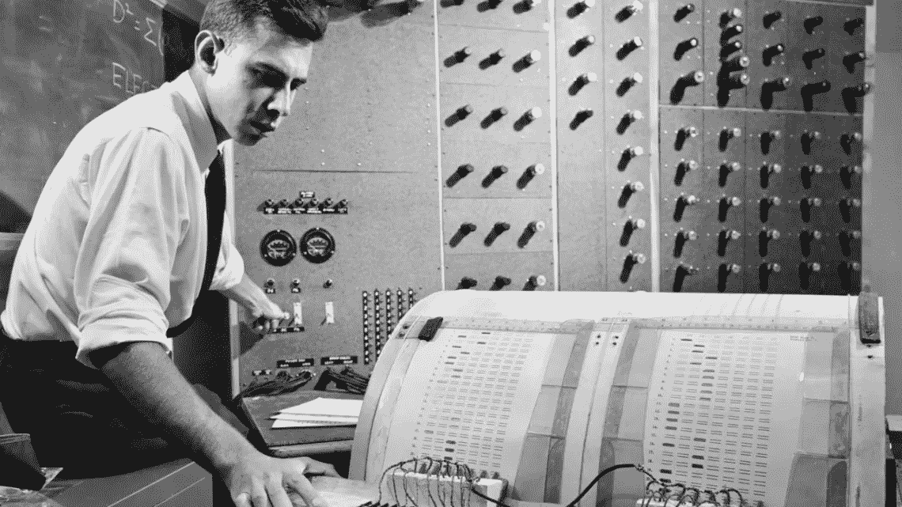

# “感知机”与弗兰克·罗森布拉特和马文·明斯基的竞争

> 原文：<https://medium.com/codex/the-perceptron-and-the-rivalry-between-frank-rosenblatt-and-marvin-minsky-e68fb3e0e3b6?source=collection_archive---------6----------------------->

马克·罗森布拉特在研究“感知机”。(图片由康奈尔纪事报-康奈尔大学提供)

## 1958 年 7 月 8 日,《纽约时报》发表了一篇题为《海军新设备边做边学:心理学家展示设计用于阅读并变得更聪明的计算机胚胎》的文章。这篇文章报道说，“海军今天展示了一种电子计算机的雏形，它期望这种计算机能够行走、说话、看、写、自我复制并意识到它的存在”

这篇热情洋溢的报道是基于由弗兰克·罗森布拉特主持的美国海军组织的新闻发布会。罗森布拉特出生于 1928 年，毕业于社会心理学，并获得康奈尔大学实验精神病理学博士学位，是康奈尔航空实验室认知系统部门的高级心理学家和负责人，他提出了自己的理论并演示了“感知机”。

感知器最初是作为为 IBM 704 编写的软件开始的，后来演变为一种专用硬件，称为“ **Mark I 感知器**”，一种为视觉模式识别任务设计的机器。Mark I 感知器是在纽约布法罗的康奈尔航空实验室建造的，由海军研究办公室资助。

罗森布拉特最初开始使用“**大脑模型**”研究人类大脑，这些系统试图从物理和数学的角度解释大脑的功能。借鉴麦卡洛克和皮茨在神经元逻辑演算方面的工作(**‘神经活动中固有思想的逻辑演算’—1943**)，他引入了一类被命名为‘感知机’的大脑模型。

用他自己的话来说:“感知机令人感兴趣，因为它们的研究似乎揭示了认知系统的生物物理学:它们以初步的形式说明了一些过程，通过这些过程，生物体或其他适当组织的实体可以拥有它们所存在的物理世界的“知识”，并且当情况需要时，它们所拥有的知识可以通过这些过程来表示或报告。”(**感知机和大脑机制理论，1196-0-8 号报告，康奈尔航空实验室，1961 年 3 月 15 日**)

在新闻发布会上，罗森布拉特在一台 5 吨重的 IBM 704 计算机上演示了感知机，给它输入了一系列穿孔卡片，这些卡片要么标在左边，要么标在右边。重复这个过程 50 次后，计算机能够学会区分标记在左边的卡片和标记在右边的卡片。

伴随着媒体大量报道所制造的噪音，展示的繁荣在公众中产生了巨大的期望。然而，很快人们就发现，感知器不能被训练来识别许多类型的模式。对罗森布拉特理论的进一步分析也揭示了缺乏科学严谨性和过于乐观的结论。最后一击是在 1969 年，马文·明斯基和西蒙·派珀特出版了《感知机:计算几何导论》一书。

作者坚持认为，对感知机的研究忽略了系统能力的主要弱点。根据罗森布拉特的**“感知器学习规则”**在 1962 年他的“神经动力学原理”中的表述，感知器可以被训练成在有限数量的步骤中区分模式，然而，作者表明有许多模式感知器不能区分，并且它不能实现异或逻辑功能。

虽然罗森布拉特和明斯基保持着友好的关系，因为他们从小就认识，并且都在布朗克斯科学高中学习，但在最初的兴奋之后，这本书导致了对神经网络的兴趣和资助的大幅下降，开启了一个被称为**“人工智能的冬天”**的时期。研究人员花了数年时间才证明多层神经网络可以克服单层网络的不足。

罗森布拉特也对天文学感兴趣，并在他家附近建造了一座天文台，在那里他开始了对 SETI(寻找外星智慧生命)的深入研究。

今天，被公认为人工智能始祖的 Mark I Perceptron 位于华盛顿特区的史密森尼学会
电气和电子工程师协会(IEEE)设立了一个年度奖项，以纪念 Frank Rosenblatt，今天许多研究人员认为他是现代人工智能之父。