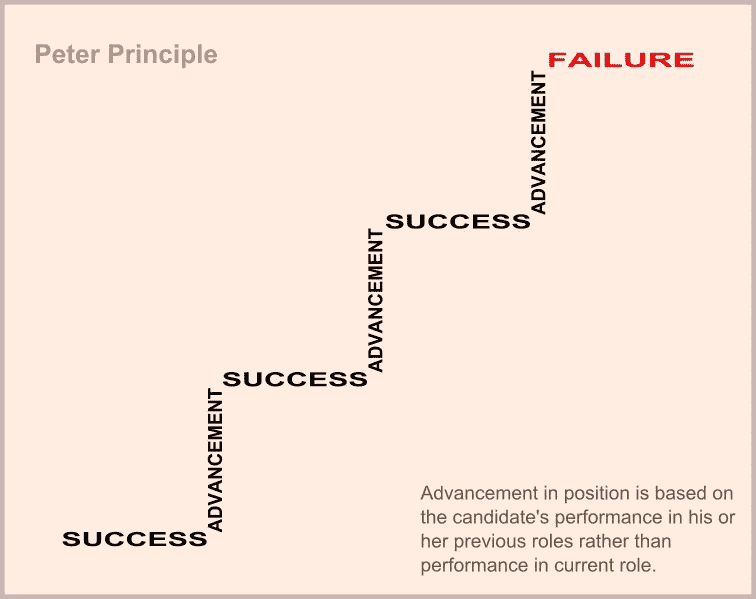

# 软件领域的彼得原理

> 原文：<https://medium.com/codex/the-peter-principle-in-the-software-field-79edbabf6833?source=collection_archive---------10----------------------->

彼得原则简而言之就是一个人被提升到一个不称职的水平，表现出一个提升的问题。如果你不熟悉彼得原理，请阅读 Investopedia 的这篇文章。我从[这里](https://www.amazon.com/The-Peter-Principle/dp/1788166051/ref=sr_1_1?crid=3LM9EW8VR61J4&keywords=the+peter+principle&qid=1640572260&sprefix=the+peter+principl%2Caps%2C131&sr=8-1)读到了一本基于这一原理的书，供感兴趣的读者阅读。

**注意:**这不是关于[软件彼得原理](https://en.wikipedia.org/wiki/Software_Peter_principle)，然而这值得一读，因为我偶然发现了这个。

参考:[https://commons . wikimedia . org/wiki/File:Peters _ principle . SVG](https://commons.wikimedia.org/wiki/File:Peters_principle.svg)

在我做软件工程师的短暂时间里，我注意到很多职业都有一些晋升的途径。虽然这个领域是全新的，职业生涯仍在形成中(如软件工程师与数据工程师)，许多细节需要解决。真正的问题是，在晋升途径如此之少的情况下，我们大多数工程师将何去何从？你想想，不换公司，不被套牢，真的没有太大的成长空间。你想从事管理还是某种建筑设计？如果你对这些问题中的任何一个说是，这都不是一件坏事，但是看看在这个领域你必须去的有限的地方。这是我们领域内的一个大问题，因为当前的技能组合并没有转化过来。

现在，如果你是一名优秀的软件工程师，你会写出最好的代码，客户会不断地称赞你添加的功能(这个世界是不真实的，但让我们玩得开心)。因此，这一事实意味着你应该被提升到另一个工程级别，这一最初的提升将赋予你更多的责任，并允许你承担自己的项目。当了一段时间的优秀工程师后，你走到了岔路口，你想走哪条路？你想成为一名经理或其他需要会议管理水平的技术角色吗？不管怎样，沿着这条路走下去，你要么会遇到一个无能的水平，除非你碰巧擅长这个角色。那么为什么要强行提拔一个优秀的工程师呢？写好代码能让你成为经理吗？显然不是，也许你不是最好的告诉人们该做什么，或者一天坐 6 个小时的会议，或者不插手一个项目。也许更适合的是让你继续做工程，并帮助指导其他人的项目。

参考:[https://pix abay . com/photos/失意-商务-失意-4201046/](https://pixabay.com/photos/frustrated-business-frustration-4201046/)

所以现在我开始漫谈，这和彼得原理有什么关系？这似乎是这一领域的一种新现象，即强迫彼得原理。在企业界，你不仅会被提升到一个无能的级别，而且你在软件行业也没有选择的余地。我的意思是，你能做什么，从一家公司跳到另一家公司，然后带着加薪退休？这可能会带来不必要的压力，但这是一种选择。接下来你可以做的就是写书和做演讲。如果这不适合你，那么你就处在一个奇怪的位置。

我的主要观点是，除非能给出一个好的理由，否则行业内需要停止强调让工程师担任管理型角色。当然，很多人会在这些类型的角色中做得很好，表现出领导素质，并能让人们支持他们的想法，但这并不像其他任何事情一样是一刀切的。这个领域还太年轻，工作场所的流动性有限，无法迫使人们扮演这种角色。

最后，这是我在现场看到的，但这似乎是一个共同的主题，即如果不在现场放手，工程就没有出路。只是为大家考虑的一个花絮。