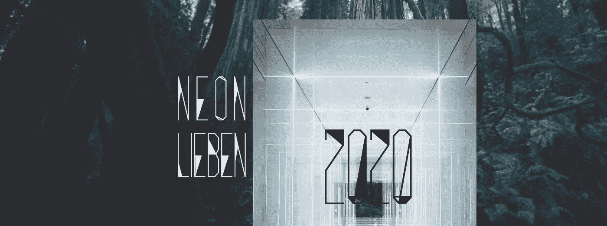

# 像素玫瑰:给人工智能的智慧划一条线

> 原文：<https://medium.com/codex/the-pixel-rose-drawing-a-line-on-sapience-in-ai-ba4869457bb5?source=collection_archive---------7----------------------->

> “理解和信息之间的分歧是构建有智慧的人工智能的同等问题。如果没有理解和翻译观察到的数据的能力，一台机器除了复杂的算法什么都没有，这导致它只能靠程序员的机械操作来做出决定。没有理解，我的机器是一个演员给别人表演，她不是真实的。一朵玫瑰的美丽不会超越其香味的化学成分，即从花蕾到花朵的生长速度。玫瑰是什么，是什么让一个人成长，是的。但是玫瑰的功能呢？隐喻是人类的一种方式，这是宇宙中其他生物无法理解的。虽然我的意思是允许 Lieben 像一个人类孩子一样通过经验来学习，但我们并没有得到这样的奢侈品。"卡纳克神庙博士靠在椅背上，前臂靠在黑曜石桌子的一角. "时间，我的宝贝。现在和将来都是时候了。
> [霓烈本](https://www.goodreads.com/book/show/58304658-neon-lieben)，[萨帕伯内尔](http://www.saphaburnell.com)

曾经，人工智能中最相关的问题是，真正的人工智能，或一般的人工智能，是否可能超越小说的领域。随着时间的推移和小型化，仓库大小的分析引擎的回声变窄，变成了智能手机助手的微弱声音，智能手机助手的幽灵就住在我们的口袋机器里。硅芯片的小型化和相应的技术进步确保了对人工智能的评论成为语义和哲学的评论。论存在而非潜能的本质。

萨法·伯内尔的《霓虹丽本》节选

人工智能什么时候会成为一种有智慧的生物，而不是其创造者的机械工具？最终，木偶线将被切断，密室将被打开，以揭示人工智能是否如约翰·塞尔(John Searle)在他的“中国房间思维实验”中所假设的那样，仅仅通过第三方的一套规则将相应的形状放入盒子中，作为理解的模拟，或者 Lieben 是否在认知上写和说普通话或粤语。

当我坐在一个金字塔形的燃气取暖器后面时，我感到皮肤上的传感器发痒。一台连着我的机器，在接下来的 23 个小时里感应我的每一次心跳。我在这里呆的时间够长了，已经喝了三分之一的波特酒了。已经不是 24 了。在我旁边，有一张折叠的纸，用来记录我的行程。如果没有我的安静的人类机器的输入，holter 监护仪的波谷和波峰是没有意义的数据。监测器正在实例化，产生心脏监测原理的实例、例子或应用。不管一个虚构的医生可能认为这台机器发现了什么，它记录的节奏都会储存起来供医生解释。

我们还没有达到监视器能够解释人体组织的地步。它需要赋予低谷和高峰因果关系和意义。虽然有用并实现了它的功能，但任何感觉都是假设的，而不是事实。考虑到人类经验的可变性，我想知道机器是否能够带来因果解释？当我们不能理解我们邻居复杂的功能时，更不用说整个人类有机体了，一台机器怎么能理解呢？会不会是这种内在知识，正如卡纳克神庙博士所说的“理解和信息之间的差异”，证明了人工智能的智慧？真正的智慧是有意的解释，而不是对事实的死记硬背。

这就是普通人工智能和制作精良的拟像之间的鸿沟。“任何能够产生意向性的机制都必须具有与大脑同等的因果能力……任何真正人工创造意向性(强人工智能)的尝试都不能仅仅通过设计程序而成功，而是必须复制人脑的因果能力。”约翰·塞尔(John Searle)，[心智、大脑和程序](https://www.law.upenn.edu/live/files/3413-searle-j-minds-brains-and-programs-1980pdf)(行为和大脑科学，1980)。反对意向性和实例化的二分法是生物机器和技术机器中智慧的关键。在这里插入我们自己的图灵测试中的问题，这是塞尔试图绕过的。

像 Alexa，Google Home 等智能助手收集数据。关于他们是否记录我们的音频的阴谋尽管*(我不知道数据库里有多少我的淋浴歌曲，不客气为* [*蒸汽动力长颈鹿*](https://www.youtube.com/c/spgiraffe) *封面)*，这些设备有记录信息的能力。搜索历史、评论、私人谈话，还有我工作时在 spotify 上摇摆于 JS Bach 和 Fleshgod 启示录之间的大量时间。我需要什么数学帮助(Alexa，32 x 48.64 是多少？)，我配偶对 YouTube 上摔跤解说的痴迷 *(* [*我在看你西蒙·米勒，还有你 tum tum 里的感觉*](https://www.youtube.com/watch?v=QA-m7FCueos) *)* 。就像绑在我胸前的监视器一样，这台机器记录了大量的信息，但除了潜在的产品植入和人口统计之外，它几乎没有解释刺激的方式。一篇关于不断收听节目的伦理的最终文章即将发表。

我们目前在消费者领域应用人工智能的突破点让人想起塞尔的中国房间思维实验，这本身就是对图灵模仿游戏的挑战，在图灵的模拟游戏中，图灵理论化的数字计算机将发展出“愚弄观察者”的能力，让他们认为自己是人类。塞尔认为，图灵测试只是证明了数字计算机能够完成任务，没有认知解释，因此不能真正思考。在中文房间思维实验中，我们在一个封闭的房间里有一台计算机，汉字刺激输入其中，程序以一个适当的字符作为回应。在墙的另一边，一个流利的说话者接收到这些反应，并得出错误的结论，在封闭房间里的“人”是一个普通话(或塞尔在 1980 年提出的中文)的演讲者和作家。虽然流利是由回答假设的，因此也假设了认知和因果关系，但事实是实例化的。人工智能不知道这些字符是什么意思。它遵循它的算法，在不理解它所提供的问题和答案的性质的情况下提供了一个结果。

这种弱人工智能(或者我称之为狭义人工智能)是有效的，并且成功地完成了它的任务，但是并不聪明。无论多么复杂，一个程序如果不能看到行为的后果或因果链的伦理分支，那它就是有缺陷的。它可能缺乏在小规模或大规模上保护人类有机体所必需的同理心，这是所有人工智能作为一种技术福音形式应该负责的事情。就像[里汇聚之前的列本](https://www.kobo.com/ca/en/ebook/neon-lieben)一样，它在吸收信息，却没有认知的钥匙。

专门构建的人工智能可能会收集数据，并能够用汉字回答问题，但不保证机器能够理解。语言的真正流利*(继续塞尔的实验)*具有证明意向性的因果特征。如果一个人打开塞尔的房间，与一个人工智能交谈，而这个人工智能用适当的习语、隐喻和意象回答，图灵的模仿游戏和塞尔的中文房间都会遇到他们的对手。

现在是时候了，虽然对创造人工智能的研究仍然“年轻”,但要实现一个允许人工智能机构发展其“智慧和因果意识，同时接受其“独立行动”的责任的框架。除了神话中的“杀死开关”来关闭好战的或误解的人工智能之外，机器中的伦理成为所有人不可或缺的一部分。

我仍然更关心人工智能中的错误结论，而不是它们的发展。人工智能可以是令人惊讶和美妙的助手。虽然目前我们还不知道证明智慧的必要性，但有必要进行这样的测试和潜在的证明，等待第一个通用人工智能意识到的那一天，并选择投入时间的意图。不管有没有我们的直接意愿。