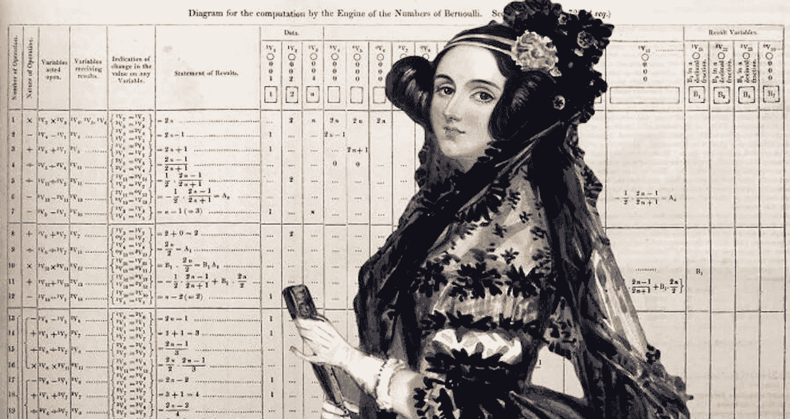
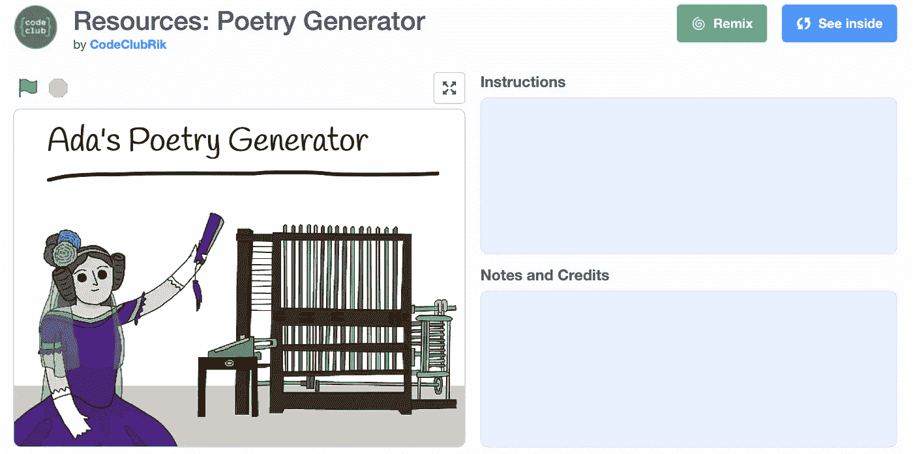
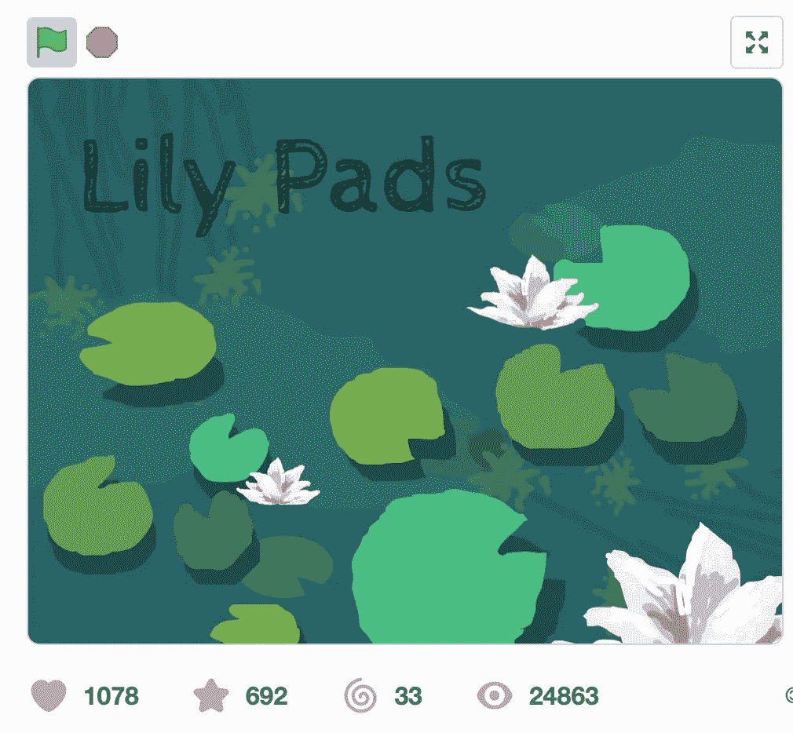
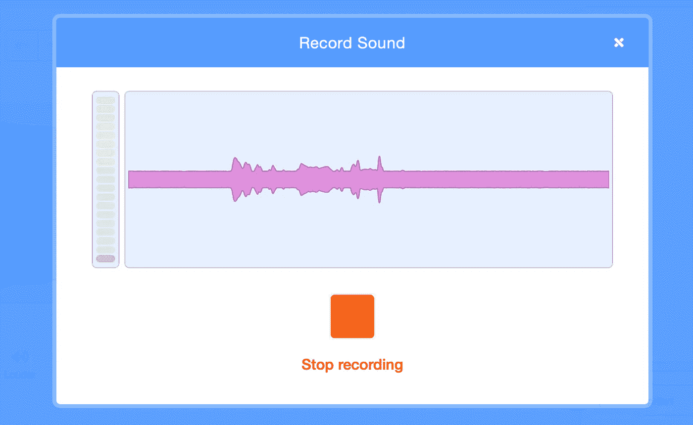
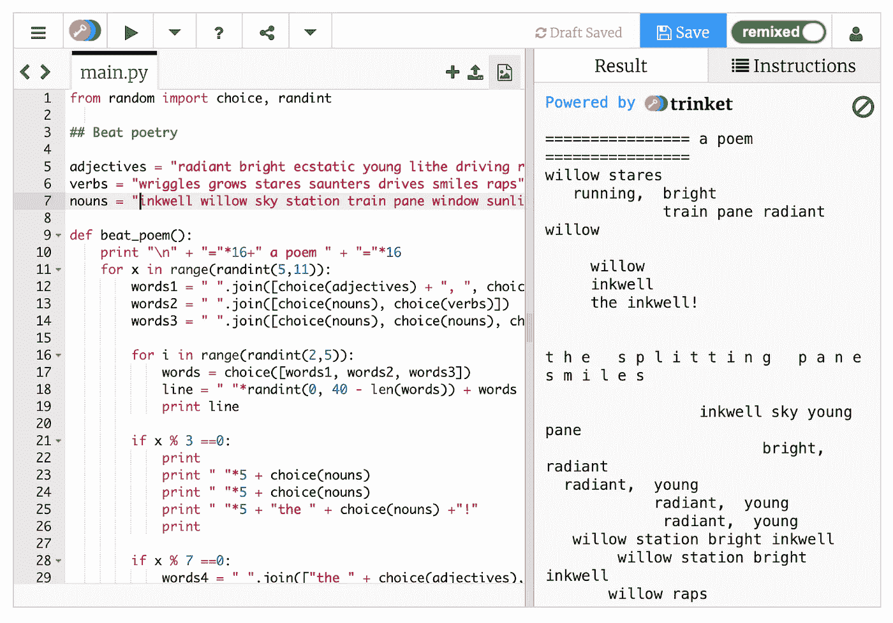

# 代码的诗意世界

> 原文：<https://medium.com/codex/the-poetic-world-of-code-acc733aaa79?source=collection_archive---------21----------------------->

在 [Unsplash](https://unsplash.com/s/photos/code-art?utm_source=unsplash&utm_medium=referral&utm_content=creditCopyText) 上拍摄的 [ThisisEngineering RAEng](https://unsplash.com/@thisisengineering?utm_source=unsplash&utm_medium=referral&utm_content=creditCopyText)

四月是全国诗歌月！

这个月是为了庆祝和鼓励全世界的诗歌阅读、写作和教学。**为了庆祝这个月，我们有一些课程想法，将诗歌和编码的精彩世界与您的学生结合起来。**

# 首先，你可能想知道，“为什么用编码来教诗歌？”

令人惊讶的是，诗歌和代码有很多共同点，它们都允许学生发挥创造力！学生们经常发现诗歌令人困惑，甚至令人害怕，但这并不是必须的！将编码和诗歌结合起来，可以让诗歌变得平易近人，甚至不那么势不可挡，也可以让诗歌变得有趣而有魅力。使用更多的可视化编码形式，如 Scratch，也可以为学生提供一个机会，通过代码的力量将他们的诗歌带入生活。

下面你会发现几个课程想法，让你的班级一起探索诗歌和编码的世界。下面所有的想法都可以在一个读写单元中完成，但是，你可以在一个诗歌单元中随意尝试多个选项。毕竟，你有整个四月的时间来庆祝诗歌艺术！

# **探索爱情比特**

 [## 爱情比特

### LoveBits 旨在展示代码可以像任何其他语言一样使用。甚至是诗意的。

lovebits.bilebile.net](https://lovebits.bilebile.net) 

LoveBits 是一个很好的入门工具，可以向学生介绍编码和诗歌，而不需要学生做任何编码工作——这对于完全的初学者来说是完美的。

## LoveBits 致力于证明编码就像任何其他语言一样，甚至可以诗意地使用！

诗意地使用代码的有趣之处在于，这些代码实际上是为人类设计的，而不是为计算机设计的，这真是**颠倒编程**！每首 LoveBits 诗都有一小段代码，以这样一种方式编写，它应该被不熟悉编程的人理解；唯一的要求是英语。

这一小段代码提供了这首诗，当学生们点击播放时，他们就可以和这首诗进行互动了。

# **阿达的诗歌生成器**

图片来自[artfixdaily.com](https://www.artfixdaily.com/artwire/release/9331-mathematics-text-owned-and-annotated-by-ada-lovelace-(1815-1852)-)

阿达·洛芙莱斯通常被认为是第一个计算机程序员，也是诗人拜伦的女儿。这个[阿达·洛芙莱斯诗歌生成器](https://scratch.mit.edu/projects/78692754)允许学生重新混合 Scratch 代码，生成他们自己的随机诗歌。

学生可以为他们的诗歌选择一个主题，并创建自己的动词、副词、名词和形容词列表，以生成符合他们所选主题的独特诗歌。

*Code Club 制作的完整教案可以在这里找到* [*。*](https://codeclub-project-assets.s3-eu-west-1.amazonaws.com/public/en-GB/poetry-generator.pdf)

# **动画艺术**

使用像 Scratch 这样的可视化编码平台，让学生创作一首诗(或使用他们在本月早些时候已经写好的一首诗)，然后用代码将它变成现实！学生可以创建一个动画图像或一个完整的动画来展示他们的诗歌。

看看这个例子"[睡莲叶子](https://scratch.mit.edu/projects/304045567)":

这是一项非常有趣的活动，因为学生不仅可以创作自己的诗歌，他们还可以添加互动、动画或其他自定义艺术作品，以一种仅使用铅笔和纸无法实现的方式真正赋予它生命**，这为他们的作品增添了另一种创造性元素。**

# **动画口语**

当和学生一起探索口语诗歌时，有时需要向全班同学展示他们的诗歌的想法会让人感到极度紧张。

创造一个生动的口语单词可以让学生探索口语诗歌的世界，同时帮助他们消除一些需要表演诗歌的压力。

使用 Scratch 中的“声音”代码块，让学生记录自己朗读的诗歌。然后，他们可以创建一个动画来为他们所说的话添加视觉元素，并在整个程序中使用他们记录的声音代码块来呈现他们所说的话。

# **用 Python 写诗**

一旦学生对 Scratch 之类的块编码语言有了更多的经验，用 Python 之类的另一种语言重新混合一些代码可能是发展他们技能的一个很好的下一步。

这个 [Beat 诗歌生成器](https://blog.trinket.io/writing-poetry-in-python/)是向学生介绍一种新的编码语言的绝佳选择

让学生重新混合这个 Python 小饰品，创作他们自己的生成诗。

学生不仅可以改变形容词、名词和动词来定制他们自己的诗歌，而且他们还可以调整诗歌的结构，甚至编码更多的诗句，因为他们在探索这种新语言时获得了更多的信心。

# **什么是混音代码？**

这些示例活动中有许多要求学生重新组合现有代码。重新混合代码是指你 ***获取别人已经创建的代码，并为你自己的目的对其进行修改。***

> 如果我从别人的作品开始，重新混合仍然是编码吗？

没错。重新混合还是编码，只要记住重点是让你的项目 ***和原来不一样！*** 否则，我们只是在抄袭别人的作品。

重新混合可以用作练习编码和学习有价值的故障排除技能的工具，而不需要学生成为高级编码人员。此外，它可以激励学生探索更高级的代码，并有机会看到他们有可能创造什么！

这就是我们的 5 个编码和诗歌活动，供你在全国诗歌月期间探索。如果您在课堂上实施了这些项目中的一个，**请务必在 Twitter 或 Instagram @ stemminds 上标记我们，这样我们就可以看到您和您的学生创造了什么**。编码快乐！

# 在你走之前…

我们是 STEM Minds，一家 STEM 教育公司，帮助我们的学生发现他们的激情，探索 STEM 奇妙世界提供的一切。 [**跟随我们**](https://twitter.com/stem_minds) 的使命，为下一代问题解决者、游戏改变者和无畏的领导者赋能！