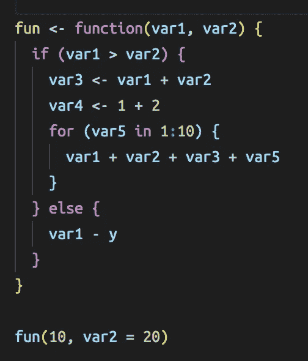
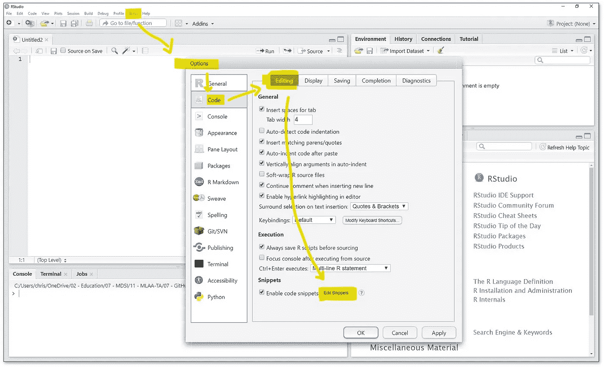
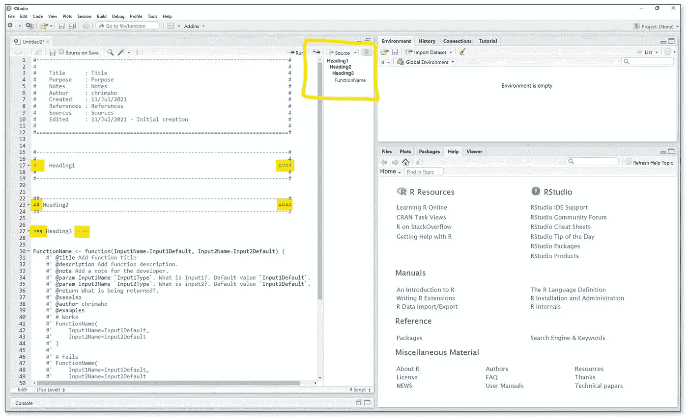
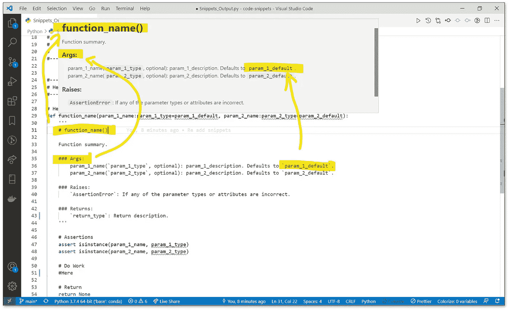

# 代码片段的力量

> 原文：<https://medium.com/codex/the-power-of-code-snippets-9b0359e7ae2d?source=collection_archive---------13----------------------->

## 如何让你的代码从优秀变得优秀

**成功的 Pythonic 算法** ([cover image](https://wallpapercave.com/w/wp3105541)by[wallpaper cave](https://wallpapercave.com/))

# 内容

1.[简介](#fdeb)2。[R+R studio](#4c91)3。[Python+vs code](#1b61)4。[结论](#46b7)
5。[更多资源](#edbf)

# 1.介绍

现代程序员写了很多代码。这是工作的一部分。但是写好代码的一个主要原则是干原则:不要重复自己(参见[干原则:R 函数](https://www.earthdatascience.org/courses/earth-analytics/automate-science-workflows/write-efficient-code-for-science-r/#dont-repeat-yourself---dry)或[干原则:Python 函数](https://scientificallysound.org/2018/07/19/python-functions/)或[维基百科](https://en.wikipedia.org/wiki/Don%27t_repeat_yourself)或任何数量的其他在线资源)。本质上，这个原则有效地表明，如果你打算写两次相同的代码，那么不要写；相反，将代码写在一个函数中，然后调用该函数两次。

还有另一个原则，如果不是更重要的话，也是同样重要的:记录你的工作。为此，函数 docstrings 非常有用。基本上，你想为别人写你的代码(即使那个人是你的未来版本…)，以便他们能更好地理解你的代码。在这里，你要解释*为什么*你的代码正在做它正在做的事情(读者只要简单地阅读代码本身就能看到*代码正在做什么*)。例如，如果有一些复杂的逻辑，或者要处理数据中的一个怪癖，那么最好编写一个 docstring。但是不要走极端！太多的文档可能是一件坏事的原因有很多(例如[如何像专家一样注释您的代码:最佳实践和良好习惯](https://www.elegantthemes.com/blog/wordpress/how-to-comment-your-code-like-a-pro-best-practices-and-good-habits)和[在代码中添加注释:好的、坏的和丑陋的](https://www.freecodecamp.org/news/code-comments-the-good-the-bad-and-the-ugly-be9cc65fbf83))。

正是这两个原则的交集导致了编程世界中一个奇妙事物的使用:代码片段。这些代码片段实际上是“保存的代码块”，可以让你加速代码的实现，提高代码的整体可读性。最终，会把你的代码从*好的*变成**伟大的**。

从数据科学的角度来看，我将重点介绍这一领域最流行的两种编程语言，以及它们各自的流行 IDE:[R](https://cran.r-project.org/)+[R studio](https://www.rstudio.com/)和 [Python](https://www.python.org/) + [VSCode](https://code.visualstudio.com/) 。

# 2.R + RStudio

**R 代码片段** ( [图片](https://user-images.githubusercontent.com/4662568/71432979-72160c00-2717-11ea-8b32-fc06d145189e.png)by[Kun Ren](https://disqus.com/by/renkun_ken/)on[renkun . me](https://renkun.me/))

首先，这里有一些在 RStudio 中使用文档字符串和代码片段的好资源:

*   [时尚风格指南:文档](https://style.tidyverse.org/documentation.html)
*   [文档字符串介绍](https://cran.r-project.org/web/packages/docstring/vignettes/docstring_intro.html)
*   在 R 中有没有一种明智的方法来做类似 docstrings 的事情？
*   [docstring 包](https://github.com/Dasonk/docstring)
*   [常见的 R 代码片段](/@manishfirewall/common-r-code-snippets-eb5c72750339?source=search_post---------0)
*   【the RStudio IDE 中的代码片段
*   [如何使用 RStudio 代码片段](https://www.infoworld.com/article/3396616/how-to-use-rstudio-code-snippets.html)
*   [使用 RStudio 代码片段更高效的 4 种方法，11 种现成的使用示例](https://jozef.io/r906-rstudio-snippets/)

要找到 RStudio 的代码片段，只需导航到:**工具** > **全局选项** > **代码** > **编辑** > **编辑代码片段**。

**查找代码片段** (图片由作者提供)

在那里，你会发现 RStudio 团队已经提供了一大堆片段。包括用于写入功能的一个:

**R 片段基本** (部分: [chrimaho/code-snippets](http://www.github.com/chrimaho/code-snippets) )

但我认为我们可以做得更好。

**R Snippet Extended** (部分:[chrimaho/code-Snippet](http://www.github.com/chrimaho/code-snippets))

这个函数将遵循处理文档字符串的标准语法。包括在行首使用特殊的注释字符`#'`和各种`@`属性。请参阅上述资源，了解为什么这些资源很重要以及如何使用它们。

通过使用此代码片段，您将能够:

1.  快速轻松地实现您的新功能。
2.  当你第一次写函数时，有效地“边写边文档”;而不是在你第一次写完函数后需要回来“重写”你的 docstring。
3.  轻松地通过`tab`功能的不同部分，并同时填写不同的部分*和*，这得益于使用出现在不同位置的`${1:FunctionName}`。
4.  只需几分钟就能返回一个现成的、记录良好的函数。

但是您不仅仅需要对函数声明这样做。您还可以在文件中添加各种标题和节。

## **！！复活节彩蛋！！**

如果注释行以四个相同的字符结尾(如`####`或`----`，那么 RStudio 会将该行添加到文档大纲面板中！这使得*文档导航变得非常棒。但是你可以更进一步。如果您在行首添加多个`#`字符，那么您可以自动缩进文档的轮廓标题！这会让你的生活变得精彩。*

**文档面板惊艳** (图片由作者提供)

如果您想要这些片段的原始文件，请在此处查看:

 [## Snippets _ Input.txt

### 帮助每个数据科学家的代码片段。

github.com](https://github.com/chrimaho/code-snippets/blob/97fc70d87902cb55c50b9f543d6b0485f4818015/R/Snippets_Input.txt)  [## 片段 _ 输出。稀有

### 帮助每个数据科学家的代码片段。

github.com](https://github.com/chrimaho/code-snippets/blob/97fc70d87902cb55c50b9f543d6b0485f4818015/R/Snippets_Output.R) 

# 3.Python + VSCode

**Python 代码片段** ( [图片](https://images.unsplash.com/photo-1515879218367-8466d910aaa4?ixlib=rb-1.2.1&ixid=MnwxMjA3fDB8MHxwaG90by1wYWdlfHx8fGVufDB8fHx8&auto=format&fit=crop&w=1950&q=80)由[克里斯里德](https://unsplash.com/@cdr6934)在 [UnSplash](https://unsplash.com/)

和以前一样，让我们从在 VSCode 中使用 Python 文档字符串和代码片段的一些好资源开始:

*   [Visual Studio 代码中的代码片段](https://code.visualstudio.com/docs/editor/userdefinedsnippets)
*   [PEP 257 —文档字符串约定](https://www.python.org/dev/peps/pep-0257/)
*   [Python 文档字符串](https://www.programiz.com/python-programming/docstrings)
*   [什么是标准的 Python docstring 格式？](https://stackoverflow.com/questions/3898572/what-is-the-standard-python-docstring-format)
*   [docstrings 主要格式](http://daouzli.com/blog/docstring.html)
*   [30 个有用的 Python 片段，你可以在 30 秒或更短时间内学会](https://towardsdatascience.com/30-helpful-python-snippets-that-you-can-learn-in-30-seconds-or-less-69bb49204172?source=search_post---------1)
*   [针对日常问题的 22 个 Python 代码片段](https://levelup.gitconnected.com/22-python-code-snippets-for-everyday-problems-4c6a216c33ae?source=search_post---------1)
*   [每个 Python 程序员都必须学习的 22 个代码片段](https://levelup.gitconnected.com/22-code-snippets-that-every-python-programmer-must-learn-b7f7ec35e9df?source=search_post---------7)

要找到 VSCode 的代码片段，您需要使用命令面板:按下`ctrl` + `shift` + `p`，键入`snip`，选择**首选项:配置用户片段**，然后打开 **snippets.code-snippets** 文件。在这里，您可以配置任何您想要的用户片段。这个文件基本上是一个 JSON 文件，所以您应该遵循它的语法约定。

与 RStudio 类似，VSCode 也有一些默认值。比如:

**Python 片段基本** (部分: [chrimaho/code-snippets](http://www.github.com/chrimaho/code-snippets) )

然而，我们知道有一个更好的方法来做到这一点。

**Python 代码片段扩展** (chrimaho/code-snippets 的一部分:

VSCode 中这个片段的好处与 RStudio 的好处非常相似:

1.  很快，
2.  很有效，
3.  很简单，
4.  已经准备好了。

## ！！复活节彩蛋！！

VSCode 以 Markdown 格式呈现文档字符串！这意味着你可以输入**标题**、`code chunks`、*斜体*、**粗体**，几乎任何你想要的降价格式！这可能会打破常规的 docstring 约定(例如 [Numpy](https://numpydoc.readthedocs.io/en/latest/format.html) 、 [Google](https://google.github.io/styleguide/pyguide.html) 、 [Sphinx](https://www.sphinx-doc.org/en/master/#) )。但对我来说，没关系。它让我的 VSCode 环境看起来很专业。不客气

**带 Markdown 格式的文档字符串** (图片由作者提供)

如果您想要这些片段的原始文件，请在此处查看:

 [## 代码片断 _ 输入.代码片断

### 帮助每个数据科学家的代码片段。

github.com](https://github.com/chrimaho/code-snippets/blob/97fc70d87902cb55c50b9f543d6b0485f4818015/Python/Snippets_Input.code-snippets)  [## Snippets _ Output.py

### 帮助每个数据科学家的代码片段。

github.com](https://github.com/chrimaho/code-snippets/blob/97fc70d87902cb55c50b9f543d6b0485f4818015/Python/Snippets_Output.py) 

# 4.结论

代码片段是以一致且美观的方式快速轻松地构建代码的绝佳方式。它们是高度可配置的，它们为您的编码增加了大量的价值和效率。通过使用片段，你的未来会感谢你。相信我。

# 5.更多资源

*   [给数据科学家的 10 个惊人的提示和技巧:一些更有用的 R 和 Python 代码片段](https://betterprogramming.pub/10-tips-and-tricks-for-data-scientists-vol-2-5640ccd1aa5e?source=search_post---------1)
*   [给数据科学家的 10 个提示和技巧:R 和 Python 中有用的代码片段](https://betterprogramming.pub/10tips-and-tricks-for-data-scientists-vol-1-a870455325da?source=search_post---------2)
*   [面向数据科学家的 5 个强大的 Python 和 R 技巧:R 和 Python 中有用的代码片段](https://betterprogramming.pub/5-powerful-python-and-r-tricks-for-data-scientists-e35dd9050750?source=search_post---------3)
*   数据科学家会喜欢的 10 个现实世界的提示和技巧:一些更有用的 Python、R 代码片段，等等

**更多编程** ( [图片](https://images.unsplash.com/photo-1518932945647-7a1c969f8be2?ixlib=rb-1.2.1&ixid=MnwxMjA3fDB8MHxwaG90by1wYWdlfHx8fGVufDB8fHx8&auto=format&fit=crop&w=1789&q=80)由[欧文·史密斯](https://unsplash.com/@mr_vero)在 [UnSplash](https://unsplash.com/) 上)