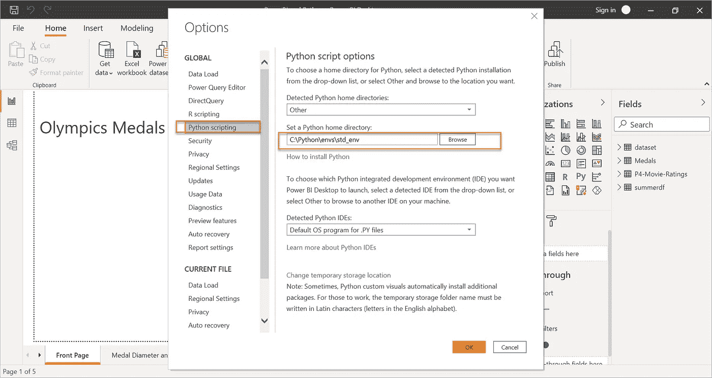
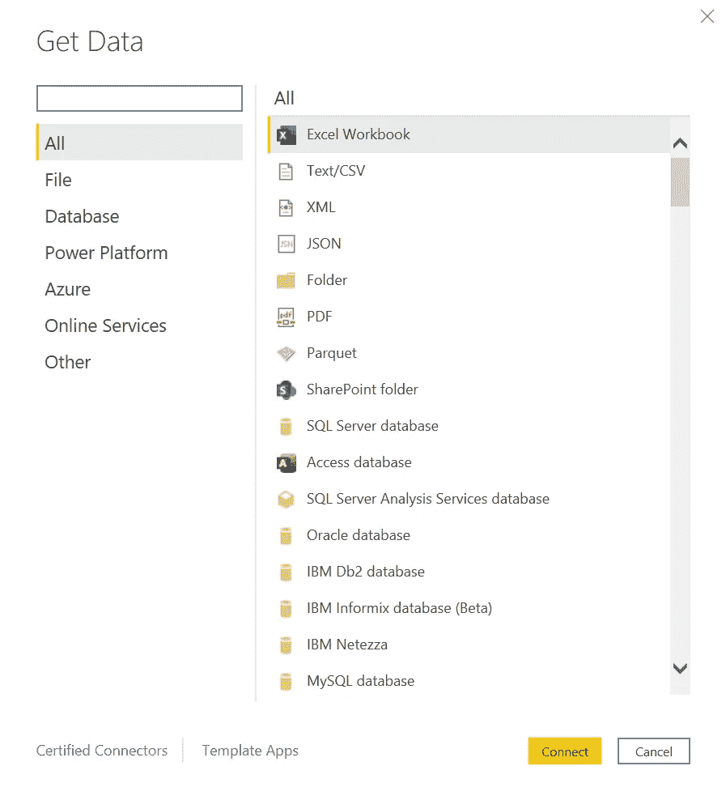
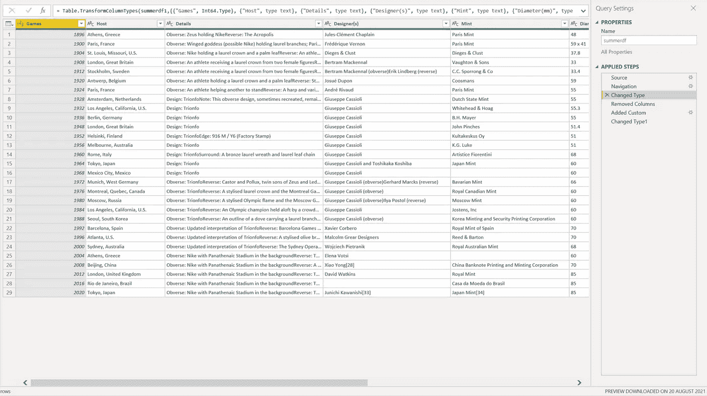
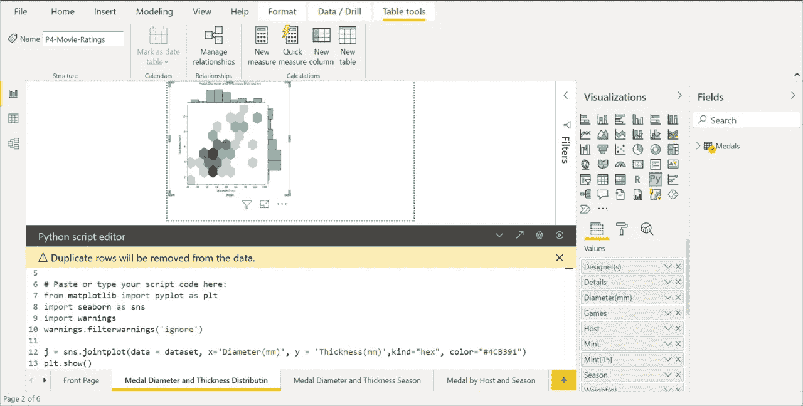
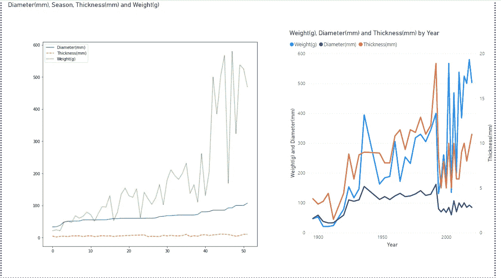
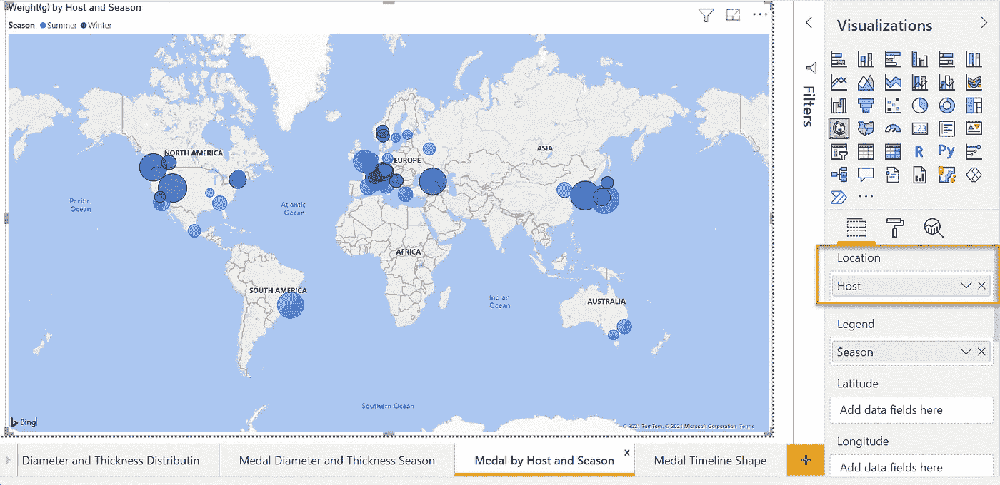

# Power BI 中 Python 的威力

> 原文：<https://medium.com/codex/the-power-of-python-in-power-bi-51daf38b7044?source=collection_archive---------4----------------------->

对于许多数据分析师和商业智能专家来说，在 Power BI 中运行 Python 脚本是一个令人兴奋的特性，原因显而易见。Power BI 是一款强大的微软数据可视化和分析工具。其用户友好的界面和拖放功能使许多非技术人员能够创建信息丰富和可展示的仪表板。作为数据科学和机器学习领域的一种流行编程语言，Python 非常适合补充 Power BI 的功能。Python 有各种各样的库，可以帮助你提取和清理数据，定制可视化，分析不同维度的数据，预测和预报数据，等等。因此，结合这两个可以是一个很好的策略。

来源:[https://unsplash.com/photos/Q1p7bh3SHj8?utm_source=unsplash&UTM _ medium = referral&UTM _ content = creditShareLink](https://unsplash.com/photos/Q1p7bh3SHj8?utm_source=unsplash&utm_medium=referral&utm_content=creditShareLink)

作为一名具备 Python 基础的 Power BI 专家，我决定学习更多关于如何在数据科学项目中使用 Python 的知识，并尝试将这些知识应用到 Power BI 中。我参加了一个名为[**Python A-Z:Python For Data Science 的在线课程，并做了实际练习！Udemy 上的**](https://www.udemy.com/course/python-coding/?utm_source=adwords&utm_medium=udemyads&utm_campaign=DataScience_v.PROF_la.EN_cc.UK_ti.5336&utm_content=deal4584&utm_term=_._ag_73899881953_._ad_532713166723_._kw__._de_c_._dm__._pl__._ti_dsa-774930027489_._li_9045940_._pd__._&matchtype=b&gclid=EAIaIQobChMIneuI_NHd8gIVkcLtCh1m_Q0EEAAYASAAEgKEofD_BwE) ，我强烈推荐给想学习如何在数据科学中使用 Python 的人。本课程向您介绍 Python 的基础知识，例如使用库来准备和可视化数据的安装和编码。

在我完成这个课程后，我认为我已经准备好开始我的第一个 Python 和 Power BI 项目了。然而，我一直在 Power BI 中运行 Python 脚本。为此，我们需要创建一个虚拟环境。此外，我已经安装了 [Matplotlib](https://matplotlib.org/stable/gallery/index.html) 和 [Seaborn](https://seaborn.pydata.org/index.html) 库。我在 Udemy 在线课程中用过这两个库，发现它们很容易使用。我还安装了 [Plotly](https://plotly.com/python/) ，它包含了创建地图控件的功能。

然后我们需要在 Power BI 桌面中设置 Python 主目录。否则，当您试图在 Power BI 中运行任何东西时，您将会得到一个不可读的错误。

设置 Python 主目录；来自我的本地机器的屏幕截图

一旦环境准备好了，我们就可以开始工作了。无论我们想使用什么技术，数据科学或数据可视化项目的生命周期都是相似的。第一步是确定我们想要分析什么。接下来，我们需要准备数据。这包括获取和转换数据。然后，我们可以分析和可视化数据。

在我的第一个项目中，我计划对所有夏季和冬季奥运会奖牌的属性做一些分析，比如重量、直径等。谷歌搜索后，网上没有现成的 CSV 或 excel 版本的数据集。我唯一能找到的数据集是维基百科页面上的一个表格。

[https://en.wikipedia.org/wiki/Olympic_medal](https://en.wikipedia.org/wiki/Olympic_medal)

强大的数据连接器是 Power BI 的一大优势。我们可以轻松地使用其中一个来连接来自 SQL 数据库、SharePoint、Dynamics 365 等的数据。但是因为这篇文章是关于 Python 的力量。我决定试一试。

获取 Power BI 中的数据；来自我的本地机器的屏幕截图

您可能已经知道，与从头开始编写代码相比，在 Python 中安装不同的库可以节省大量时间。幸运的是，我发现维基百科和请求包正是我所需要的。有一篇有用的文章告诉你如何做到这一点，[将维基百科表格抓取到 Python data frame | Analytics vid hya(medium.com)](/analytics-vidhya/web-scraping-a-wikipedia-table-into-a-dataframe-c52617e1f451)

按照本文中的说明，我设法从维基百科页面提取了奥运奖牌榜，并将其加载到 Power BI 中。

奥运奖牌榜中的权力 BI；来自我的本地机器的屏幕截图

通常对于数据科学项目，下一步是使用 Python 来准备数据，比如改变数据类型或聚合列。但是出于这个目的，我更喜欢使用 Power Query 和 DAX，因为我在这两个方面比 Python 更有经验。

下一步是分析和可视化数据。我从“Visualizations”区域单击“Py”按钮，从我们刚刚加载到 Power BI 的表中选择列，然后在下面的区域编写 Python 脚本。

Power BI 中的 Python 分布图；来自我的本地机器的屏幕截图

我制作了上面的分布图，它分析了每个奖牌的直径和厚度之间的关系。多亏了 Matplotlib 和 Seaborn 库，只需要一行代码就可以指定要报告的列来创建这个图表。这演示了 Python 在制作涉及某种分布的图表时是多么简单，这允许您创建更高级的 Power BI 报告。

不过如果你只需要简单的折线图或者条形图，我建议用 Power BI 内置的图表来代替。这种图表很容易配置和更改，完全不需要代码。此外，加载 Python 视觉效果比内置图表花费更多的时间，因此将更长的加载时间分配给更复杂的图表更有意义，Power BI 本身无法实现这一点。

折线图对比:Python(左)，Power BI 内置图(右)

在涉及地理数据的报告中，地图是一种理想的可视化方式。如果你使用的是 Power BI 的内置图表，创建地图可视化只需要点击几下。

Power BI 内置地图可视化；来自我的本地机器的屏幕截图

我发现在 Power BI 中使用 Python 的一个限制是，并不是所有的 Python 库都与 Power BI 框架集成在一起。例如，我使用 Python 的 Plotly 库制作了下面的动画地图可视化。在代码中定义诸如位置和大小等属性方面，这稍微复杂一些。但是视觉效果看起来很花哨，因为这张地图是动画的。由于集成问题，我们还不能在 Power BI 报告中显示这样的动画地图。

Python 动画地图可视化；来自我的本地机器的屏幕截图

在本文中，我们通过一些简单的例子看到了 Python 在 Power BI 中可以做什么。Python 在获取数据和创建更复杂的定制图表方面释放了巨大的潜力。然而，Python 可视化有一些限制。正如我们之前提到的，Python 会降低性能，它最多只能检索 150，000 条记录。我可以想象这对大型商业智能项目来说是个问题。

这只是我探索 Python 在 Power BI 中能做什么的开始。以后我可能会有更多的想法分享！