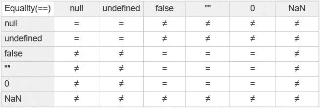

# 零/假/空/空对成功的力量。

> 原文：<https://medium.com/codex/the-power-of-zero-false-null-empty-on-success-4eef779df748?source=collection_archive---------4----------------------->

最近，我的论坛上有一个成员询问一些会话和表单处理代码，每当创建一个新的表单副本时，都会创建一个唯一的散列。这是一个很简单的问题，但是我越看越觉得老派的错误处理会/应该更健壮。我认为解释/分享这种方法可能对你们这些可能不会“思考”解决问题的人有用…