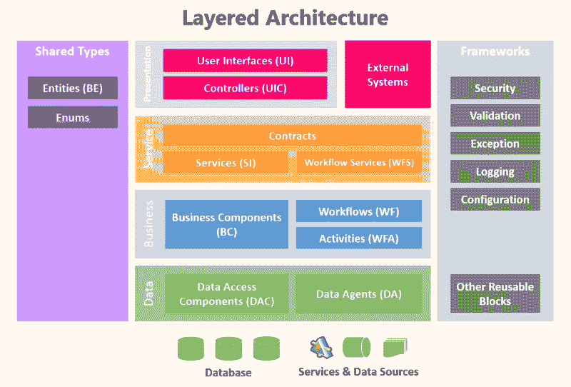
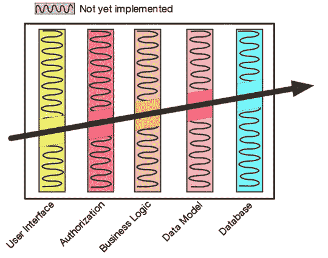

# 实用程序员 EP.3 —实用实践第二部分

> 原文：<https://medium.com/codex/the-pragmatic-programmer-ep-3-a-pragmatic-practice-part-ii-1193c5c3bfac?source=collection_archive---------15----------------------->

# 正交性

“正交性”这个词是从数学中借来的，意思是向量 u 和 v 形成一个直角。这两个合成向量永远不会相遇[ [维基百科](https://en.wikipedia.org/wiki/Orthogonality#:~:text=In%20mathematics%2C%20orthogonality%20is%20the,contain%20nonzero%20self%2Dorthogonal%20vectors.) ]。这个词变成了一个编程词，意思是如果我们改变一件事情，系统中的其他事情不会受到影响。

## 为什么我们的系统应该具有正交性

**获得生产力:** 1。工程师将很容易阅读代码，解决问题，并增强系统。
2。这种方法鼓励重用函数。职能导致单一责任。所以，再造是容易的。

**降低风险:** 1。因为代码的每一部分都是孤立的。在一个模块被感染的情况下，其他模块不会受到影响。
2。代码的任何修正或更改都将局限于特定的领域。其他模块可以继续工作。
3。我们不会被特定的供应商或工具所束缚。它很容易插入任何新产品。

正如我们所熟悉的，我们通过分层来设计系统。然后，我们可以轻松地改变任何事情，而不会在系统中发生任何地震。例如，我们可以改变用户界面(UI)而不改变数据库。然而，正交系统也允许测试人员和开发人员通过端到端测试轻松地编写和执行单元测试，因为一个模块仅限于一个目的。不仅源代码应该是正交的，文档也应该是正交的。编程文档的格式应该可以根据工具进行查看，例如 Markdown(.md)文件。

图片来自 [Pinterest](https://www.pinterest.com/)

## 产生正交系统的技巧

1.  一种功能，一种责任
2.  远离全局变量:有一天，我们的系统可能会发展到处理多线程系统。那些声明的全局变量将直接影响到不能正确工作。自系统启动以来，全局变量允许存储不变的值。单例模式是处理这一问题的有效方法。让我们在下一集继续探讨这个问题。
3.  避免类似的功能:这些问题会导致代码重复，这是结构性问题。

# 可逆性

构建可逆系统需要产生解耦模块和架构。它让我们的系统容易改变。这意味着如果你一直依赖于一个事实，就很有可能发生变化。改变需要付出高昂的代价才能撤销。所以，即使你的客户这么说，也不要做最后的决定。提醒自己，任何东西都可以在任何时候改变，比如需求、工具等等。

# 曳光弹

士兵使用曳光弹来提高命中目标的精度。子弹有规律地装入枪中。当士兵扣动扳机时，曳光弹由磷点火推出。如果示踪剂击中目标，普通子弹也会击中。

这个术语变成了一种实用技术，意思是从实际情况中获得实时反馈。当我们想要构建一个我们从未见过、从未做过、甚至不知道幕帘目标的系统时，就会用到这种技术。然后，它让我们立即得到反馈。叫做*曳光弹研制*。

这种技术只是在每一层中只实现所需的模块，以便只让您的目标工作，而不使用的功能将在后面实现，如下所示。

图片来自[奥赖利](https://learning.oreilly.com/api/v2/epubs/urn:orm:book:9780135956977/files/images/layer-diagram-tracer.png)

不出所料，这种实现风格为项目从未结束的想法增加了更多空间。因此，它可以改变或添加任何功能。此外，每个实施周期都不能保证第一次就能成功。

不要混淆曳光弹开发和原型开发。原型是一种概念，即在特定的点上创建要研究的东西，并在找到答案后丢弃它并重建它，而 tracer bullet 实现风格将只编码需求，并在获得反馈后一次又一次地提炼它们，而不是丢弃它。

# 原型

原型是一种实现产品的方法，以最简单、最快速、成本最低的方式来测试**一个项目的一个或多个特定方面**。原型也帮助你澄清一些你怀疑的事情。因此，在原型中，你可以忽略其他与你想知道的无关的东西，例如，正确性、完整性、健壮性、实现方式等等。

Senne Hoekman 拍摄的照片

# 特定领域语言

> 特定领域语言(DSL)是专注于特定领域的表达能力有限的计算机编程语言。[ [维基百科](https://en.wikipedia.org/wiki/Domain-specific_language) ]

外部 DSL 是一种完全独立的语言，它被解析成宿主语言可以理解的数据，而内部 DSL 是作为库在宿主语言中实现的。这意味着内部 DSL 受到主机语言能力的限制。 [*Rspec*](https://rspec.info/) 和 [*Cucumber*](https://cucumber.io/) 是 DSL 话题下的典型讨论和比较，因为 Rspec 和 Cucumber 分别是内部 DSL 和外部 DSL。

作者的建议是“*不要花的力气比你攒的多”。所以，你应该权衡花费的时间和你将得到的。一般来说，你应该选择外部 DSL，如 YAML、JSON、CSV 等。如果不是，*你应该考虑内部 DSL 而不是*。*

照片由[小野幸树](https://www.pexels.com/@ono-kosuki/)拍摄

# 估计

如果你被要求评估某事，他寻求的是高精度的评估。指的是估算的单位。这是指估算单位。如果您评估您将花费 250 天，并且您传达了“大约 8 个月”。你的目标受众会意识到可能是 7 到 9 个月。虽然 250 天意味着 7-9 个月，但事实上，250 天比以月为单位的估计更准确。

**如何估算**

估计你要用多长时间或要花多少钱的最简单的方法是向有经验的人请教。如果没有，请尝试以下步骤

1.  理解提问者的需求
2.  建立一个模型
3.  将模型提取为组件
4.  找出对我们的系统有重大影响的因素
5.  计算答案

请注意，在现实生活中，你应该在限定的条件下回答问题。例如，如果用户访问每分钟不超过 100，000，系统将消耗 100 Mbps 的带宽。

感谢《实用编程》这本书提供了以上知识，如果您有兴趣阅读这本书，请点击[此处](https://learning.oreilly.com/library/view/the-pragmatic-programmer/9780135956977/)了解更多详情。