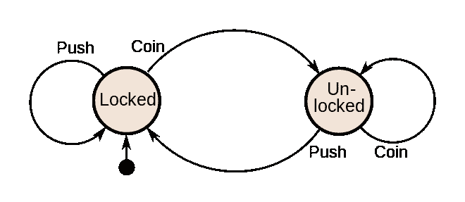
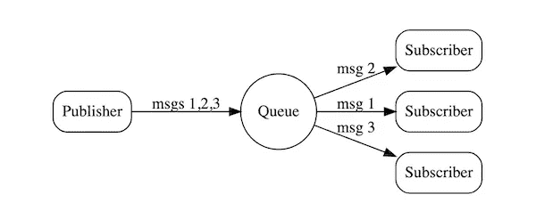

# 实用程序员 EP.6 —升级您的应用程序

> 原文：<https://medium.com/codex/the-pragmatic-programmer-ep-6-upgrading-your-application-9c1f55e81d8d?source=collection_archive---------7----------------------->

解耦网络由[布雷特·赛勒斯](https://www.pexels.com/@brett-sayles/)

# 退耦

设计软件时，由于各种因素，如需求变化、添加的功能等，很有可能发生变化。所以，我们需要软件的灵活性。作者说

> 更糟糕的是，耦合是传递的:如果 A 耦合到 B 和 C，B 耦合到 M 和 N，C 耦合到 X 和 Y，那么 A 实际上耦合到 B，C，M，N，X 和 Y。
> 
> 这意味着你应该遵循一个简单的原则:
> 
> 解耦的代码更容易更改— [务实的程序员](https://learning.oreilly.com/library/view/the-pragmatic-programmer/9780135956977/f_0049.xhtml#coupling)

耦合软件的特点是:

*   导入一些与您的代码无关的库
*   改变一些东西会影响或破坏不相关的东西
*   开发人员害怕做出改变，因为他们不确定什么会受到影响。
*   集思广益，让所有团队成员找到解决方案，因为没有人肯定知道这些。

这些可能会导致以下代码行为:

**连锁呼叫**

你可能会看到这样的代码:总是调用一个链式函数来得到你想要的。

感谢[务实的程序员](https://learning.oreilly.com/library/view/the-pragmatic-programmer/9780135956977/f_0049.xhtml#coupling)给出了这个例子

但是，作为务实的程序员，我们相信

> 告诉，不要问— [务实的程序员](https://learning.oreilly.com/library/view/the-pragmatic-programmer/9780135956977/f_0049.xhtml#coupling)

这意味着函数应该返回结果，不要为结果询问或调用函数，就像这样:

感谢[务实的程序员](https://learning.oreilly.com/library/view/the-pragmatic-programmer/9780135956977/f_0049.xhtml#coupling)给出了这个例子

**全局数据**

由于每个函数的可访问性，改变全局数据总是会影响所有这些函数。因此，避免建立全局数据。记住，我们讨论的是全局数据，不是全局变量。让我们想象一下，当我们在全局变量中存储数据时，一旦您的业务团队决定在线程中调用您的服务，或者您的应用程序一次被多个请求调用。当线程 1 在应用程序中存储值时，线程 2 被触发并用新数据替换它们。之后，当线程 1 试图访问它们的数据时会发生什么？因此，如果你有足够的理由创建全局数据，别忘了把它包装成一个 API。

**继承**

您可能会惊讶地发现，继承可能是代码耦合的原因之一。这是因为继承的类总是依赖于它们的父类。如果它们的父类改变了一个类结构，子类总是会受到影响，而不会有任何警告。它可能在运行时被破坏。我们将在下一节再次讨论这一点。

# 在现实世界中变戏法

近几十年来，一个*事件*产生的数据最终成为大数据。因此，我们可以将其分为四类，以使您的应用程序达到高生产率。

**有限状态机**

状态机是处理事件的基本概念。这个概念由一组状态组成，其中之一是*当前状态*。对于每个状态，达到定义标准的唯一事件可以前进到下一个状态。

图由[维基百科](https://en.wikipedia.org/wiki/Finite-state_machine)

转到开发部分，有一个可用的库来实现有限状态机，例如， [XState](https://xstate.js.org/docs/) 。你可能会发现自己每天都在写一个 FSM，因为它只是一个简单的想法。

**观察者模式**

这个模式有一个被称为*可观察对象*的事件源和一个对这些事件感兴趣的被称为*观察者*的客户端列表。

如今我们可以普遍看到这种模式，一个*观察者*记录感兴趣的*可观察的*。当事件发生时，*可观测的*列出所有寄存器，并调用它们中的每一个来传递商定的值。请参见下面的示例:

> 然而，观察者模式有一个问题:因为每个观察者都必须向可观察对象注册，这就引入了耦合。此外，因为在典型的实现中，回调是由可观察对象同步内联处理的，所以这可能会引入性能瓶颈。— [务实的程序员](https://learning.oreilly.com/library/view/the-pragmatic-programmer/9780135956977/f_0050.xhtml#event)

因此，作者提出了下一个可以解决这个问题的策略，称为发布-订阅(pubsub)。

**发布-订阅(发布-订阅)**

发布-订阅或发布-订阅可以解决观察者模式面临的代码解耦和性能瓶颈问题。

在发布-订阅模式中，*订阅者必须通过单独实现到指定域的通道订阅*发布者。有时，他们的背景可能由相同的流程和基础设施提供，也可能不是。与观察者模式不同，它将所有事物集中到一个通道中。这就是为什么 pub-sub 可以解决观察者模式。这意味着用户必须独立订阅每个频道。

> Pubsub 是一种很好的技术，用于分离异步事件的处理。它允许在应用程序运行时添加和替换代码，而不改变现有的代码。缺点是很难看到大量使用 pubsub 的系统中发生了什么——务实的程序员

由[Luc judge 绘制的图表](https://itnext.io/getting-started-with-nats-b752cbb17f74)

**反应式编程和流**

*反应式编程*的概念是，一旦我们将一个公式分配给一个引用另一个单元格的单元格，被引用的单元格就会用新值更新，然后 referrer 单元格提示会更新其值。例如， [Google Sheet](https://www.google.com/sheets/about/) 中的电子表格。

很明显，所有事件都可以用来触发反应，但是实时更新并不容易。这就是为什么*流*进入这种模式。

图片来自 [Thenextweb](https://thenextweb.com/news/holy-sheet-how-to-embed-data-from-one-google-sheet-in-another)

# 转换编程

所有的应用都有一个共同的目标，那就是把输入转换成输出。对于大部分的设计部分，我们侧重于建筑和结构设计。除此之外，我们还担心数据结构和算法、语言和框架。我们很少考虑创造转变。让我们看看这个命令的例子，并一步一步地思考它是如何工作的。

感谢[务实的程序员](https://learning.oreilly.com/library/view/the-pragmatic-programmer/9780135956977/f_0051.xhtml#function_pipelines)给出了这个例子

结果如下:

第一—列出所有文件
第二—计算行号
第三—按编号
排序最后—仅 grep 最高的 5 条记录

定位转换的最简单的方法是从需求开始，并确定它的输入和输出。

> 编程是关于代码的，但是程序是关于数据的
> 
> 将代码视为一系列(嵌套的)转换可能是一种解放性的编程方法。这需要一段时间来适应，但是一旦你养成了这个习惯，你会发现你的代码变得更干净，你的功能更短，你的设计更扁平。— [务实的程序员](https://learning.oreilly.com/library/view/the-pragmatic-programmer/9780135956977/f_0051.xhtml#function_pipelines)

# 遗产税

让我们回到继承，继承是面向对象编程(OOP)的一个概念

> 允许程序员创建基于现有类的类，指定新的实现，同时保持相同的行为([实现接口](https://en.wikipedia.org/wiki/Class_diagram#Realization/Implementation))，重用代码，并通过公共类和[接口](https://en.wikipedia.org/wiki/Interface_(object-oriented_programming)) [ [维基百科:继承](https://en.wikipedia.org/wiki/Inheritance_(object-oriented_programming)#:~:text=Inheritance%20allows%20programmers%20to%20create,via%20public%20classes%20and%20interfaces.))独立扩展原始软件。

非正式的话，一个现有的类叫做“父类”，一个继承的类叫做“子类”。正如我在上一节解耦中所说的，继承伴随着代码解耦而来。因为这个概念允许在父类和子类之间共享代码。想想当父类在不改变函数名的情况下改变方法中的逻辑。在某些情况下，好消息是开发者打算改变所有的父类和子类。但是，在现实世界中，开发人员可能不知道哪些函数正在使用这个类。其他使用该类但不需要改变该方法逻辑的函数也受到了影响。因此，在最糟糕的情况下，应用程序可能会响应不正确或崩溃。

要解决这个问题，请应用以下方法:

**接口和协议**

在 Java 中，接口概念允许开发人员在没有实现的情况下声明方法名和参数。这个类的继承类被强制实现那些声明的方法。所以，当父类的方法名被改变时，所有的子类都会被强制修改。

**代表团**

作者说，

> 如果一个父类有 20 个方法，而子类只希望使用其中的两个，那么它的对象仍然有另外 18 个方法可以调用。该类失去了对其接口的控制。这是一个常见的问题— [务实的程序员](https://learning.oreilly.com/library/view/the-pragmatic-programmer/9780135956977/f_0052.xhtml#inheritance_tax)

是时候委托给持久性类的 API 了，例如:

**混血儿和特质**

作者提到 mixins 是为了用一个简单的概念来解决这个问题，即

> 我们希望能够在不使用继承的情况下用新功能扩展类和对象。所以我们创建了一组这样的函数，给这个函数命名，然后用它们来扩展一个类或对象。此时，您已经创建了一个新的类或对象，它结合了原始类及其所有 mixins 的功能。在大多数情况下，即使您无法访问要扩展的类的源代码，您也可以进行这种扩展。——[务实的程序员](https://learning.oreilly.com/library/view/the-pragmatic-programmer/9780135956977/f_0052.xhtml#inheritance_tax)

下面是一个应用混合的例子

感谢[务实的程序员](https://learning.oreilly.com/library/view/the-pragmatic-programmer/9780135956977/f_0052.xhtml#inheritance_tax)给出了这个例子

# 配置

如果您熟悉应用程序中的配置，这意味着您将所有可能在不同环境中发生变化的东西都放入了配置中。必应加油！你已经通过了这次测试。将这些值保存在外部使得配置应用程序变得容易，例如，数据库凭证、端口、路径、URL、外部参数(例如利率)、许可证密钥等等。不仅让您的生活轻松部署，也让您的配置安全。

请注意，上面显示的所有示例都是示例，只是为了强调对概念的理解。它可能被简化理解，而不是正确的语言语法。

感谢《实用编程》这本书提供了以上知识，如果你有兴趣阅读这本书，点击[这里](https://learning.oreilly.com/library/view/the-pragmatic-programmer/9780135956977/)了解更多详情。