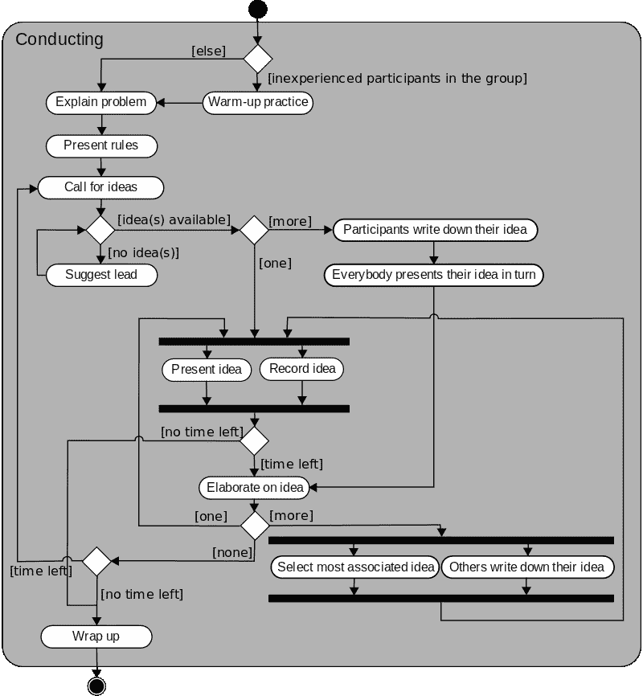

# 实用程序员 EP.7 —并发性

> 原文：<https://medium.com/codex/the-pragmatic-programmer-ep-7-concurrency-1fc96645506b?source=collection_archive---------14----------------------->

先说并发和并行的含义。

> *并发*是指两段或多段代码的执行就像它们同时运行一样。*并行*是当他们*做*的同时运行。
> 
> 为了实现并发，您需要在一个环境中运行代码，该环境可以在运行时在代码的不同部分之间切换执行。这通常是使用纤程、线程和进程等东西来实现的。
> 
> 要实现并行，您需要能够同时做两件事的硬件。这可能是一个 CPU 中的多个内核，一台计算机中的多个 CPU，或者连接在一起的多台计算机。— [务实的程序员](https://learning.oreilly.com/library/view/the-pragmatic-programmer/9780135956977/f_0054.xhtml)

# 转换为并发流程

并发问题的一个常见原因是顺序设计；做这件事然后*总是*做那件事。相反，为了减少应用程序的执行时间，通过记住代码是解耦的——没有依赖性——来允许应用程序并发。然后，回顾并分析你的**活动图**是否能同时执行什么。

> 活动图由一组绘制成圆形方框的动作组成。离开一个动作的箭头要么指向另一个动作(一旦第一个动作完成就可以开始)，要么指向一条称为 ***同步条*** 的粗线。一旦*进入同步栏的所有*动作完成，你就可以沿着离开同步栏的任何箭头继续前进。— [务实的程序员](https://learning.oreilly.com/library/view/the-pragmatic-programmer/9780135956977/f_0056.xhtml#:-:text=An%20activity%20diagram%20)

感谢[维基百科](https://en.wikipedia.org/wiki/Activity_diagram)

在分析之后，我们将看到并发性使您的应用程序更高效的机会。然后，排比也进来了。请记住，并行与硬件有关。如果我们有多个处理器，那么我们可以拆分任务，这样可以减少总的花费时间。

# 信号灯

如果你去百货商店买一双新鞋。你订购了一款白杨尺码为 8 号的运动鞋的特别版，一名售货员承认有现货，而在商店的另一边，一名顾客订购了同样规格的鞋子。不幸的是，在那个时候，只有 1 双鞋可用。结果是只有一个顾客能得到这双鞋。对方可能很不满意。

问题在于共享状态。每个销售人员都检查同一产品的可用性，而不考虑其他产品。当可售鞋子的数量改变时，在销售点向其中一个售货员显示的数量现在就过时了。

> 这里的问题不是两个进程可以写入同一个内存。问题是两个进程都不能保证它对内存的看法是一致的。— [务实的程序员](https://learning.oreilly.com/library/view/the-pragmatic-programmer/9780135956977/f_0057.xhtml#:-:text=The%20problem%20here%20is%20not%20t,that%20memory%20is%20consistent)

为了提高效率，让我们在应用程序中应用一个**信号量**。

> 信号量是一个简单的概念，允许一次只有一个人可以拥有一个特定的东西。因此，创建它并使用它来控制资源。

对于鞋店，我们应该创建一个信号量来控制对鞋子信息的访问，并更新鞋子的数量。任何想这么做的人，只要拿着旗语。例如，它通常被命名为锁定/解锁或要求/释放，

把保护鞋子的责任委托给穿鞋子的人并不是一个好主意。让我们像这样集中控制:

让我们看看信号量在哪里被锁定和解锁，无论你是否能得到鞋子，不要忘记在锁定后解锁信号量。正如你所看到的代码，我把信号量解锁放在*确保*语句下(第 13 行)。

## 多资源处理

在这种情况下，售货员应该给你一双用袋子包好的鞋子。因此，流程应该是拿走鞋子，然后分配一个袋子来装鞋子。我们的代码是:

一些语言可能会提供一个 *protect* 特性来处理这个问题，如下所示:

以上代码可以工作，但是，很多时候，当一双鞋可用，但包它没有。这就让售货员把鞋子退给了存货。务实的解决方案是，我们应该创建一个新的模块来处理鞋和包，而不是鞋的责任或包组件的责任。这个新模块将告诉销售人员是成功还是失败。此外，如果您想为每个产品都提供袋子，您可能需要创建一个通用组件来获得带有袋子的产品。

## 并发更新

当超过 1 个实例试图同时访问相同的资源时，出现问题的风险很高。例如，当进程 1 在应用程序中存储值时，进程 2 被触发并用新数据替换它们。这就引出了一个调查应用程序症状的技巧

> 随机故障通常是并发问题— [务实的程序员](https://learning.oreilly.com/library/view/the-pragmatic-programmer/9780135956977/f_0057.xhtml#:-:text=Random%20Failures%20Are%20Often,%20Concurrency%20Issues)

# 参与者和流程

让我们看看书中对参与者和过程的定义。

> 一个*角色*是一个独立的虚拟处理器，有自己的本地(和私有)状态。每个演员都有一个邮箱。当一条消息出现在邮箱中，而演员空闲时，它就开始工作并处理这条消息。当它完成处理后，它会处理邮箱中的另一封邮件，或者，如果邮箱是空的，它会继续休眠。
> 
> 一个*进程*通常是一个更通用的虚拟处理器，通常由操作系统实现以促进并发性。流程可以(按照惯例)被约束为像演员一样的行为——务实的程序员

作者建议让 actors 实现无共享的并发。当有足够多的处理器来运行并发时，您应该在其上运行 actor，因为每个 actor 中的代码都是相同的，您不需要添加额外的代码来处理并发。

总体流程如下:

*   一位顾客想要一双新鞋。
*   一位顾客向售货员要一双特定规格的鞋子。
*   销售员检查股票的余额。
*   如果有一双鞋子，系统会给顾客，并通知售货员将其添加到账单中。
*   如果没有合适的鞋子，系统会告诉售货员，让售货员向顾客道歉。

如果我们实现前面的例子——鞋店——并启动服务。考虑到并发性，我们会看到下面的对话。

# 黑板

照片由 [cottonbro](https://www.pexels.com/photo/man-wearing-a-gray-suit-8369518/) 拍摄

作者提到了一种调查并发问题的黑板方法，例如当侦探试图解决一个案件时，黑板的特征是:

*   侦探们不需要知道彼此在做什么，只需要把他得到的信息添加到黑板上。
*   每个侦探成员的基础知识可能是不同的。他们可能受到不同学科的训练。
*   团队成员可能不在同一个地方工作，甚至他们不经历相同的过程。
*   黑板上可以放什么没有限制。它可以是照片、软文件、句子等等。

这种方法允许团队成员在不同的州和位置达到相同的目标。有些人忙于收集数据，而另一些人则在认真整理手头的数据。最终，他们把注意力集中在案件的结论上。

转到《实用程序员》中的动作，我们在编写应用程序时使用黑板方法来研究问题。所以，我们的黑板转向这些特征:

*   问题证据(响应)可以以任何顺序到达。
*   所有信息将由来自不同地点和不同时区的不同人员收集。
*   一些数据可以由自动系统获取。
*   任何新的信息都可能导致新的问题，并需要额外的支持信息。

请注意，数据检索的顺序并不重要。此外，反馈可以显示在你的申请，它可以导致新的适用规则。

> 消息系统可以像黑板一样——务实的程序员

服务和事件日志之间的消息可以放在我们的黑板上。两者都可以通过系统或者平台来收集，比如卡夫卡。这些可以消除潜在的应用程序并发问题。实际上，它伴随着项目费用。因此，尝试集中资源来处理它们，并创建唯一的 *trace-id* 来跟踪不同 API 或系统中的流程。

请注意，上面显示的所有示例都是示例，只是为了强调对概念的理解。它可能被简化理解，而不是正确的语言语法。

感谢《实用编程》这本书提供了以上知识，如果你有兴趣阅读这本书，点击[这里](https://learning.oreilly.com/library/view/the-pragmatic-programmer/9780135956977/)了解更多详情。