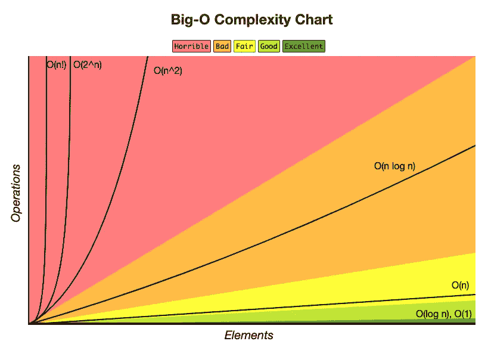

# 实用程序员 EP . 8——编码过程中的事情

> 原文：<https://medium.com/codex/the-pragmatic-programmer-ep-8-things-during-coding-6bcd344e4ff2?source=collection_archive---------7----------------------->

这一集将指导你在编码时应该关注哪些因素或事情。

# 处理你的潜意识

当你目睹某事或面对某种情况时，你可能会变得不受控制。因为这是你的本能，是你通过反复学习获得的，或是与生俱来的。作为一名程序员，当你写程序的时候，你害怕任何事情，例如，**每当你执行查询语句**的时候，你都会害怕。你的大脑通常试图告诉你一些事情。你应该找出你为什么会有这种感觉，并通过以下步骤找到解决办法:

1.  找到恐惧的根源:有两个问题。其中之一是你的大脑作为一个开发者，在试图判断它是否有效。因为你经历过。另一个问题是你害怕犯错。
2.  倾听自己:你的大脑通过阅读所有可读的回答，例如，错误的陈述，或错误的逻辑编程，来唤起注意力，以找到问题的根源。您应该后退一步，阅读您正在编写的代码，不管它是否符合业务逻辑。
3.  与你的大脑交谈:因为你不能直接控制你的大脑，与他们交谈的最简单的方法是通过短暂休息、与队友聊天或散步来让他们休息一会儿。
4.  重启一切:我们应该认为这只是一个游戏，不要太当真。当你被一段代码卡住时，你就把它藏起来，开始做原型。这是一个原型，这意味着它可能会失败并被丢弃。然后，创建注释来概述您将执行的步骤。你可以继续编码，直到你对你的代码满意或者你的实验工作正常。那时，你可能会丢弃你的原型，从干净的代码开始。

除此之外，你可能会被分配到现有的代码上工作。您可能会遇到奇怪的编码风格或模式。这是获得新知识的一种方式。记下它，并在合适的时候应用它。

如果你在培养业务团队时感觉有什么不对劲，或者某个要求让你觉得不清楚或难以实现，停下来评估你的感受。大声表达你的想法。相信你的直觉，不要让问题找上你。可能很难解决。

# 巧合编程

巧合的编程是当你写代码时，它似乎通过给定的*有限* *测试*而工作。但是，实际上，它可能会在其他情况下失败。例如，在不同环境中的一个应用程序现在工作正常，但是它只是重合，某一天可能出现错误。

意外实现随时随地都有可能发生。这是一个你可能没有被设计去做的例行程序，但是它似乎*有效。*

为了防止编程的巧合，你应该依赖于记录需求文档。如果没有，你应该尽可能地在文件上签名。而且，重要的是通过全面的测试案例来证明它，而不是想象。

## 如何无巧合地编程

*   意识到你在做什么。
*   只有在你理解清楚的情况下，在开始编码之前收集所有核心逻辑(可以毫无疑问地解释一切)。
*   使用你完全了解的技术或工具，因为你知道是什么导致它失败。
*   计划，并遵循计划。
*   不要依赖任何模糊的概念或假设。
*   记录应用程序的假设和限制。
*   通过断言在代码中测试业务逻辑，可能是在单元测试中。
*   优先考虑你的努力。花时间在重要的方面。
*   不要害怕修改不正确的现有代码。遗产并不总是神圣的。

所以，下一次有些事情看起来可行，但是你不知道为什么，确保这不仅仅是一个巧合。

# 算法速度

在开发代码时，您应该关注代码的执行速度或资源消耗。这就是为什么你应该知道如何评估你的算法的速度。**大 O 符号**在计算机科学中用于评估算法速度。

> ***大 O 符号*** *是一种数学符号，描述当自变量趋向某一特定值或无穷大时函数的极限行为—* [*维基百科*](https://en.wikipedia.org/wiki/Big_O_notation)

符号由表示

`**O(...) where n is the size of records for a particular routine**`

它使用来表示取决于输入大小的可能次数的上限。与 *n* 相关的最高项将得到关注，而其他项将被丢弃。所以，我们可以得出结论

**O(2n +100n)** 与**相同 O(2n )** 与 **O(n )** 相同

事实上，具有 O(n)的算法-1 可能比具有 O(n)的算法-2 更快，但是我们忽略它，因为大 O 符号不会告诉你实际的次数，但是*它只告诉我们当我们改变输入的次数时，这些值将如何变化。*

感谢[BigOCheatSheet.com](https://www.bigocheatsheet.com/)

如您所见，可能的符号是

> ***O(1)*** *:常量(访问数组中的元素，简单语句)*
> 
> ***O(log(n))****:对数(二分搜索法)。对数的底数无关紧要，所以这是等价的。*
> 
> ***【O(n)****:线性(顺序搜索)*
> 
> ***O(n log(n)):*** *比线性差，但差不了多少。(快速排序的平均运行时间，堆排序)*
> 
> ***O(n )*** *:平方律(选择和插入排序)*
> 
> **:立方(两个 n×n 矩阵相乘)**
> 
> ****【o(c^n】)****:指数(旅行商问题，集合划分)——*[*务实的程序员*](https://learning.oreilly.com/library/view/the-pragmatic-programmer/9780135956977/f_0063.xhtml#:-:text=%20an%20example)*

*转到您的代码，您可以通过这个例程来评估您的代码*

***O(n)** 简单循环:访问 element-1 直到 element-*n* **O(*m*x*n*)**嵌套循环:在另一个循环中循环，其中循环有 *m* 和 *n* 元素。
**O(log *n* )** 二进制斩:递归分析一个输入的一半
**O(*n*log*n*)**分而治之:将输入分成更小的部分，递归确定那个输入，最后组合出最终答案。
**O(n！)** combinatoric:任何一种通过 n，n-1，n-2，n-3，…，1 次访问一个输入的算法*

*意识到算法，你通过估计你的算法速度来写代码。让我们让[代码剖析器](https://en.wikipedia.org/wiki/Profiling_(computer_programming))来帮助你。*

# *重构*

*你的代码随时间变化是中性的。这是代码进化。*

> *重写、返工和重新架构代码统称为重构。但是有一部分活动已经被实践为 ***重构****
> 
> ****重构*** *被马丁·福勒定义为:**
> 
> **重组现有代码体的规范技术，在不改变其外部行为的情况下改变其内部结构。——*[*务实的程序员*](https://learning.oreilly.com/library/view/the-pragmatic-programmer/9780135956977/f_0064.xhtml#:-:text=The%20gardening%20metaphor%20is,d%20to%20be%20weeded%20or%20pruned.)*

*重构是一项小任务。它将在一天内完成。在开始重构之前，单元测试是最重要的事情。每个函数或重构目标都需要单元测试，以保证您的代码在重构后继续正常执行。*

*下一个问题是我们应该多久重构一次。答案往往是尽你所能。如果您发现您的代码在其他地方重复了，知识过时了，需求已经改变了，需要在其他地方使用，需要提高系统性能，甚至需要添加一小段代码来编写更多的测试用例，您可以随时重构它们。然而，本书的作者建议，重构时必须完成以下三件事:*

> **1。不要试图在重构的同时增加功能。**
> 
> **2。在开始重构之前，确保你有好的测试。**
> 
> **3。采取简短、谨慎的步骤—* [*务实的程序员*](https://learning.oreilly.com/library/view/the-pragmatic-programmer/9780135956977/f_0064.xhtml#:-:text=Clearly%2C)*

# *通过测试编码*

*测试是确认和验证软件在特定环境下工作的过程。然而，测试的关键优势不仅仅在于执行时间，还在于我们如何看待测试。*

*如果我们一直在思考测试，我们会考虑如何设计一个可测试代码的软件结构，我们应该测试什么，我们如何测试，等等。这是一个众所周知的激励我们用测试编码的工具。*

## *测试驱动开发(TDD)*

*使用一个简单的循环，TDD 迫使我们在开始编码之前考虑测试:*

1.  *想象一个你想要实现的功能。*
2.  *创建一个测试来指定函数的期望值。*
3.  *运行所有测试。您将看到只有一个测试失败了，那就是您刚刚编写的函数。*
4.  *尽可能实现最小的代码片段来通过测试。*
5.  *再次运行所有测试，以验证它们是否通过。*
6.  *重构以改进您的代码。*

*只需重复上述步骤，直到您的应用满足所有要求(参见[契约设计](/codex/the-pragmatic-programmer-ep-5-imperfect-software-ea2239dfd16f))。在这一点上，你会发现你的应用程序的所有部分都由测试用例来保证。在我们开始之前，我们应该知道我们应该往哪个方向走。不是自上而下或者自下而上，而是端到端。从简单的端到端开始。然后，将它们重组到适当的层中，并通过测试确认每个修改都通过了相同的逻辑。*

# *基于属性的测试*

*除了需求测试之外，基于属性的测试是你应该执行的，以给你的应用程序更多的*不变量*。一个突出的例子是通过长度和排序列表中每个元素的结果进行测试。*

*运行该测试后，您将看到:*

*在假设(hypo alias)的幕后，这个库帮助我们根据所选的数据类型随机选择 100 个输入。*

*因此，如果假设发现某个值破坏了您的功能，您应该将它包含在单元测试中。因为，在下一次运行测试的时候，库可能会也可能不会选择这个值。*

# *安全意识*

*编码时应考虑基本的安全性。我们可以简单地应用它，以便让您的应用程序安全和健康。*

1.  *最小化攻击面:应用程序越复杂，就越容易受到攻击。使减少危险漏洞变得简单。*
2.  *最低特权:如果有人要求，只允许最低授权。不要授予他们所有人管理员权限。*
3.  *安全默认值:保持应用程序的默认安全性，即使这很不舒服，例如，键入星号时隐藏密码。有些人可能希望看到它是正确的还是错误的。如果你在公共场所，它会保护你的密码不被窥探。*
4.  *加密敏感数据:绝对不要以纯文本形式留下敏感信息，如密码、国民身份证号码等。*
5.  *保持安全更新:始终保持所有工作电脑的安全补丁最新。如果过期了，可能会有危险。*

# *命名一切*

*在编程中，我们不可避免地要经常给变量、函数、包、文件等命名。因为我们努力找出重点是什么。*

> **名字深具意义这一观点背后是有科学依据的。事实证明，大脑阅读和理解单词的速度真的很快—* [*务实的程序员*](https://learning.oreilly.com/library/view/the-pragmatic-programmer/9780135956977/f_0068.xhtml#:-:text=It%20turns%20out%20that%20the%20bra,erstand%20words%20really%20fast)*

*例如，你应该通过`let seller = assign(role)`而不是`let user = assign(role)`显式声明一个变量。或者，定义一个类似于`def requestSummaryReport(Financial criteria)`而不是`def getData()`的函数。*

*然而，声明一个在特定语言文化中众所周知的变量是可以接受的，比如在 C 语言编程中为循环增量变量声明 **i，j，k** 。*

*最关键的方面是一致性。所有队友都应该理解每个单词的意思，并在相同的上下文中使用它们。许多团队利用字典向团队列出特殊术语。*

*最后，仔细指定所有有意义的事物的名称，因为重命名会耗费大量精力来弄清楚它的真正含义。甚至很难。*

*请注意，上面显示的所有示例都是示例，只是为了强调对概念的理解。它可能被简化理解，而不是正确的语言语法。*

*感谢《实用编程》这本书提供了以上知识，如果你有兴趣阅读这本书，点击[这里](https://learning.oreilly.com/library/view/the-pragmatic-programmer/9780135956977/)了解更多详情。*