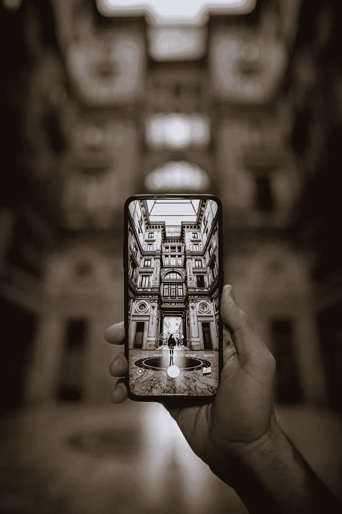

# 智能手机摄像头的隐私法

> 原文：<https://medium.com/codex/the-privacy-law-on-smartphone-camera-a1593033756d?source=collection_archive---------24----------------------->

## 当一加 8 Pro 相机可以看穿你的衣服

戴维·蒙涅在 [Unsplash](https://unsplash.com/photos/Oa87HmW6vds) 上的照片

M 你们中的大多数人一定都熟悉日本的法律，该法律禁止任何人在没有事先同意的情况下拍摄他人的照片。隐私法是日本 iPhone 没有静音拍照模式的原因。然而，目前还没有关于智能手机摄像头隐私保护的具体规定