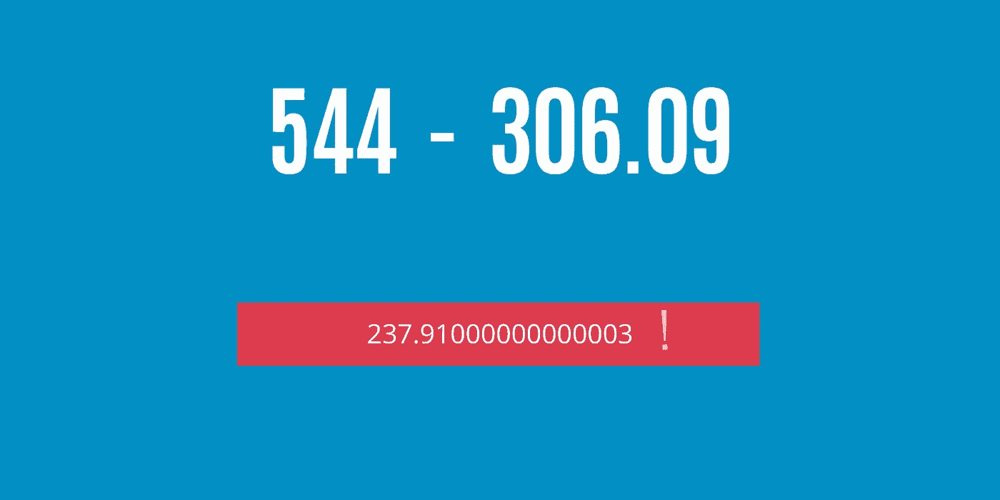

# JavaScript 中十进制减法的问题

> 原文：<https://medium.com/codex/the-problem-with-decimal-subtraction-in-javascript-788887c115f9?source=collection_archive---------2----------------------->

## [法典](http://medium.com/codex)

## 为什么 544-306.09 = 237.9000000000003？

JS 减法小数问题

如果你没有处理过**金融**数据，那么你永远不会知道小数的问题(这只是我的观点)。为什么？因为只有当我处理金融数据时，我才意识到小数的问题。金融数据大多有十进制的值**。当……**