# 未来的编程语言

> 原文：<https://medium.com/codex/the-programming-language-s-of-the-future-24af5cfa8479?source=collection_archive---------0----------------------->

我有一个 Quora 账户，我喜欢阅读编程相关的问题和答案。我同样建议你，因为你可以从其他程序员的经验中受益。然而，最近，我看到了这样的问题:

*   将取代 JavaScript 的技术是什么？
*   Kotlin 有机会取代 Java 吗？
*   Rust 会取代 C++吗？
*   在 D、Go 和 Rust 之间，哪种语言替代 C 的前景最光明？

我喜欢最后一个，特别是因为问这个问题的人非常肯定，他给出了可供选择的选项。我认为，自从学术论文*“跨编程语言的能效:能量、时间和内存如何相关”*发布以来，这类问题开始比以前更频繁地被问及。(如果你愿意，可以在这里阅读[的论文。)我认为所有这些问题都指向一个我们想知道答案的共同问题:未来的编程语言是什么？在本文中，通过使用给定论文的结果，并分析其他统计信息，我们将试图找到这个问题的答案。在我开始之前，我保证我会尽可能客观，因为我不想给你一个有偏见的结果。先说最近的现象，纸。](https://greenlab.di.uminho.pt/wp-content/uploads/2017/09/paperSLE.pdf)

# 报纸

如果你决定进一步阅读，我几乎可以肯定，你一定已经看到了下表:

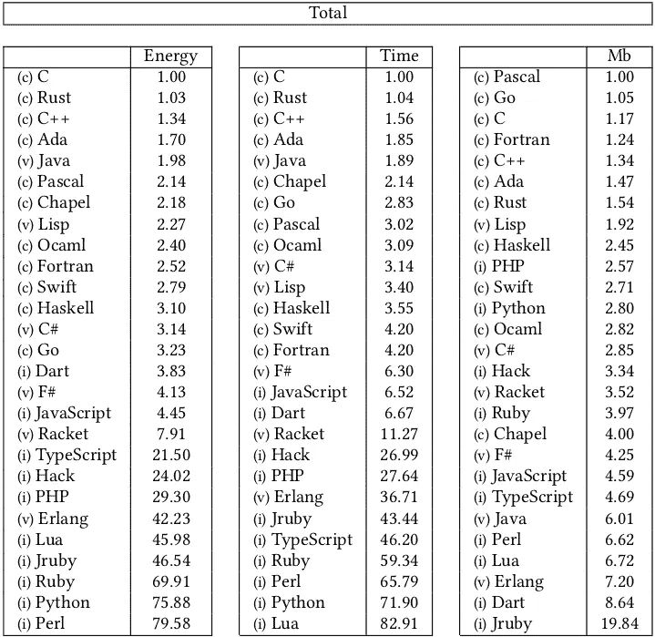

编程语言的比较，摘自相应的论文

这东西我看了太多次了。许多人在不同的社交媒体平台上分享了这个，并且知道几乎没有人不知道这个桌子。但是，在直接研究结果之前，我想分享一些初步的信息。

关于这些结果的第一个重要问题应该是如何测量这些结果。普遍接受的测量 CPU 性能的方法是基准测试。作者对编程语言做了同样的事情，他们考虑了用每种语言表达的 10 个不同的编程问题，遵循相同的算法，如在*计算机语言基准游戏*中定义的。下表给出了这些算法及其数据大小:

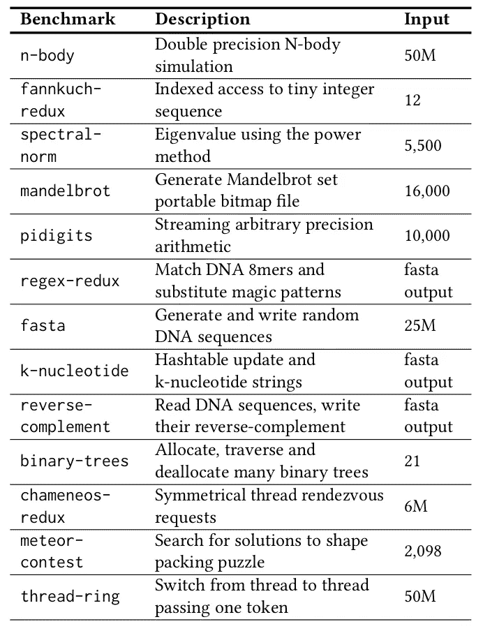

CLBG 程序语料库

此外，他们还根据编程语言的范例对编程语言进行了分类，如下表所示:

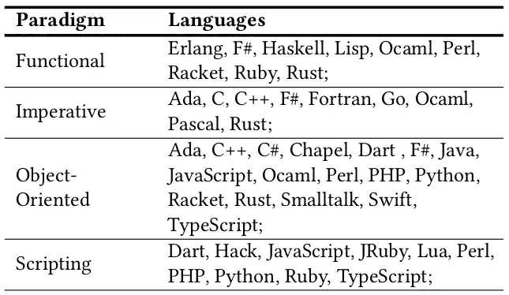

然而，范例对于性能测试并不重要。重要的是编程语言的类型:它是编译的、解释的还是用于虚拟机的？编译语言、虚拟机语言和解释语言在性能和能源使用上有明显的区别。因此，他们在班上测试这些算法，这是正确的做法。

下一步是执行 CLBG 测试。他们分享了几个问题的结果。让我们来看看它们。

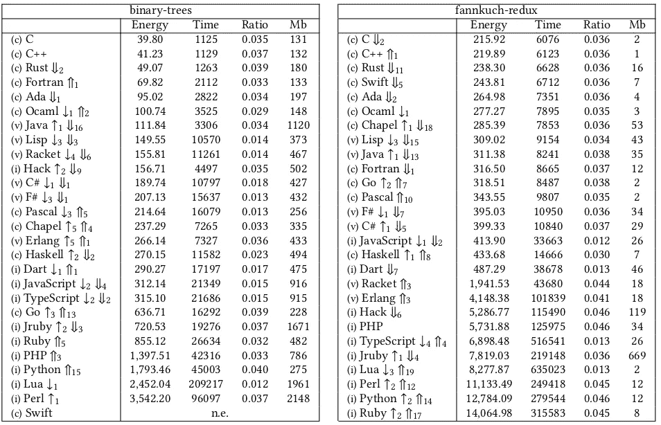

两个 CLBG 的结果

能量以焦耳为单位，时间以秒为单位。而比值就是能量和时间的比值，用来计算语言大概的功耗。此外，语言旁边还有上下箭头。如果我们对这个关于执行时间的表进行排序，只有一行的箭头显示了这种编程语言上升/下降了多少步。双线箭头是相同的，但顺序是根据峰值内存使用量来确定的。

当我看到我在社交媒体上分享的第一张表时，我认为执行时间的顺序也很重要，但它没有被分享。但是他们特别做了那个案子。根据我们对指标的了解，例如，对于二叉树 C，C++和 Rust 给出了最好的结果，但是从内存的角度来看，Rust 表现出稍差的性能。另一方面，同样适用于 fannkuch-redux 基准游戏中的 C。没有明显的区别。

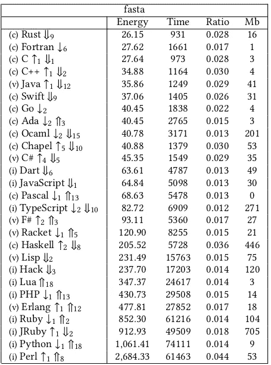

fasta CLBG 的结果

另一方面，fasta 基准测试游戏向我们展示了一个非常不同的表。表演越来越模糊。但这些都是个案特有的，所以我们可以分析其他结果。

我喜欢这篇论文的一点是，他们还比较了语言所属的类类型，所以你可以在它们的类中比较编译语言和解释语言。这三次测试的结果如下所示。

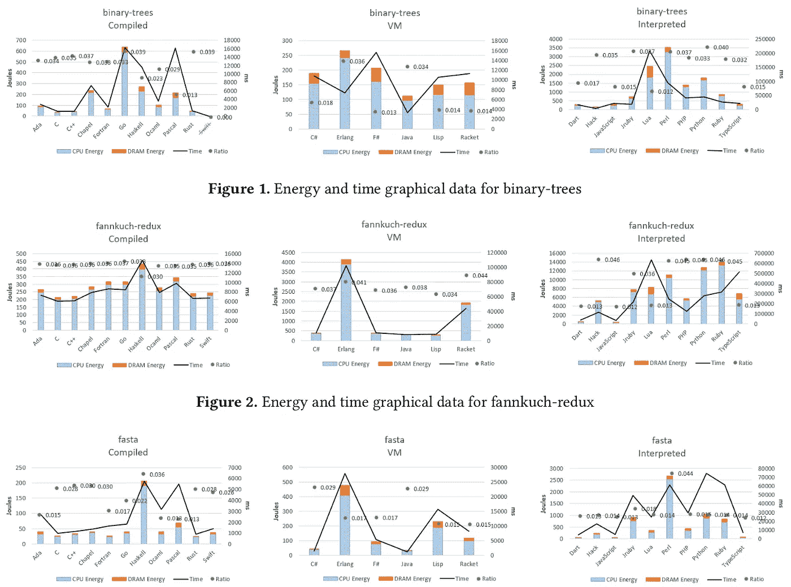

分类语言之间的度量比较

我不想给你更多与这篇论文相关的数据。如果你要检查，你有它的链接，你可以进一步阅读。但是，最终我们得出了下面给出的结果表，上面分享了:

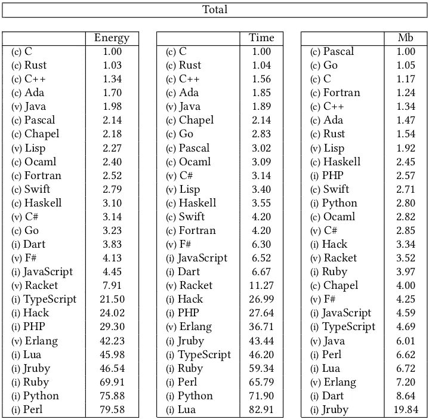

关于 CLBG 结果的编程语言的比较

最后，除了内存之外，C 语言似乎在能量和性能方面是最好的。但在记忆里，也还不错。Rust 和 C++如下。所以我们可以说 C 或者 Rust 会是最好的 cho…等一下！这些语言不支持面向对象的编程。(你可以认为 Rust 支持它，但它只支持接口(或 Rust 语言中的特征)，不支持 OOP 结构)。然而，在公司中，一般来说，我们使用 OOP 公司，易用性也很重要。C、C++和 Rust 并不那么容易，它们迫使你考虑对象生存期、动态分配等等。因此，我们也应该考虑这些类别。但即使只是在 3 个类别中，也有许多差异和模糊的决定。如果我们考虑易用性和实现结构的能力，结果会变得更加模糊。

到现在为止，我们学到了什么？我们比较了这些语言的能耗、内存需求和完成该过程所需的时间。然而，我们不能仅仅通过检查这些指标来决定哪种语言是最好的。然而，如果我们添加更多的度量标准，结果将变得太复杂，以至于无法决定是使用一种语言还是每种类型中的一种语言。

关于这一点，我想建议一个策略的改变:我们假设人是很有逻辑的。在经济学论文中，一般来说，研究人员假设这一点，尽管人类没有那么强的逻辑性。然而，让我们假设我们是非常有逻辑和挑剔的。那么，我们如何决定最好的语言呢？通过分析使用最多的编程语言的趋势。我们如何衡量呢？在网络空间中有许多代码，其中大部分保存在私人仓库中。我们可以检查一下搜索引擎的统计数据吗？因为我们知道所有的开发人员在面临软件问题时都会使用搜索引擎。我们继续吧。

# 谷歌统计

谷歌趋势工具对所有人开放。我用这个工具来获得关于编程语言的谷歌搜索统计数据，但有一个限制:你只能从 5 个关键词中获得数据。所以，我们先根据之前的结果和 Java，从最好的 3 种语言开始。

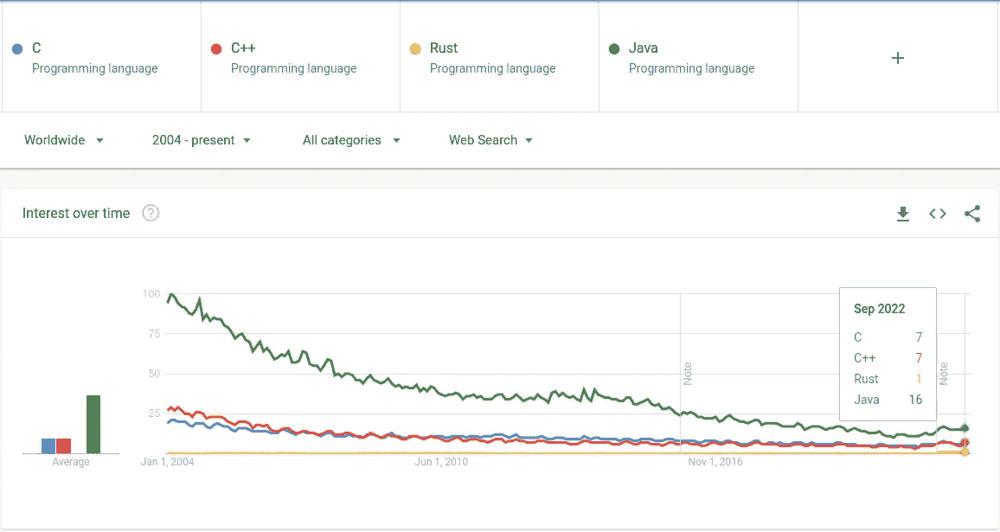

谷歌趋势自 2004 年以来的 C、C++、Rust 和 Java

看起来 Java 仍然比其他编译语言使用的多，尽管它已经明显减少了。C 和 C++非常接近。但是，生锈率很低。这可能是因为它是一种新的语言，但公平地说，Rust 相对于 C 和 C++来说是新的。然而，它在 2010 年 7 月发布。几乎 12 年过去了，从那时起，没有重大变化。这些统计数字的结果与我们以前得到的结果大不相同。让我们继续学习 Java，选择 4 种不同的语言:Kotlin、Javascript、Python 和 Go。

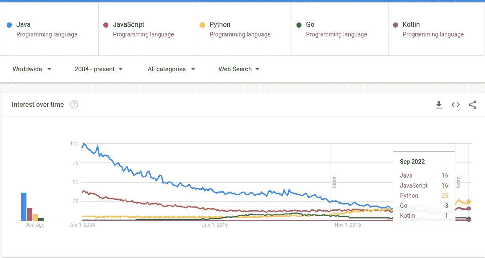

自 2004 年以来的 Java、JavaScript、Python、Go 和 Kotlin 的 Google 趋势

形势又变了，现在有了一个非常不同的趋势。Python 起步较低，但它现在是要求最高的语言。Java 和 JavaScript 在第二种。Python 现在是老大，但是我想再给一轮。

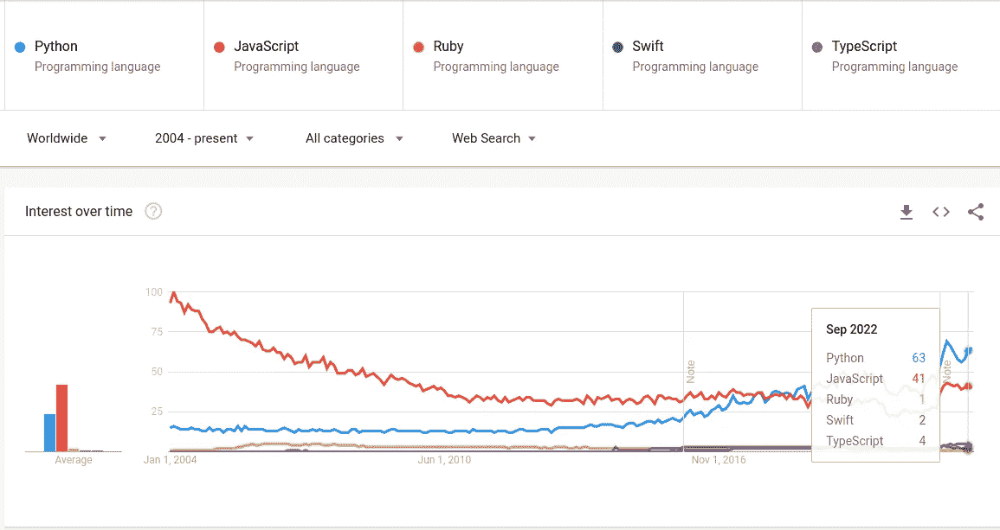

2004 年以来的 Python、JavaScript、Ruby、Swift 和 TypeScript 的 Google 趋势

好的，看起来我们有一个赢家:Python！然而，我们应该尽可能客观，我们只分析了一个搜索引擎的统计数据。这是世界上最常见的搜索引擎之一，但结果可能会发生变化。但是，我们不能一个接一个地进行搜索，也不能将它们组合起来，因为这将花费太多的时间。好消息是有一家公司正在为我们做这件事。

# TIOBE 指数

TIOBE 是一家专门评估和跟踪软件质量的公司。你可以查看他们的[网站](https://www.tiobe.com/)来了解更多关于他们的信息。他们提供的主要服务是检查软件代码库的质量。他们创建了一个名为 TQI (TIOBE 质量指标)的指标，下面给出了这个指标的一个例子。

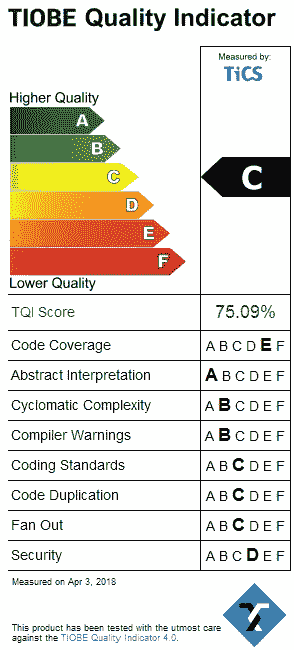

这家公司创建了一个名为 TIOBE index 的编程语言索引。通过使用这个指数，他们正在根据搜索引擎的趋势来衡量编程语言的性能，他们正在考虑几乎所有相关的搜索引擎。你可以阅读更多关于 TIOBE 指数是如何测量的[点击这里](https://www.tiobe.com/tiobe-index/programminglanguages_definition/)。

根据这一指数，最新结果如下:

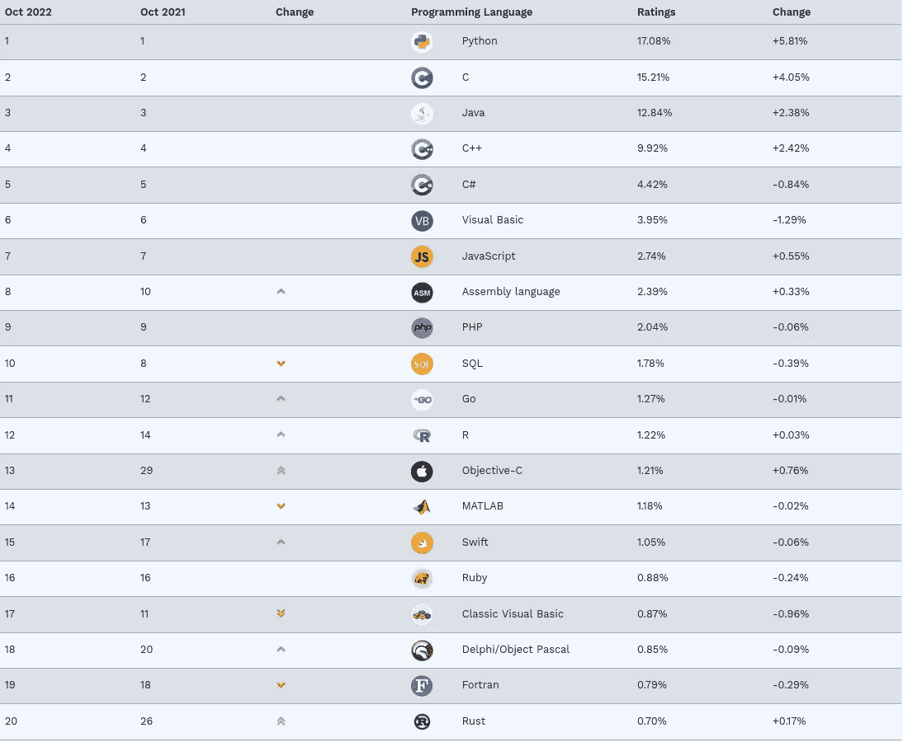

这与我们在谷歌趋势中看到的结果非常接近。然而，在这里，C 是第二常见的语言，这是意想不到的。此外，还有一张编程语言性能的历史图表，如下所示:

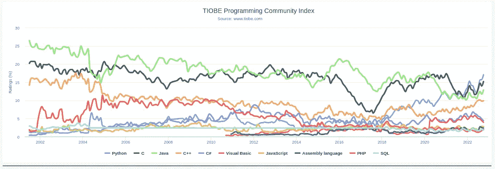

很明显，Java 和 c 一起统治了环境很长一段时间。然而，Python 变得越来越流行，现在已经成为第一。这里有一个临界点需要注意:趋势是不断变化的。Java 是第一，现在是 python 虽然 2010 年之前很低。因此，问题是，我们如何衡量编程语言的未来潜力？

# 考虑未来的可能性

在过去的 10 年里，机器学习和人工智能变得非常流行。Python 语言是这种数值运算的最佳选择，因为它有很好的 C API，当你需要性能时，你可以将这种语言与 C 和 C++结合起来。在这种趋势下，根据搜索趋势和索引，Python 成为了世界上使用最多的语言。

然而，这并不意味着 Python 会保留它的位置。一些其他语言可能表现出比 Python 更好的性能，并取代它。例如，考虑铁锈。亚马逊和脸书宣布他们开始使用 Rust 开发他们内部的 CLI(命令行界面)工具。还有，6.1 版以后的 Linux 内核含有 Rust。这是对编程语言非常强的支持，正如你所看到的，它在一年内从第 26 名上升到第 20 名。

这个问题仍然没有答案。我们如何预测未来？

# 答案

我很抱歉让你读这些东西，但这个问题毫无意义。我们不是政治家，没有人给我们预算或资金或任何有价值的东西来支持这些技术趋势(如果你赚到了这样的价值，一定要继续做下去，我不想阻止你赚钱)。

那么，我们为什么要这样做？我们狂热地支持一种语言或技术？一般的答案是，因为我们懒。我们正在学习一种编程语言或技术，然后围绕这些工具开发一个舒适区。然后，我们不想把它们留在我们的舒适区内。过于狂热地支持 C 和 C++的人之所以这么做，是因为他们不想从头开始学习 Rust 这样的新语言。狂热地支持 Rust 的人，因为他们不想学 C 和 C++，因为它们有点难，而且有很多东西需要小心。我认为这两种方法都是错误的，我们不应该犯这样的错误。在我看来，我们应该比这更好。

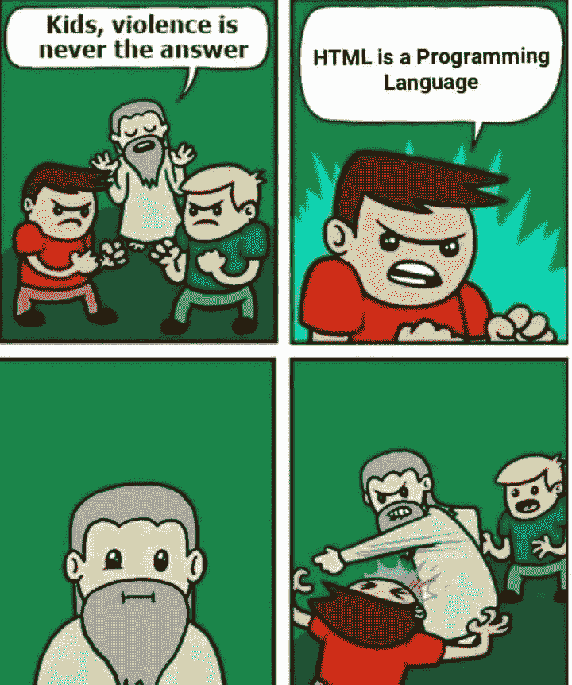

编程语言只是像螺丝刀一样的工具。如果你需要使用平头螺丝刀，你不会强迫使用平头螺丝刀。你将根据你的情况来决定。如果你有能力决定螺钉的类型，那么你将考虑墙壁的结构或你将使用的材料。你可以根据自己的情况使用胶带或其他东西。一个工程师应该根据需求去思考最优的解决方案。

简而言之，没有终极编程语言可以取代其他任何语言。只有你目前岗位的要求，你要用正确的工具。仅此而已，为了实现这一点，您应该了解您正在考虑的编程语言的具体特性。

由于我的关注领域，我通常使用 C、C++、Rust 和 Python。我没有足够的经验来谈论其他语言，但我可以给你一个例子，分析我正在使用的语言的利弊。我写了另一篇文章，内容如下:

 [## C、C++、Rust、Python、Carbon(什么时候用哪个？)

### 编译语言 C、C++、Rust、Carbon 和解释语言之间的性能、能量和易用性比较…

medium.com](/@uguryagmur/c-c-rust-python-and-carbon-when-to-use-which-2912a88f205b) 

我希望你喜欢它。谢谢你的时间和问候。