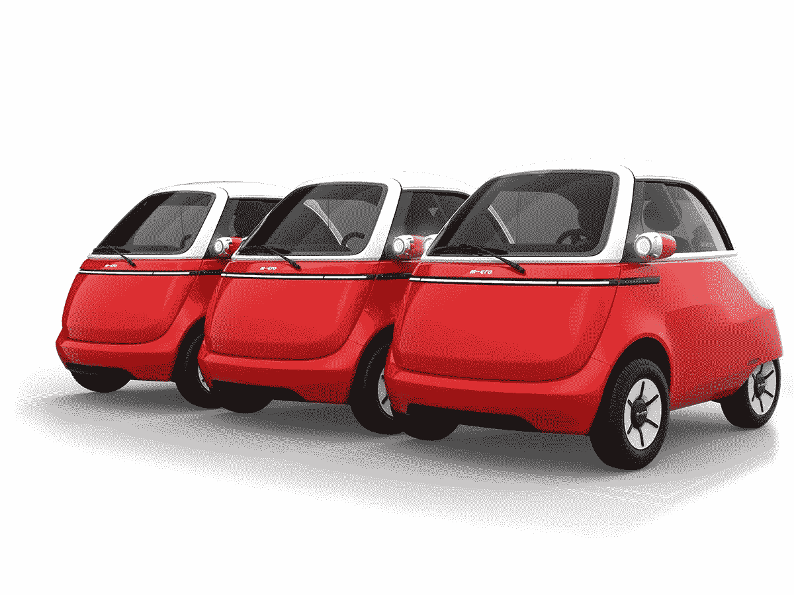

# 微里诺的美好未来

> 原文：<https://medium.com/codex/the-promising-future-of-the-microlino-46b4d5e52da9?source=collection_archive---------6----------------------->

## 从 Micro Mobility Systems 了解一下这款小型电动汽车

[Microlinos(由 Micro Mobility Systems AG 提供的媒体)](https://microlino-car.com/resources/public/dtc/media/thumb/thumb_width1200_microlino-milano-red-parking-002.png)

[Microlino](https://microlino-car.com/en/microlino) 是一款泡泡形状的电动微型交通工具，风靡全球。Microlino 是一家名为 Micro Mobility Systems AG 的瑞士公司的发明，该公司开始生产迷你滑板车。这辆小汽车很有前途，开起来很快…