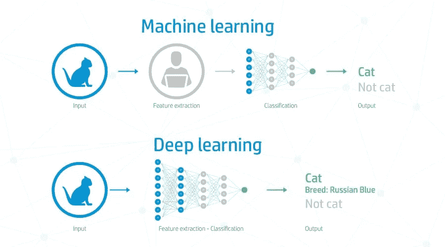

# 深度学习与机器学习的利弊

> 原文：<https://medium.com/codex/the-pros-and-cons-of-deep-learning-vs-machine-learning-530ea1066358?source=collection_archive---------6----------------------->

## 深度学习相对于机器学习有什么利弊？

深度学习和机器学习都是分析数据和进行预测的重要方法。各有利弊。

深度学习比机器学习更准确，但也更…