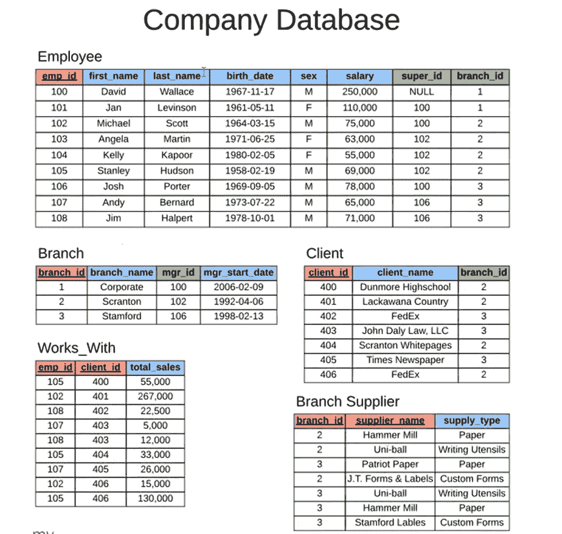

# 使用 SQL 创建公司数据库的最快方法

> 原文：<https://medium.com/codex/the-quickest-way-to-create-company-database-using-sql-f0033fdc02e7?source=collection_archive---------6----------------------->


[https://blog.fyself.com/how-to-manage-a-company-database/](https://blog.fyself.com/how-to-manage-a-company-database/)

每个公司都有自己的数据库，包括他们的销售额、员工人数、客户数量等。企业和其他组织使用 SQL 程序来访问和操作数据库中的信息和数据，以及创建和更改新表。

*在这里*，我们将学习如何使用 MySQL 模式创建公司数据库。稍后，我们将看到如何改变表格和使用一些函数来获得想要的结果，以学习更多的 MySQL 基础知识。

MySQL 模式是一组包含行和列的表，允许用户查询数据库。它是一个数据库模板，指定数据的大小、类型和分组。数据类型、函数和操作符都是 MySQL 模式的一部分。



(图 1.0)红色列—主键，绿色列—外键

让我们以给定的公司数据库为例(图 1.0)。现在，我们如何把这个数据库变成一个 MySQL 数据库？

让我们开始吧。。。

主键用于确保每列的值是唯一的。外键将两个表连接在一起。

```
CREATE TABLE employee ( employee.emp_id INT PRIMARY KEY,employee.first_name VARCHAR(40),employee.last_name VARCHAR(40),employee.birth_day DATE,employee.sex VARCHAR(1),employee.salary INT,employee.super_id INT,employee.branch_id INT );
```

将创建该雇员表。我们的员工 ID 是一个整数。这将成为表的主键。然后是名、姓和出生日期。因此，生日实际上是一个格式为(YYYY-MM_DD)的日期。VARCHAR 数据类型是一种 SQL 数据类型，用于存储可变长度但不超过给定最大长度的字符串。Super_id 是一个外键，它引用了 employee 表中的另一个雇员。此外，branch_ID 是引用分支表的外键。

现在情况是这样的，我们还不能制作这些外键，因为数据库中不存在雇员表。
我们还没有生成分支表，所以技术上不存在。

```
CREATE TABLE branch ( branch_id INT PRIMARY KEY, branch_name VARCHAR(40), mgr_id INT, mgr_start_date DATE, FOREIGN KEY(mgr_id) REFERENCES employee(emp_id) ON DELETE SET NULL ); ALTER TABLE employee ADD FOREIGN KEY(branch_id) REFERENCES branch(branch_id) ON DELETE SET NULL; ALTER TABLE employee ADD FOREIGN KEY(super_id) REFERENCES employee(emp_id) ON DELETE SET NULL;
```

将使用创建表分支。因此，它有一个作为主键的分支 id，以及一个分支名称和一个经理 ID。经理 ID 也是一个外键。因此，我们将经理 ID 定义为指向雇员表的外键。然后是日期，这是经理的开始日期。

```
CREATE TABLE client ( client_id INT PRIMARY KEY, client_name VARCHAR(40), branch_id INT, FOREIGN KEY(branch_id) REFERENCES branch(branch_id) ON DELETE SET NULL );
```

因此，您会注意到这里的 CREATE TABLE 客户端。我们将通过将客户端 id 存储为主键、客户端名称和分支 id，使分支 id 成为外键。

```
CREATE TABLE works_with ( emp_id INT, client_id INT, total_sales INT, PRIMARY KEY(emp_id, client_id), FOREIGN KEY(emp_id) REFERENCES employee(emp_id) ON DELETE CASCADE, FOREIGN KEY(client_id) REFERENCES client(client_id) ON DELETE CASCADE );
```

接下来是工作表。因为它有一个复合主键，所以使用 table 实际上很特别。
员工 ID 和客户 ID 存储在主键中。事实上，主键的每个组件都是一个外键，这就是它的独特之处。因此，emp_id 和 Client_id 是一个外键。

```
**CREATE TABLE branch_supplier (** **branch_id INT,** **supplier_name VARCHAR(40),** **supply_type VARCHAR(40),** **PRIMARY KEY(branch_id, supplier_name),** **FOREIGN KEY(branch_id) REFERENCES branch(branch_id) ON DELETE CASCADE );**
```

最后，我们将建立分支供应商表，这将是我们的最后一个表。这在几个方面可以与 table 的作品相媲美。还有一个组合键。因此，它的键由几列组成。虽然分支 id 字段是外键，但供应商名称列不是。

企业不仅利用 SQL 存储信息，还检索和操作数据。我们已经学习了如何使用各种函数和主键、外键以及不同类型的数据类型(VARCHAR、INT、DATE 等)的概念在公司数据库中创建表。).

*所以，*

现在我们已经创建了所有这些表。我们为数据库模式创建了所有的表。我们现在要做的实际上是将数据放入这些表中，这只有通过特定的方式才能实现，因为创建的所有表都有引用另一个表的外键关系。

我将向你们展示我们可能如何做这样的事情，这也会让你们知道如何去做。查看使用 SQL 将数据插入数据库的链接。