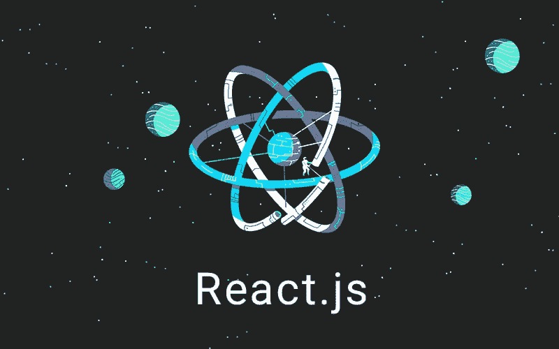

# React 之旅:第 2 部分—基础知识(续)

> 原文：<https://medium.com/codex/the-react-journey-part-2-fundamentals-continued-240439b0cfc6?source=collection_archive---------4----------------------->

在本系列的第一部分中，我们讨论了 React 组件、JSX、道具和状态的区别以及条件渲染。但是在进入更高级的主题之前，我们还需要讨论一些问题。所以不浪费你更多的时间，让我们开始吧。

1.  **列表和键**