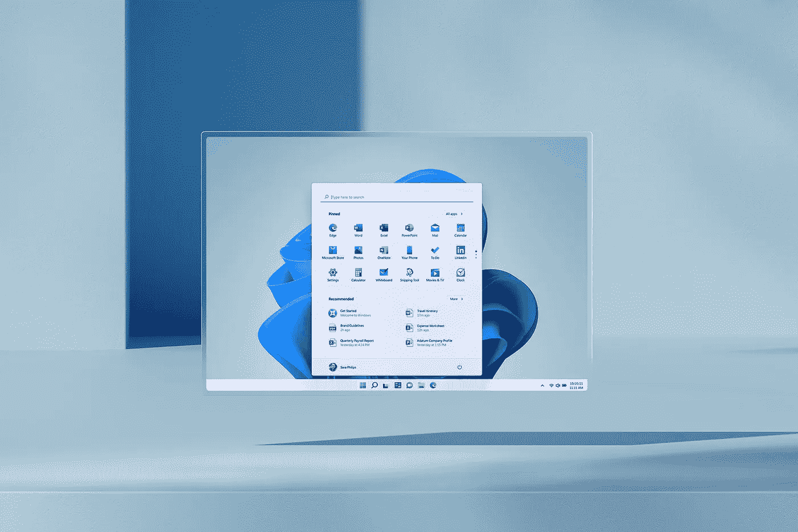
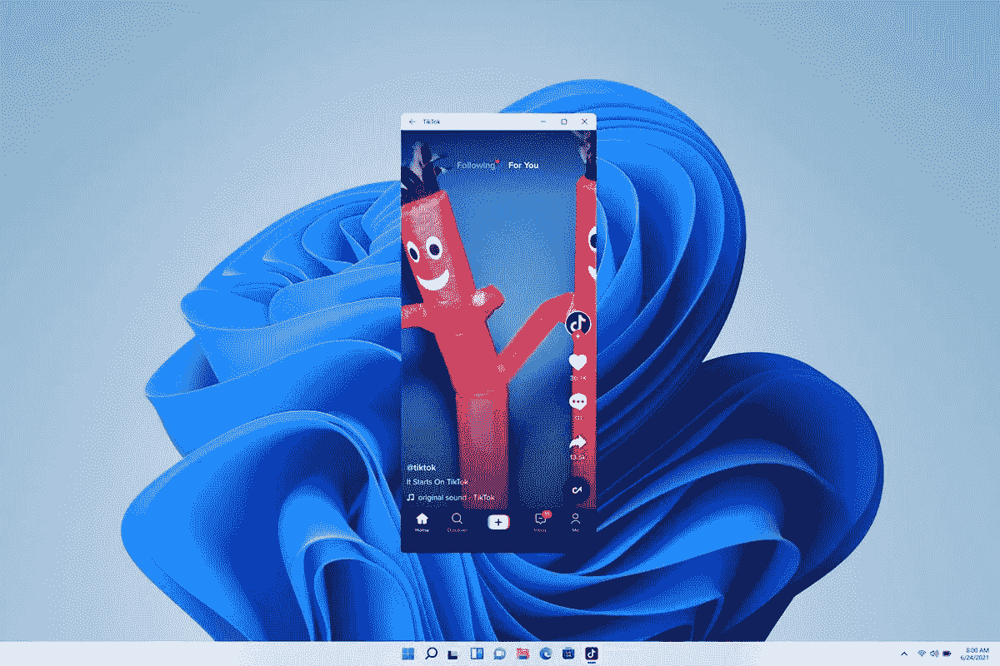

# Renegade 项目为智能手机带来了成熟的 Windows 11

> 原文：<https://medium.com/codex/the-renegade-project-brings-full-blown-windows-11-to-smartphones-67f126b039c7?source=collection_archive---------0----------------------->

## 开发者重振并彻底改变微软的 Windows Phone 梦想

Renegade 项目将 Windows 11 引入智能手机。来源:图片由作者创作。

微软[年前抛弃了 Windows Phone](https://techreport.com/review/34459/the-death-of-windows-phone-and-the-five-stages-of-mobile-grief/) 。

虽然缺乏开发人员的支持永远扼杀了它，但其桌面风格的连续功能让 Windows Phone 用户可以在外部显示器上运行有限的成熟 Windows 应用程序。今天的智能手机在显示器上也能玩得很好，但微软有更大胆的野心:在智能手机上安装真正的 Windows。ARM 上的 Windows 看起来像是朝着这个方向发展，尽管它有[不确定的 x64 仿真](https://www.windowscentral.com/microsoft-states-x64-emulation-only-available-windows-11-arm-pcs)支持。

修改者多年来一直试图将 Windows 移植到智能手机上，并取得了不同程度的成功。

绕过现有设备的固件和设备特定的驱动程序的麻烦是听起来几乎不可能的挑战。但是 Renegade 项目的开发人员兑现了这个承诺。

Renegade 项目将 Windows 11 带入了一个规模虽小但不断增长的智能手机列表。

Windows 11 在视觉上改造了传统的 Windows 体验。来源:微软。

## 通过一些工作，Renegade 项目可以让你的手机运行 Windows 11

凭借一个[便捷的指南](https://renegade-project.org/#/en/windows/Installation-guide)，Renegade 项目背后的开发人员试图简化一套相当复杂的流程。不言而喻，他们不会对砖砌设备负责，但在智能手机上运行桌面级操作系统的机会是诱人的。

很少有消费者意识到将桌面操作系统移植到手机上所需的底层变化。

XDA 开发人员的聪明头脑试图揭开这个过程的神秘面纱:

> “第一步是从头构建一个固件接口，为此，叛逆的项目开发人员建议在智能手机的引导加载程序上编译一个 [Tianocore EDK II](https://www.tianocore.org/) 映像。你可以在相应的 GitHub repo 的 [*版本*部分找到针对特定设备的预编译二进制文件。接下来，从](https://github.com/edk2-porting/edk2-sdm845/releases/latest) [UUP 转储](https://uupdump.net/)下载 Windows 11 的 ARM64 build，准备安装程序。从 Windows 预安装环境中应用 WIM 软件包并整合驱动程序后，您应该会看到 Windows 11 正在启动。”
> ——XDA 塞犍陀·哈扎里卡([来源:XDA](https://www.xda-developers.com/renegade-project-boot-arm64-windows-10-11-on-android-devices/) )

Renegade 项目开发人员已经设法将 Windows 11 移植到少数设备上。其中一些比如诺基亚 9 Pureview 甚至不运行安卓系统。

以下是迄今为止已经测试过的[官方设备列表](https://renegade-project.org/#/en/windows/state-frame.html):

*   **华硕** — ZenFone 5Z
*   AYN——奥丁
*   **谷歌** —像素 3
*   **LG** — G7 ThinQ，V30，V35，V40
*   **魅族** — 16，16 Plus
*   **摩托罗拉** — Z2 力
*   诺基亚 — 9 纯景
*   **OnePus** — 5，5T，6，7，7 Pro
*   **OPPO** —找 X
*   **高通** —骁龙 720G QRD
*   **三星** — Galaxy S9 Plus
*   **Smartisan** —坚果 R1
*   **索尼** — Xperia XZ2
*   **小米** —黑鲨、米 6、米 8、米 8 Pro、米 9、米 Mix 2、米 Mix 2S、米 Mix 3、米 Mix 3 5G、米 Pad 4、米 Pad 5、POCO F1、红米 K20 Pro、米 9T Pro
*   **Vivo** — NEX 双显示器
*   **中兴** — Axon 9 Pro，Nubia X

运行在 Windows 11 上的 Android 应用。来源:TheVerge。

## Renegade 项目在 Windows 11 上的成功有着巨大的潜力

由于这些开发人员的协作努力，Windows 11 在智能手机上运行得相对较好。源代码可以在 GitHub 上获得，这里鼓励开发者贡献。在 [Beebom](https://www.youtube.com/watch?v=3MzMiiu3sYM) 的技术爱好者测试了一款 Windows 11 智能手机，注意到其全面的出色性能。

他们甚至在上面测试了传送门和半条命 2。

虽然 Windows on ARM 的 x64 支持仍然是一个痛点，但将微软的梦想变为现实是一个了不起的成就。它不像 [Windows RT](https://en.wikipedia.org/wiki/Windows_RT) 那样不堪一击，但仍然不是传统操作系统的替代品。但是随着 Windows 11 提供了对 Android 应用程序的支持，很难说这个叛逆的项目会给它的一连串小胜利增添什么。

由 Windows 11 驱动的智能手机带来了一些诱人的可能性。

微软的 Surface Duo 折叠智能手机系列有朝一日可能能够支持桌面应用程序。如果 Windows 11 驱动的移动游戏起飞，无论是在视觉上还是在机制上，都不知道游戏会变成什么样。像 PhotoShop 或 Visual Studio 这样的应用程序可以帮助专业人士将他们的工作机器放在口袋里。

如果需要屏幕空间，可以把它连接到显示器上。

作为一个 Windows Phone 的长期粉丝，看到开发者模糊了桌面和智能手机之间的界限令人印象深刻。Renegade 项目看起来很有前途，我迫不及待地想看看他们从这里走向何方。要了解更多，请前往他们的[论坛](https://forum.renegade-project.org/)。