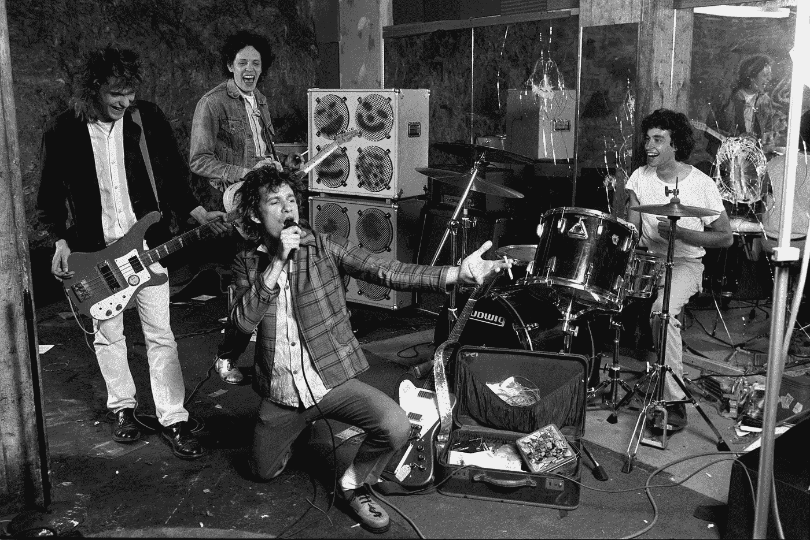

# 替代 JavaScript 算法

> 原文：<https://medium.com/codex/the-replacements-javascript-algorithm-6df5e2c30724?source=collection_archive---------6----------------------->



图片来自《纽约客》

在之前的帖子中，我分享了我是如何[寻找并摧毁](/codex/seek-and-destroy-the-javascript-algorithm-8d028a2770dd)的。我还分享了如何使用正则表达式改变音节，并在电脑上做一个[猪拉丁](/codex/pig-latin-caribbean-jeringoza-on-javascript-d5bc88a75e0a)游戏。这一次，我想分享如何对一串数据进行替换。我们来做替换算法，两种不同的方式。

# 解决方案 1 —使用。替换()

在这个解决方案中，我们将使用`[.indexOf()](https://developer.mozilla.org/en-US/docs/Web/JavaScript/Reference/Global_Objects/Array/indexOf)`和`[.charAt()](https://developer.mozilla.org/en-US/docs/Web/JavaScript/Reference/Global_Objects/String/toLowerCase)`来编写`[.replace()](https://developer.mozilla.org/en-US/docs/Web/JavaScript/Reference/Global_Objects/String/replace)`算法，并使用`[.toUpperCase(](https://developer.mozilla.org/en-US/docs/Web/JavaScript/Reference/Global_Objects/String/charAt)` [)](https://developer.mozilla.org/en-US/docs/Web/JavaScript/Reference/Global_Objects/String/charAt) 和`[.toLowerCase()](https://developer.mozilla.org/en-US/docs/Web/JavaScript/Reference/Global_Objects/String/toLowerCase)`来操作字符串上的字符。

```
const index = str.indexOf(before);
```

我们首先创建一个变量，它将在字符串中“before”所在的位置查找索引。

```
if (str[index] === str[index].toUpperCase()) {
  after = after.charAt(0).toUpperCase() + after.slice(1) ||     after.charAt(0).toLowerCase()
}
```

在这个条件语句中，如果“before”单词以大写字符开始，我们将“after”单词的第一个字母改为大写字符。

```
return str.replace(before, after);
```

然后，我们将要求计算机把替换品还给我们。

以下是完整版本:

```
function theReplacement1(str, before, after) {
   const index = str.indexOf(before);

   if (str[index] === str[index].toUpperCase()) {
       after = after.charAt(0).toUpperCase() + after.slice(1) ||     after.charAt(0).toLowerCase()
} return str.replace(before, after);
};
```

如果我们用下面的字符串运行代码。

```
theReplacement1("The Replacements: Punk Rock band from Minnesota.", "Punk", "alternative")
```

将返回关于一个乐队离开他们的 DIY 根源的信息。

```
The Replacements: Alternative Rock band from Minnesota.
```

这真是一团糟！

## 解决方案 2 —使用。分裂和。加入

如果我告诉你还有其他方法呢？不过。replace 看起来非常简单，你永远不知道你是否遇到过这样的代码:使用`[.split()](https://developer.mozilla.org/en-US/docs/Web/JavaScript/Reference/Global_Objects/Array/split)`方法将字符串切割成片段，然后使用`[.join()](https://developer.mozilla.org/en-US/docs/Web/JavaScript/Reference/Global_Objects/Array/join)`得到它们将在该字符串中替换的单词。使用这些方法比我们想象的要普遍得多。

```
const index = str.indexOf(before);if (str[index] === before[0].toUpperCase()) {
   after = after[0].toUpperCase() + after.slice(1)
}
```

像前面的解决方案一样，我们定位了`before`这个词的索引。接下来是条件语句，它是我们之前的一个更短的版本，对大写字母做了同样的事情。

```
return str.split(before).join(after);
```

我们将用 split 和 join 方法返回调用它的字符串，以便计算机返回包含我们想要的更改的字符串。

这是一个完整的函数。看看 JavaScript 能有多好看。

```
function theReplacement2(str, before, after) {
   const index = str.indexOf(before);

   if (str[index] === before[0].toUpperCase()) {
      after = after[0].toUpperCase() + after.slice(1)
   }
   return str.split(before).join(after);
}
```

所以如果我运行这个函数，在字符串中写下这个语句:

```
theReplacement2(“The Replacements is the best band to ever come out of Minnesota.”, “The Replacements”, “hüsker Dü”);
```

电脑会帮我修好的:

```
Hüsker Dü is the best band to ever come out of Minnesota.
```

我很抱歉，但是 Hüsker Dü是最好的乐队。

如你所见，这只是两种方法。但像许多其他算法一样，有更多的方法来替换和更改字符串。还有强大的`[.replaceAll()](https://developer.mozilla.org/en-US/docs/Web/JavaScript/Reference/Global_Objects/String/replaceAll)`，可以用来代替破折号和其他活动的空格。

我希望您喜欢这两个解决方案，并学到一些新的东西来实践代码或在您的项目中实现。

编码快乐！

# 摘要

1.  替换算法简介。
2.  使用`.replace()`的解决方案
3.  使用`.split()`和`.join()`的解决方案
4.  结论

# 参考

1.  MDN 网络文档，[字符串](https://developer.mozilla.org/en-US/docs/Web/JavaScript/Reference/Global_Objects/String)