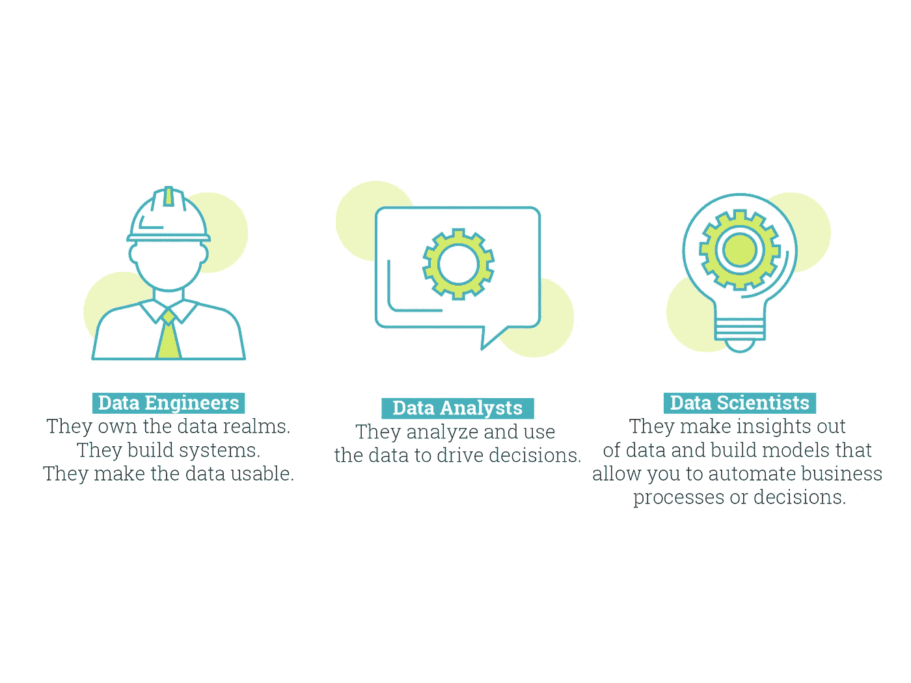

# 数据工程师的职责

> 原文：<https://medium.com/codex/the-responsibility-of-a-data-engineer-b5173b785ffa?source=collection_archive---------14----------------------->

## 人工智能基金公司 Factored AI 的数据工程

> *本文原载于* [*因袭的 AI 博客*](https://factored.ai/2021/08/12/the-responsibility-of-a-data-engineer/)

数据角色——由作者制作的插图。

数据科学领域有相当多的角色:数据工程师、数据分析师、数据科学家、机器学习工程师、数据架构师、BI 开发人员等等……角色列表相当长。有这么多…