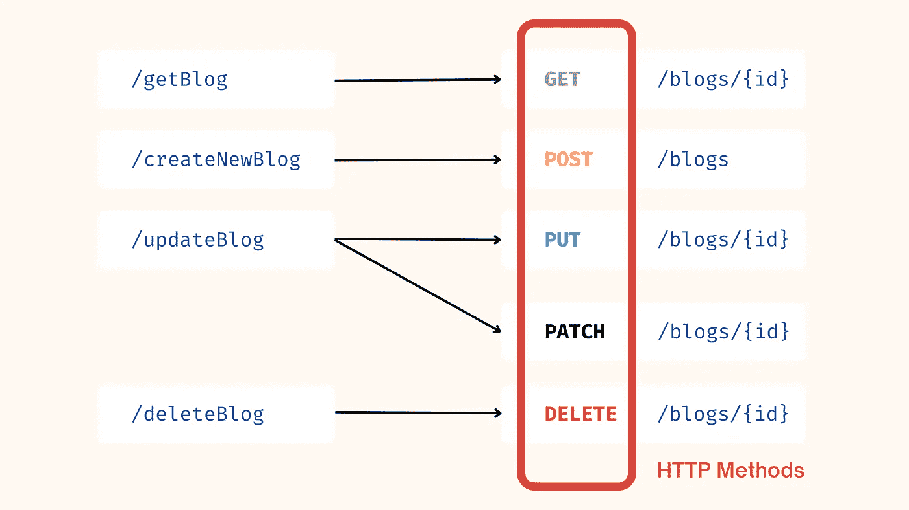

# REST 架构——为什么你会完全错过它

> 原文：<https://medium.com/codex/the-rest-architecture-why-you-might-have-entirely-missed-it-d45adf3ed981?source=collection_archive---------1----------------------->

## 这是不对的。这一切必须马上停止。

这篇博客不应该是咆哮，而是从面对事实开始——很多后端开发人员完全忽略了核心的 REST 设计原则和最佳实践。

今天我遇到了一些可怕的端点，比如`/getAllSubsections`和`/deleteContactOfUser`😱在 Node.js 项目中，这促使我写这篇博客，并触及设计 REST APIs 的基本原则。


让我们从陈述显而易见的事情开始。REST API 是符合 REST 或*表述性状态转移*架构风格的设计原则的 API。REST 提供了高度的灵活性、可伸缩性和自由度，这就是它成为当今最常用的 API 架构的原因。

*如果你不确定 API 是什么，也许可以读一下* [*这个*](https://www.ibm.com/cloud/learn/api) *然后回到这里。*

REST APIs 可以用任何编程语言开发，不像 SOAP 或 XML-RPC。唯一的要求是它们符合**六个 REST 设计原则**——也称为**架构约束**。

# 概念

不过，在我们谈论这些原则之前，让我们缩短理论，尝试讨论一些概念，并通过一些现实生活中的例子来理解事情。

## 资源

> 一个**资源**是一个**对象**，它具有一个类型、相关数据、与其他资源的关系以及一组对其进行操作的方法。

通常任何可以被命名的东西都可以被认为是资源。例如，考虑一下[媒体](https://medium.com/u/504c7870fdb6?source=post_page-----d45adf3ed981--------------------------------)上的资源。如果你看一下 Medium 的 [API](https://github.com/Medium/medium-api-docs#3-resources) ，我们会看到以下 4 个资源—


请注意，在设计您的 API 时，您可以自由决定应该将什么作为资源进行分配。这个决定将影响你的 API 相应的复杂度和结构。

## 基于资源的 URL

在为你的 API 设计端点或 URL 时，我们需要确保它们是**结构良好的**并且是从我们上面定义的**资源**中派生出来的。

## HTTP 方法

正如在资源定义中所讨论的，它与一组可以对其进行操作的方法相关联。最常见的 HTTP 动词有`**GET**`**`**POST**`**`**PUT**`**`**PATCH**`**和`**DELETE**`。********

## ****一个重要的例子****

****假设中型 API 端点如下所示。我们试图通过前 4 个端点进行的操作是**创建**、**阅读**、**更新**和**删除**博客。****

********

****以上端点一塌糊涂，原因如下——****

1.  ****URL 的结构不是很好，它们包含的不仅仅是资源名(名词)。****
2.  ****编写诸如/getAllSubsections 这样的端点(正如我在介绍中提到的)是一场噩梦，因为子节**不是定义良好的资源**。****
3.  ****向 URL 添加动词会很快使管理变得不可能。我们现在有 4 个新的端点，而我们原本只有一个，也就是`/blogs`。随着我们开始处理其他资源，这个数字只会继续增加。****
4.  ****对于**复杂或嵌套查询**，比如获取所有用户出版物或在出版物下创建帖子，URL 将会很大。想象一下我们需要 3 或 4 层嵌套的场景！****

****那么我们在这里错过了什么？端点应该只包含**资源**(名词)并使用 **HTTP 方法**进行操作！这是我们修复端点后的样子。你将在后面了解到这个约束被称为**统一接口**。另外，请注意，按照惯例，我们使用复数名词从资源中构造 URL。所以我们使用`\blogs`而不是`\blog`。****

********

****对于嵌套的情况，假设我们想要获得特定用户的所有发布，我们将使用类似于—****

```
**GET /users/{{userId}}/publications**
```

****这里的`userId`是特定用户的唯一标识符。您可以看到 Medium 确实使用了这个[端点](https://github.com/Medium/medium-api-docs#32-publications)用于相同的目的！****

## ****以 JSON 形式发送数据(通常)****

****JSON 是一种轻量级的数据交换格式。通常，当客户端和服务器交互时，任何交换的数据都应该是 JSON 格式的。此外，发送的数据必须遵循一些规范，如 **JSend** (最常见)、 **JSON: API** ，或 **OData JSON 协议**。****

****一个基本的符合 JSend 的响应就是这么简单。这里可以阅读更多[。](https://github.com/omniti-labs/jsend)****

```
**{
    status : "success",
    data : {
        "post" : { "id" : 1, "title" : "A blog post", "body" : "Some useful content" }
     }
}**
```

## ****无国籍****

****REST APIs 必须是无状态的。所有状态在客户端处理**。每个请求必须包含处理特定请求所需的所有信息。**服务器不需要记住以前的请求。********

**例如，让我们说你目前正在查看第 6 页上的所有博客。如果你想看第七页上的博客，那么下面的请求不允许**

```
GET /blogs/nextPage  -- bad practice 
```

**服务器是无状态的。这是因为需要将一些数据存储在服务器端，以跟踪上一次发送哪个页面来响应之前的请求。另一方面，请求我们指定页面**

```
GET /blogs/page/6    -- good practice
```

**number(或 id)不需要在服务器端处理任何状态，这被认为是一个好的实践。**

**这种情况下可能出现的另一个问题是缓存。在服务器端使用缓存有助于更快地解决查询。**然而，人们必须注意到，缓存并不意味着服务器正在存储应用状态**。它只是复制以前请求的数据，并将其放入一个快速的内存中，以便将来请求时可以访问。**

# **架构限制**

**因此，最后，让我们看看六个 REST 设计原则。你会注意到，我们已经讨论了这里的几个要点。**

## **1.统一界面**

**对同一资源的所有 API 请求看起来应该是一样的，不管请求来自哪里。REST API 应该确保同一块数据，比如用户的姓名或电子邮件地址，只属于一个统一资源标识符(URI)。资源不应该太大，但是应该包含客户可能需要的每一条信息。**

## **2.客户端-服务器解耦**

**在 REST API 设计中，客户端和服务器应用程序必须完全相互独立。客户端应用程序应该知道的唯一信息是所请求资源的 URI；它不能以任何其他方式与服务器应用程序交互。类似地，服务器应用程序不应该修改客户机应用程序，而应该通过 HTTP 将它传递给请求的数据。**

## **3.无国籍**

**REST APIs 是无状态的，这意味着每个请求都需要包含处理它所需的所有信息。换句话说，REST APIs 不需要任何服务器端会话。不允许服务器应用程序存储任何与客户端请求相关的数据。**

## **4.可缓存性**

**如果可能的话，资源应该可以在客户端或服务器端缓存。服务器响应还需要包含关于所交付的资源是否允许缓存的信息。目标是提高客户端的性能，同时增加服务器端的可伸缩性。**

## **5.分层系统架构**

**在 REST APIs 中，调用和响应经过不同的层。根据经验，不要假设客户端和服务器应用程序直接相互连接。**

****

**在通信回路中可能有许多不同的中介，每个中介都有特定的职责。一个好的设计确保各层是隔离的，除了它们下面的层之外，不要与其他层通信。**

## **6.按需编码(可选)**

**REST APIs 通常发送静态资源，但是在某些情况下，响应也可以包含可执行代码(比如 Java 小程序)。在这些情况下，代码应该只按需运行。**

# **其他最佳实践**

**我们已经在上面的段落中讨论了以下最佳实践——用 JSON 接受和响应、在端点路径中使用名词而不是动词、用复数名词命名集合、分层对象的嵌套资源以及缓存数据以提高性能。**

**还有其他几件事你可以处理。这些东西并不违反这些原则，但是对于一个好的 API 设计是必不可少的。**

## **优雅地处理错误并返回标准错误代码**

**为了在错误发生时消除 API 用户的困惑，我们应该优雅地处理错误，并返回表明发生了哪种错误的 HTTP 响应代码。一些常见的错误 HTTP 状态码可以在[这里](https://developer.mozilla.org/en-US/docs/Web/HTTP/Status)找到。**

**错误代码需要附带消息，以便维护人员有足够的信息来解决问题，但攻击者不能使用错误内容来进行我们的攻击，如窃取信息或关闭系统。**

## **允许筛选、排序和分页**

**REST API 背后的数据库可能会变得非常大。有时候，数据太多了，不应该一次全部返回，因为这样太慢了，或者会让我们的系统瘫痪。因此，我们需要过滤项目的方法。**

**我们还需要对数据进行分页的方法，以便一次只返回几个结果。我们不想因为试图一次获得所有请求的数据而占用资源太长时间。排序有助于根据需要提取有序数据。**

## **良好的安全实践**

**客户端和服务器之间的大部分通信应该是私密的，因为我们经常发送和接收私密信息。因此，使用 SSL/TLS 来保证安全性是必须的。**

**将 SSL 证书加载到服务器上并不太困难，而且费用是免费的或者非常低。没有理由不让我们的 REST APIs 通过安全通道而不是开放通道进行通信。**

## **版本化我们的 API**

**我们应该有不同版本的 API，如果我们对它们做任何改变，可能会破坏客户。可以像现在大多数应用程序一样，根据语义版本(例如，2.0.6 表示主要版本 2 和第六个补丁)进行版本控制。你可以在这里阅读更多关于这个[的内容。](https://semver.org)**

**这样，我们可以逐步淘汰旧的端点，而不是强迫每个人同时迁移到新的 API。v1 端点可以为不想改变的人保持活跃，而具有闪亮新特性的 v2 可以为那些准备升级的人服务。如果我们的 API 是公开的，这一点尤其重要。我们应该将它们版本化，这样我们就不会破坏使用我们 API 的第三方应用程序。**

**版本化通常用`/v1/`、`/v2/`等完成。添加在 API 路径的开头。**

# **结论(TL；博士)**

**那么准备好像专业人士一样设计 REST APIs 了吗？🙃**

**让我们在接下来的三段中快速总结一下整篇文章。**

****

**设计高质量 REST APIs 最重要的一点是遵循 web 标准和约定来保持一致性。JSON、SSL/TLS 和 HTTP 状态码都是现代 web 的标准构件。**

**性能也是一个重要的考虑因素。我们可以通过不一次返回太多数据来增加它。此外，我们可以使用缓存，这样我们就不必一直查询数据。**

**端点的路径应该一致。我们使用名词只是因为 HTTP 方法指出了我们想要采取的行动。嵌套资源的路径应该在父资源的路径之后。他们应该告诉我们正在获取或操作什么，而不需要阅读额外的文档来理解它在做什么。**

**如果你读了这篇文章，发现它很有用，你可能也会喜欢—**

**[](/codex/facts-about-node-js-you-might-have-missed-772267878d30) [## 你可能错过的关于节点 JS 的事实

### 节点 JS 不是一个框架和更多…

medium.com](/codex/facts-about-node-js-you-might-have-missed-772267878d30)** 

**如果您有任何问题或建议，请随时联系我。您可以在这些社交媒体平台上关注我— [LinkedIn](https://www.linkedin.com/in/ab-satyaprakash/) 、 [YouTube](https://www.youtube.com/channel/UCJ6D0HS8c9Il-eX5lGbAyGg) 、 [Twitter](https://twitter.com/AbSatyaprakash) 、 [Instagram](https://www.instagram.com/absatyaprakash/) 了解更多更新内容！**

****一如既往！黑客快乐！😇****

**[加入我的电子邮件列表，获得更多精彩的教程和编程博客](https://absatyaprakash01.medium.com/subscribe) ❤️**