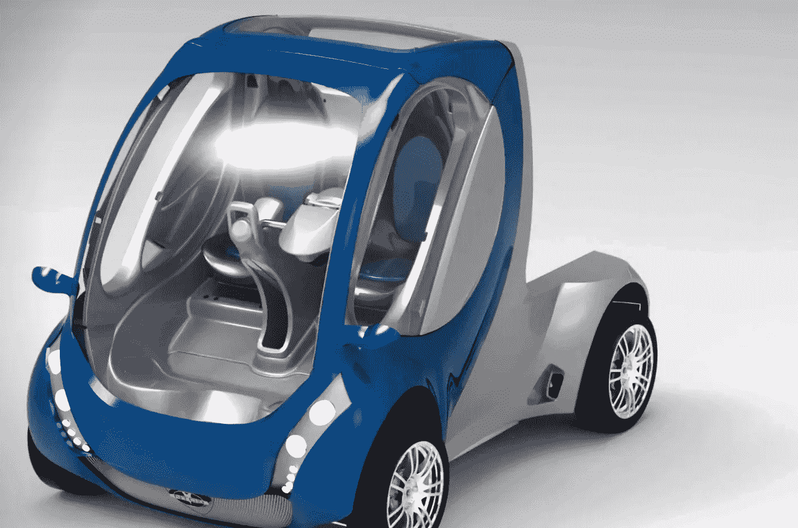

# 来自欧洲的革命性折叠汽车——拉科塔

> 原文：<https://medium.com/codex/the-revolutionary-foldable-car-from-europe-lakota-f683ca2aef42?source=collection_archive---------3----------------------->

## 想象一下在世界各地的城市中有这样的车队

[拉科塔(NTDENERGY 的媒体)](https://ntdenergy.com/lakota/)

微移动是未来的潮流，而欧洲的创新者正在引领潮流。西班牙汽车制造商 [NTD 能源](https://ntdenergy.com/lakota/)正在开发一种可折叠的电动汽车，这将彻底改变我们在城市中的出行方式。这种可折叠的车辆可以通过拉它的…