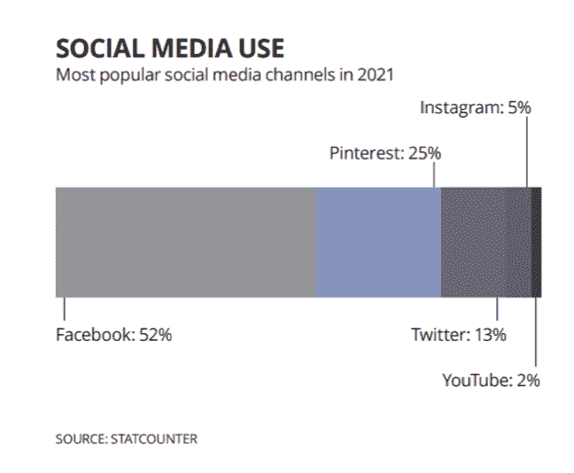
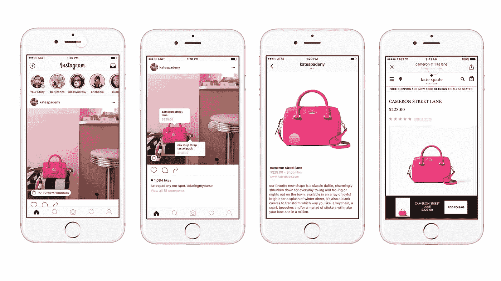
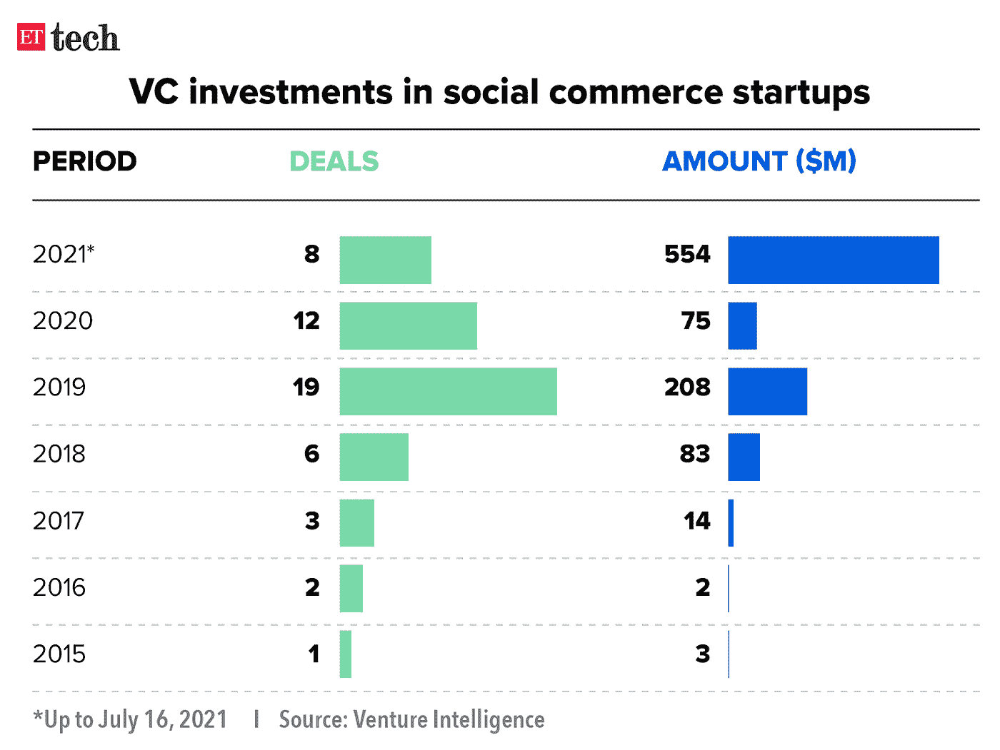
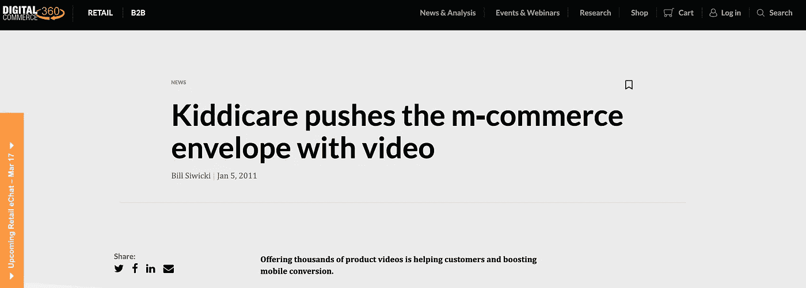

# 社交商务和视频的兴起

> 原文：<https://medium.com/codex/the-rise-of-social-commerce-and-video-fd4263290fc3?source=collection_archive---------6----------------------->

## 视频和社交将成为电子商务经济价值的最大驱动力之一。

不久前，我还在使用一套工具，如 Later 和 Canva，为我的初创公司的社交网页创建内容。今天，情况略有不同。社交媒体营销是社交商务的先驱。社交购物不是为即便是最著名的艺术家也会羡慕的社交网站设计资产，然后将潜在客户重定向到你的网站进行购买，而是省去增加转化率的额外步骤，并允许客户在他们已经使用的网络中结账。截至 2021 年，社交和商业的融合价值 3748 亿美元。

社交商务是利用社交媒体平台和社交方面与电子商务相结合。

*图一。英国社交媒体的使用——资料来源:2021 年欧洲电子商务报告*

社交商务蓬勃发展，结合聊天机器人结账和自动填充支付选项，购物之旅大大简化。例如，英国去年的社交商务销售额增长了 95%。ParcelHero 的消费者研究主管 David Jinks 说，2020 年，将近[1100 万英国购物者在社交媒体上第一次看到一件商品后，会很容易地、心甘情愿地花钱。](https://www.business-money.com/announcements/lockdown-leads-to-a-95-sales-increase-in-social-commerce/)

同样不足为奇的是，社交购物的两大领导者是 Instagram 和 Pintrest。

Instagram 购物

各种规模的品牌都在利用这个渠道。Barbour 报告说，自从使用 Instagram 购物以来，他们在 Instagram 上的销售额[增加了 42%](https://pattern.com/uk/blog/how-social-shopping-on-instagram-and-pinterest-drive-ecommerce-sales/) ，网站流量增加了 98%。欧洲和美国投资者一直在投入大量风险资本，以利用亚洲的机会。截至 2020 年 7 月，印度的社交商务初创公司已经筹集了 5.54 亿美元，比去年增长了 7 倍，是 2015 年以来的最高水平。

*图二。社交商务初创公司的风险投资(2015–2021)——来源:风险情报(经济时报)*

# 亚洲的社交商务创业公司

红杉资本印度公司称，印度电子商务的下一个最大增长动力将是社交商务。像 [Meesho](https://meesho.com/) 、 [DealShare](https://www.dealshare.in/) 、 [Mall91](https://www.mall91.com/) 和 [SimSim](https://simsim.in/en/home) 这样的初创公司是引领印度社交商务增长的一些关键角色，而 [CityMall](https://www.citymall.com.mm/) 、 [Trell](https://trell.co/) 、 [OneCode](https://www.onecode.in/) 和 [Otipy](https://www.otipy.com/) 吸引了像 Tiger Global 和 General Catalyst 这样的顶级投资者。为了预测社交商务在欧洲市场将如何发展，我们可以观察一下在亚洲运作良好的模式。

# 视频——社交商务的支柱

在过去的 5-10 年里，我们看到了围绕内容创作者形成的社区，催生了现在的创作者经济。顺便说一下，我们已经看到创作者通过 Youtube (2007 年)、Twitch (2011 年)和 Tiktok (2017 年)利用视频的力量。接下来是购物视频。在中国最大的电子商务平台淘宝上，42%的产品页面已经包含了短视频，直播正在快速增长。直播视频商务在亚洲无处不在，淘宝、葵和斗印等公司就是证明，我们相信它将进入欧洲。

JD.com(中国电子商务平台)上的现场互动表演

抖音、Instagram、YouTube 和 Pinterest 等短格式视频内容平台的崛起开创了本土电子商务的新时代。投资组合公司 [**Codices**](https://www.linkedin.com/company/codices/) 正在构建一个每个人都可以消费现场互动视频的世界。该团队用 QuizKit 证明了他们为创作者构建伟大工具的能力，QuizKit 被 20 个 Twitch 频道中的 1 个使用。在接下来的几个月里，该团队将推出 MOAR——一个独立的直播互动节目平台，使创作者能够通过直播互动视频来创作和分发他们的内容。

在 Haatch，我们作为运营商支持视频和电子商务，并作为投资者继续这样做。

[https://www . digital commerce 360 . com/2011/01/05/kiddicare-pumps-m-commerce-envelope-video/](https://www.digitalcommerce360.com/2011/01/05/kiddicare-pushes-m-commerce-envelope-video/)

Haatch 的联合创始人兼合伙人弗雷德·索恩亚说

> 早在 2009 年，我在 KC (Kiddicare)的第一个职位是视频团队，我们制作了超过 4000 个产品视频，当产品有演示视频时，交谈率翻了一番。我们让一家名为 Liveclicker 的初创公司接待了他们，这家公司后来被收购了。

**社交商务及其对小品牌的重要性**

社交商务的好处也增强了个人和小品牌的实力。在埃森哲进行的调查中，超过一半(59%)的电子购物者(主要是社交买家)表示，与在电子商务网站购物相比，他们更有可能通过社交商务支持中小型企业。

在 Haatch，我们对社交商务和视频感到兴奋。如果你是一个建立社交商务平台或产品的创始人，我们希望听到你的意见！在这里取得联系:【https://haatch.com/founders/ 