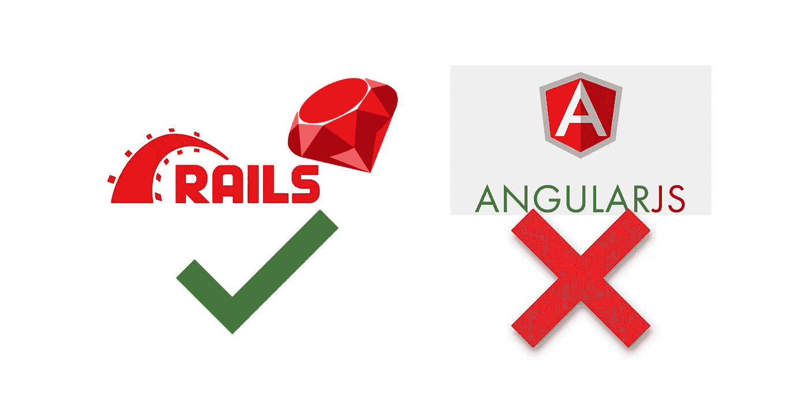

# 红宝石在铁轨和角铁上的起伏

> 原文：<https://medium.com/codex/the-rises-and-falls-of-ruby-on-rails-and-angularjs-3674fd51232d?source=collection_archive---------6----------------------->

## Ruby on Rails 是最好的 web 框架，遗憾的是，失败的 AngularJS 毁了 Ruby on Rails 的使用

AngularJS 和 Ruby on Rails (RoR)都是流行的 web 框架。