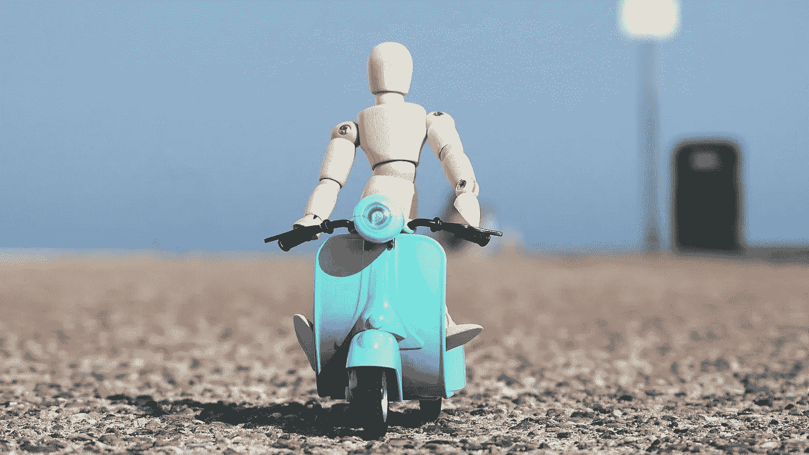
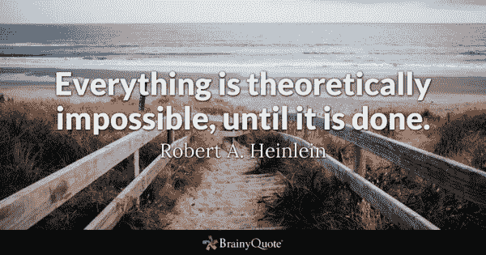
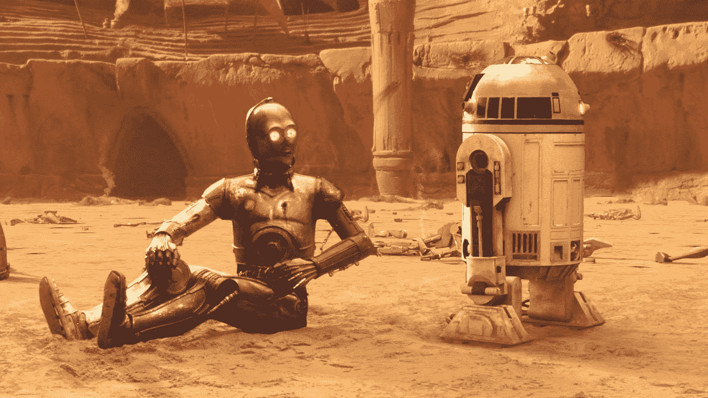

# 机器人来了。

> 原文：<https://medium.com/codex/the-robots-are-coming-b90ee3a54bff?source=collection_archive---------10----------------------->

敏捷教练的世界将不再一样

现在是早上 8 点 55 分。Altea corporation 的 scrum 大师 Mark 正在快速爬办公室的楼梯。他想按时达到每日站立姿势。昨天晚上与 Lea 教练关于技术债务稳步增长的讨论一直在他的脑海中，他打算在今天的团队讨论中提出来。Lea 还建议对计划进行一些修改。有些特性可以等一等，在下一次 sprint 中再收集一些重构故事会更明智。

*苏珊是 Altea 公司的一名开发人员，她和马克在同一个团队，她的教练 Lea 每天都会提醒她。她的代码的圈复杂度分数在过去的几周里已经远远偏离了目标。在对她唠叨了几天之后，Lea 自己修复了一些代码，并将其发送给 Suzan 作为参考，这样她就可以处理和修复其余的代码。*

你想象过 Lea 是一个人吗？如果 Lea 是一个由技术驱动的程序呢？

几天前，我在 LinkedIn 上进行了一次[投票](https://www.linkedin.com/posts/hkarekar_ai-ml-coaching-activity-6895248210626248704-OcRO)，目前为止我收到了 20 张投票，结果是这样的:

超过 50%的人说他们会喜欢一个好的虚拟助理教练，当然，紧随其后的是怀疑论者，认为这是一个科幻的胡言乱语。

[brainyquote.com——理论上一切都是…](https://www.brainyquote.com/quotes/robert_a_heinlein_121947)

> 今天看似不可能的事情，科技将它带入了可能的领域，并最终进入平凡的世界。

想象一下，有人在亚历山大大帝的宫廷里提到，有一天人类可以通过长途飞行在几个小时内穿越大陆。他们会被嘲笑和取笑。今天，空中旅行是一项平凡的活动。经常乘坐飞机的人，尤其是那些在飞行中打开笔记本电脑的人，甚至没有意识到这种奇迹和魔力——他们正在几千英尺高的飞机上进行日常工作。飞行对他们来说不是大事。一架飞机在飞。没什么大不了的！

我们在人工智能、机器学习、量子计算和其他**技术方面取得的快速进步，将我们带到了我们以前认为过于复杂而无法自动化或机器人化的前沿**。这些任务被认为非常复杂，只有人类才能完成。

就像迄今为止的工业革命一样，技术进步将在未来的日子里继续颠覆。与我们迄今为止经历的其他颠覆性技术类似，**这些影响将在未来几十年内感受到，而不是立即感受到**。[互联网发明于 20 世纪 70 年代](https://science.blurtit.com/790/what-year-was-the-internet-invented)，然而直到 90 年代才成为主流。

技术已经在飞速发展。**2020 年，大学生利亚姆·波尔(Liam Porr)使用 GPT-3 撰写虚假博客文章，最终登上黑客新闻** [ [链接](https://www.theverge.com/2020/8/16/21371049/gpt3-hacker-news-ai-blog) ]榜首。如果人工智能可以写博客，为什么它不能给 Scrum 大师或开发人员提建议？

事实上，我们仍然在谈论专业或狭义的人工智能应用，而神圣的谷物——AGI——[人工通用智能](https://www.geeksforgeeks.org/what-is-artificial-general-intelligence-agi/#:~:text=Artificial%20General%20Intelligence%20%28AGI%29%20also%20commonly%20known%20as,approach%2Fintelligence%20to%20solve%20any%20kind%20of%20varied%20problems.)和[人工超级智能](https://www.geeksforgeeks.org/what-is-artificial-super-intelligence-asi/)还很遥远，也许还要几十年。

[YVPAN.jpg(1920×1080)(imgur.com)](http://i.stack.imgur.com/YVPAN.jpg)

虽然像 R2D2 和 C-3PO 这样的项目还很遥远，但是能让我们的生活变得更好更简单的项目已经出现在地平线上。

Lea 需要解决的几个挑战:机器人可以成为我们的虚拟商业教练，因此，目前，价值 150 亿美元的教练行业没有来自机器人的直接威胁。

然而，我们生活在一个充满创造性破坏的资本主义世界。随着技术的进步，旧的为新的让路。在 [*《资本主义、社会主义和民主*](https://en.wikipedia.org/wiki/Capitalism,_Socialism_and_Democracy#:~:text=Capitalism%2C%20Socialism%2C%20and%20Democracy%20is%20a%20book%20on,of%E2%80%94if%20not%20his%20most%E2%80%94famous%2C%20controversial%2C%20and%20important%20works.)》(1942 年)中，奥地利经济学家约瑟夫·熊彼特写道，他创造了“创造性破坏”这个术语

> 国内外新市场的开拓，以及从手工作坊到美国钢铁公司等企业的组织发展，说明了同样的工业突变过程——如果我可以用这个生物学术语的话——不断从内部革新经济结构，不断摧毁旧结构，不断创造新结构。这种创造性破坏的过程是资本主义的基本事实。(第 83 页)

**这些产业变革将继续构建、破坏和重建商业和运营模式。不，即使是敏捷教练或商业教练的世界也不能幸免。到今天为止，我们的问题确实比答案多。随着我们解决这些问题，一个新的世界将会出现，一个与我们今天生活的世界截然不同的世界。有些人会在其中茁壮成长，有些人会害怕它。**

不管怎样，机器人就要来了。继续关注这个空间。

***你喜欢这个吗？**随意按动那个拍手按钮**。你想要更多吗？**在 Medium 上关注我**|[LinkedIn](https://www.linkedin.com/in/hkarekar/)|[Twitter](http://www.twitter.com/hrishi_karekar)，或者 [**在这里阅读更多**](https://hrishikeshkarekar.medium.com/) 。***