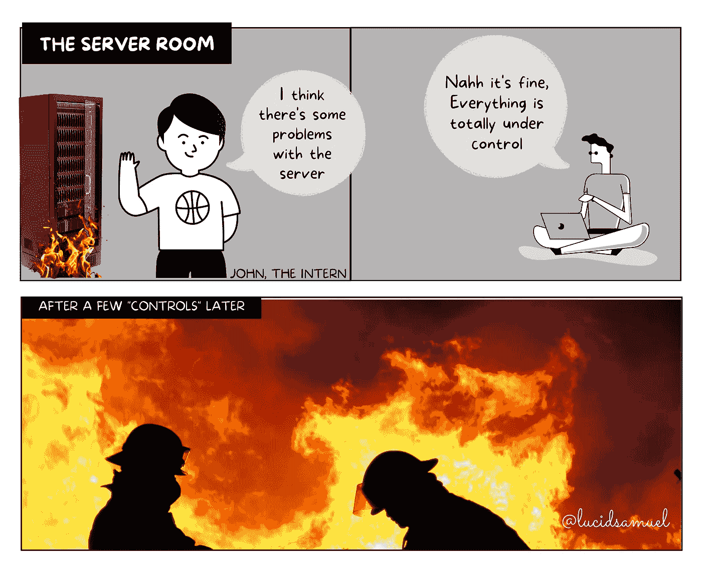
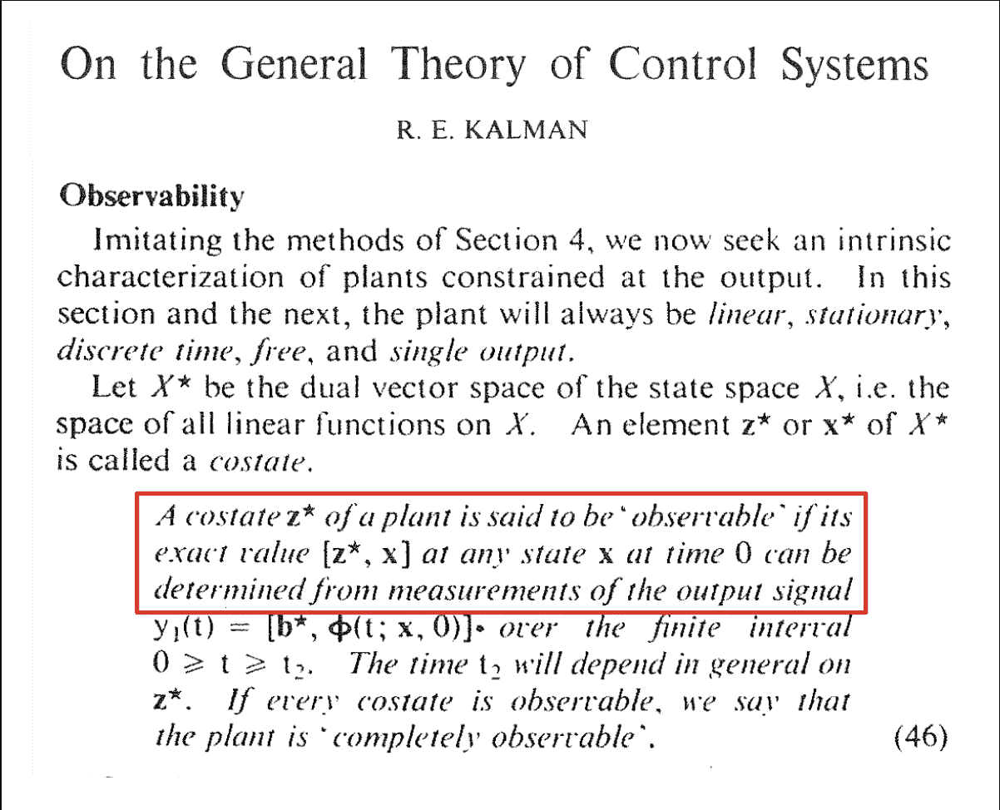
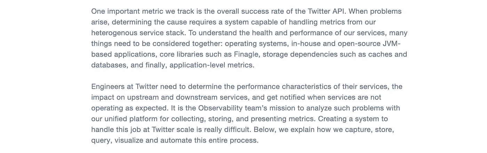
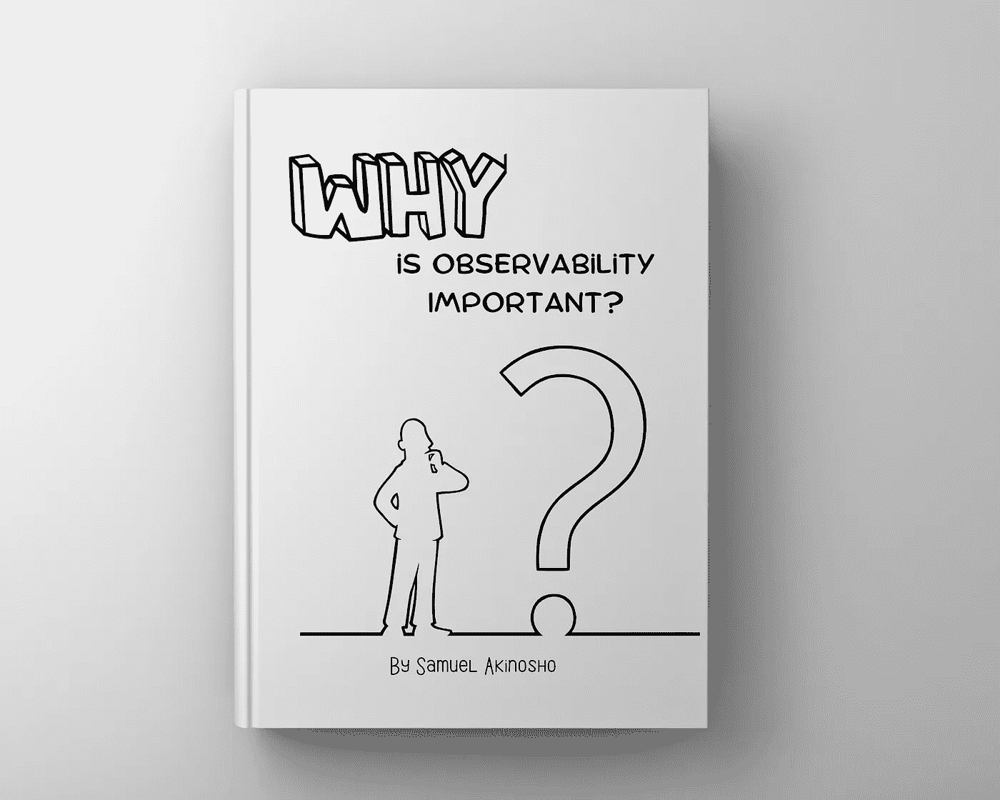
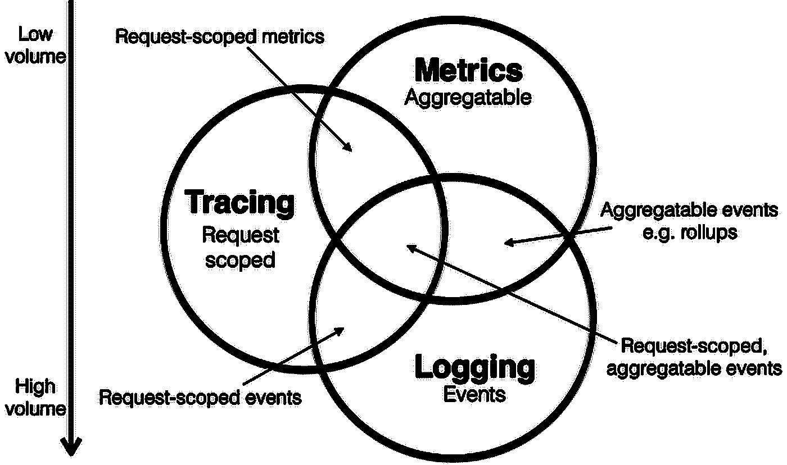

# 可观察性和监控在软件中的作用。

> 原文：<https://medium.com/codex/the-role-of-observability-monitoring-in-software-46bd88f792fe?source=collection_archive---------12----------------------->

在本文中，我们将深入探讨可观测性及其在软件中的重要性。我们将了解它的历史、目标和可观察性的重要性，以及如果它不出现在软件生命周期中可能出现的问题。

我们还将分析可观察性和监控之间的关键区别。最后，我们将看看采用可观察性的最佳实践，选择可观察性工具时要考虑的因素，以及如何为您的业务采用最佳策略。

## 什么是可观测性？—历史

“可观察性”这个术语来源于“观察”这个词，它意味着以得出结论为目的仔细观察某件事情。

回到技术领域，可观察性是由 Rudolf E. Kálmán 在 1960 年创造的，其根源与控制理论(应用数学的一个分支，处理使用反馈来影响系统行为以实现预期目标)有关，在机械系统中，传感器和检测器测量输出以通知适当的控制。

可观察性就是简单地知道您的用户、系统和应用程序在任何给定时间都在做什么(数据收集),以通知您什么是错误的以及为什么会发生(跟踪)。

> 我们无法修复我们无法观察到的东西

**Observability 的第一次出现，**这个术语的第一次出现是在 2013 年，当时 Twitter 的工程师发表了一篇名为“ [Observability at Twitter](https://blog.twitter.com/engineering/en_us/a/2013/observability-at-twitter) ”的博客文章，该文章旨在观察“多样化服务拓扑”在从整体式 IT 架构转向分布式 IT 架构时的健康状况和性能。

Twitter 的工程博客片段

现在我们已经介绍了背景，让我们看看“可观察性”和“监控”之间的基本区别，因为英语将它们解释为几乎相同的意思。

**监控**简单地告诉并向您展示某个地方出了问题，因为它是基于收集系统中预定义的度量标准或日志，而**可观察性**使用数据收集来告诉您出了什么问题以及为什么会出问题，从而使 SRE(系统可靠性工程师)或 DevOps 团队能够轻松地调试他们的系统，因此它是基于探索可能事先没有定义的度量标准和模式。

## 那么我们为什么需要它，它的重要性是什么？

艺术:为什么可观察性很重要？——塞缪尔·阿基诺索

从可观测状态 2021 [报告](https://www.businesswire.com/news/home/20210615005372/en/State-of-Observability-2021-Report-Links-Observability-Best-Practices-With-Successful-Digital-Transformationammsv/2021/09/21/10-key-takeaways-from-new-relics-observability-forecast-report/?sh=239c7ca41c0091%25)研究报告的问题开始:

*   53%的受访者表示，应用程序问题导致了客户或收入损失。
*   45%的受访者表示由于服务失误导致客户满意度下降。
*   30%的受访者表示因此失去了客户。

这导致很大比例的受访者为服务失败的后果付出沉重代价:

*   客户满意度较低(45%)
*   收入损失(37%)
*   声誉损失(36%)
*   客户流失(30%)

法律和合规部门肯定不会忽视观察，因为它在确保组织遵守其保护敏感数据免受未授权访问的法律义务方面发挥着重要作用。可观察性技术也可用于安全领域，以识别违规和入侵行为并防止数据泄露，从而使政府和监管机构能够避免或减少对违规行为的罚款。

统计数据还继续显示，由于可以从客户行为中监控的分析洞察力，具有可观察性实践的组织已经看到了收入增长和盈利能力，这有助于营销人员做出战略决策，并改善用户体验，从而提高组织的声誉。

那么，下一步是什么？

## 可观察性的三大支柱

来源:Peter Bourgon Venn 图表

**指标**

*指标*是如何在时间间隔内测量数据的数字表示。从操作系统到应用程序的一切都会生成指标，这些指标包括一组属性，如名称、时间戳和一个字段，以指示通常传达关于[SLA、SLO 和 sli 的信息的一些值。](https://cloud.google.com/blog/products/gcp/sre-fundamentals-slis-slas-and-slos)

当谈到监控时，度量是一个逻辑起点，因为如此多的资源已经准备好提醒我们它们自己。通常，SREs 和 ops 工程师使用指标在系统值超过指定阈值时触发警报，这些指标是选定的关键性能指标(KPI ),如响应时间、峰值负载、服务的请求、CPU 容量、内存使用、错误率和延迟。示例 KPI:

*   当系统停机或负载平衡器达到最大容量时触发警报
*   量化绩效
*   监控异常活动

**测井**

日志记录是监控工具箱中一个非常重要的过程，因为几乎所有东西都记录了它们在任何给定时间所做的事情的信息。此外，日志提供了比指标更详细的资源信息，大多数应用程序框架、库和语言都支持日志记录。因此，如果指标显示资源已经死亡，日志将帮助您找出它死亡的原因。

日志的问题是好东西可能太多了。由于您环境中的一切都在跟踪他们在做什么，并急于共享这些信息，因此很容易看到这会产生大量数据，而不是简化监控过程，您可能只是在创建另一个新的集中式大草堆。

**追踪**

日志和度量对于评估单个系统的行为和性能很有用，但是对于确定分布式系统中请求的生命周期却很少有用。跟踪是另一种可观察性方法，它允许您跨多个系统查看和理解一个操作的整个生命周期。

如上所述，跟踪可以说是一系列因果关联的分布式事件的表示，这些事件封装了通过分布式系统的端到端请求流。

跟踪反映了请求或操作的完整路径，当它遍历分布式系统中的所有节点时，提供了对系统健康状况的关键可见性。跟踪提供系统剖析和检查，特别是对于容器化应用、无服务器架构和微服务架构。

通过分析跟踪数据，您可以监控整个系统的健康状况，识别潜在的问题，更快地发现和处理问题，并识别优化和改进的高价值领域。

## 实现可观察性工具

来源:逻辑监视器

当考虑到能够在您的组织中实现成功时，客户体验往往是首先要考虑的事情，也是当今大多数科技公司成功的关键。另一个关键标准是必须主动解决诸如生产中的应用程序可用性和性能等问题。这就是可观察性发挥作用的地方。现在需要一个可靠的可观测性架构来保持您的系统平稳运行。

我已经为日志聚合、分布式跟踪、APM、时序分析和指标收集编制了一系列可观察性工具。但不是基于对这些工具的主要优点或比较的深入研究；然而，这是一个很好的起点，可以让你开始增加可观察性。

通过选择正确的可观察性平台，在单一视图中获得系统性能数据的关联视图，并建立可观察性文化，您将能够更快地发现问题，了解问题的原因，并最终以更快的速度构建以客户为中心的产品。

一些值得考虑的顶级可观察性和日志管理工具。

*   [Splunk](https://www.splunk.com/)
*   [Datadog](https://www.datadoghq.com/)
*   [胡密欧](https://www.humio.com/)
*   [Dynatrace](https://www.dynatrace.com/)
*   [格拉夫纳实验室](https://grafana.com/)
*   [蜂巢](https://www.honeycomb.io/)
*   [新遗迹](https://newrelic.com/)

然后，您需要识别和监控与您已经经历过的问题以及将来可能遇到的问题相关的指标。

将可观察性纳入事件管理流程后，您必须识别和监控与已经发生的问题和预计将来会发生的问题相关的指标。之后，您应该在整个组织中建立以可观察性为中心的文化。

如果没有实现这个模型，您可能无法从您的可观测性架构中获得最大收益，因为再多的可观测性工具也无法取代坚实的工程本能和直觉。

