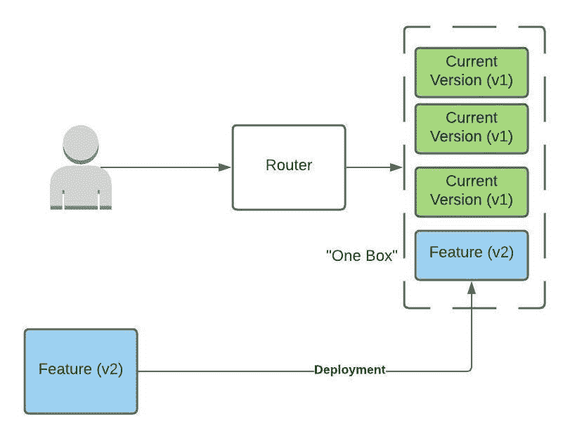
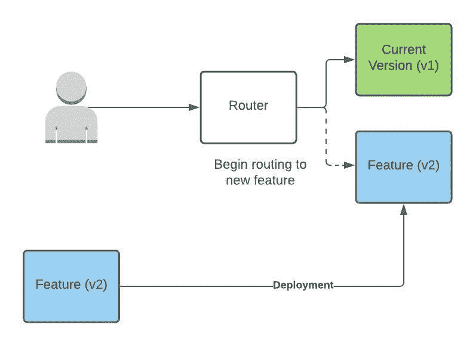
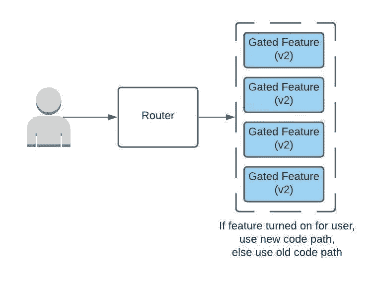
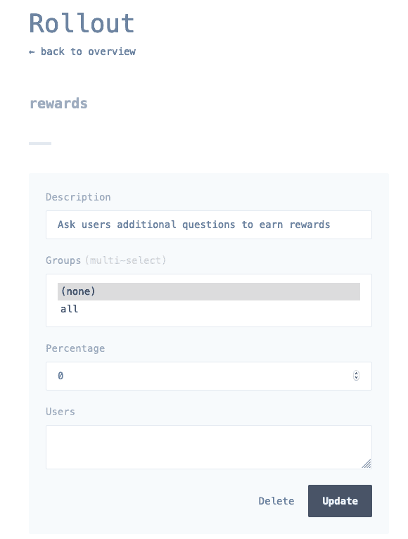
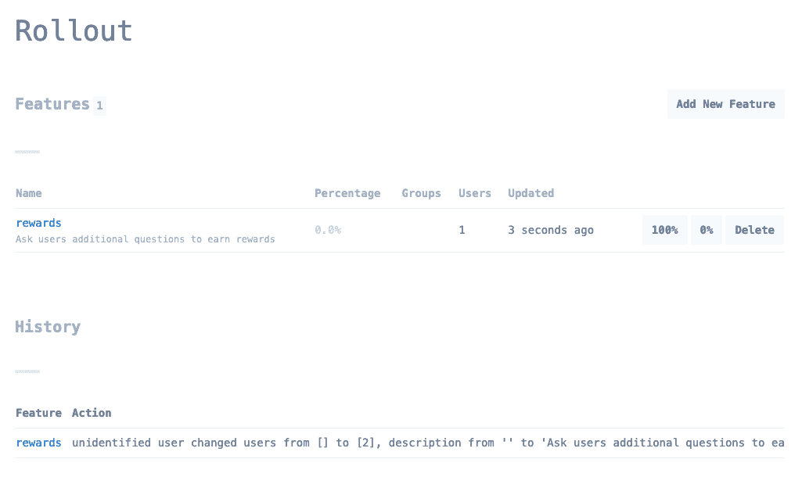
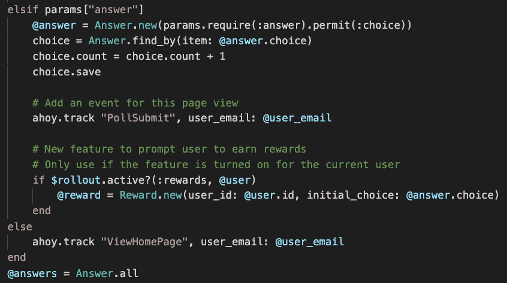
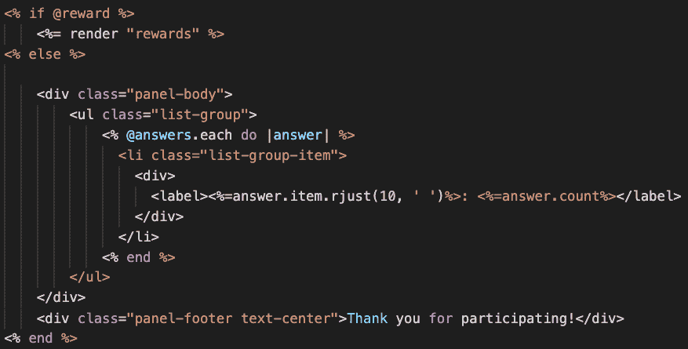
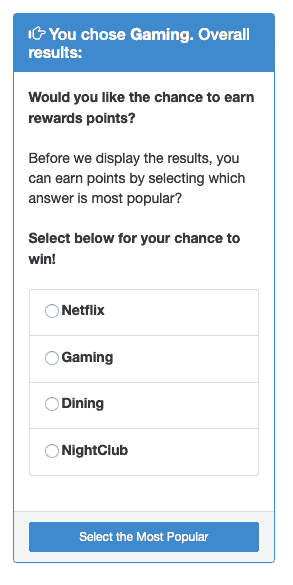

# Ruby Unbundled 系列:通过放慢速度来更快地发布特性

> 原文：<https://medium.com/codex/the-ruby-unbundled-series-release-features-faster-by-slowing-down-9852992773a8?source=collection_archive---------10----------------------->


在今天的环境中，特征速度是绝对重要的，然而质量也是如此。客户最初的糟糕体验可能会导致他们不再回来。事后解决问题可能为时已晚，因为第一印象很难改变。那我们该怎么办？你可以选择花更多的时间进行测试，但是当你呆在实验室里的时候，你会得到越来越少的回报。现实世界的操作条件是无可替代的。也没有办法事先知道客户对新功能会有什么反应。幸运的是，有许多技术可以让你更自信地向世界发布新特性。

有句话说，为了加快速度，你需要放慢速度。这在软件开发中是真实的，因为我们想要控制用户接受新特性的速度。如果每个人都同时获得一个新版本，并且出现了问题，那么您已经影响了所有的客户。这对每个人来说都是糟糕的一天。相反，您希望慢慢推出该功能，以消除出现的任何问题。

如果问题确实存在，快速回滚是必不可少的。即使只有一小部分客户遇到了新版本的问题，您也希望尽快将这种影响降到最低。这些发布策略提供了比典型的软件部署更快的“回滚”机制。

一般来说，你想在一开始缓慢地发布新的版本和特性，然后随着你对新软件的信心增加而加快速度。慢慢前滚，但总是快速回滚。通过使用较慢的首次展示，您将提高您的整体功能速度和客户满意度。

# 通过部署控制推广率

一种方法是控制服务器接收新版本的速度。您可以允许客户流量在所有设备中实现负载平衡，但只有一定比例的主机会有这项新功能。该过程通常从单个主机获取更新开始。这个主机叫做 [OneBox](https://aws.amazon.com/builders-library/automating-safe-hands-off-deployments/) 。你仔细监视这一台主机，如果有任何问题就发出警报。如果一切顺利，你可以继续对舰队的其他部分进行分阶段部署。



这种方法与[蓝/绿部署形成对比](https://martinfowler.com/bliki/BlueGreenDeployment.html)在这种方法中，您有第二组主机的开销，您交替使用这两组主机来指代蓝主机或绿主机。备用设备群的部署完成后，流量将被路由到新主机。这种策略会产生基础架构开销，但好处是前滚和回滚速度极快。然而，基本概念是全有或全无的方法。一旦你转换到新的舰队，任何潜在的影响将是广泛的。你向前滚动的速度非常快，但请记住这不是我们的目标。最初，我们希望以缓慢、有条不紊的步伐向前推进。



# 用特性门控制推广率

另一种不同的理念是将新软件放在设备群中的主机上，但使用标志或功能门来控制哪些用户获得新功能。这涉及到将您的用户划分到箱中，通常基于客户标识符或属性的散列值。使用这种技术，你可以从只向 5%的用户发布你的特性开始。如果进展顺利，增加到 10%，30%，等等，直到 100%释放。100%时，您的功能通常是可用的。

这种技术允许你最小化可能存在的任何错误的爆炸半径或影响。如果新功能引起了问题，您希望在影响最少客户的情况下尽快发现问题。

这确实是以增加代码复杂性为代价的。在一段时间内，将有多条路径必须被维护。一旦特性正式发布，您确实需要清理旧的代码路径，以减少混乱和以后处理它们所花费的时间。

尽管如此，特性门提供了一种非常有效的方式来管理安全的特性发布。当必须管理数据库迁移和软件部署的时间安排时，它们也非常有用。如果很难或不可能创建支持两个版本的数据库模式，那么可以使用这种技术来精确控制转换的时间。



理想情况下，第一个获得门控功能的生产用户是一个[金丝雀](https://martinfowler.com/bliki/CanaryRelease.html?ref=wellarchitected)账户。现在，这个 canary 用户是由您的团队创建的，并在正在进行的自动化测试中使用。因此，这些能力是在生产中运用的，但它们只影响您自己的客户。这可以捕获许多特定于环境的问题，否则这些问题不会出现在测试环境或系统测试中。然而，测试覆盖范围将被限制在您的手动测试或者使用该帐户的测试脚本所覆盖的用例上。实际用户倾向于做一些你意想不到的事情，但是这项技术对于在你的客户发现问题之前知道问题的存在是非常宝贵的。

# 永远不要害怕回滚

到目前为止，我们已经谈论了我们前进的速度。另一方面，您还可以非常快速地安全回滚，这一点非常重要。如果你将要经历一个软件发布，并且你不知道你的回滚程序是什么，停下来，回到你的发布的计划步骤。

最简单的回滚形式是运行另一个部署，这次是回到代码的原始版本。然而，与其他选项相比，这相当慢。我们讨论的一些技术使用路由来快速改变处理给定请求的端点和伴随的软件版本。功能标志还提供了一种快速回滚机制，因为标志被切换回来，代码所采用的路径会立即从新的返回到旧的。

您应该始终对回滚机制感到满意。如果怀疑某个版本是否会导致问题，或者您在指标中看到有问题的数据，您应该继续回滚。回滚您的发布不一定是一件坏事。不应该有失败的感觉，因为你总是从向前滚动中学到一些东西，可以用来改进事情。现在，您的日志和度量中有了数据，您可以分析这些数据来查看新代码在生产中的效果。分析所需的时间可能比您想象的要长，因此您不希望在这项工作完成时对客户产生任何影响。因此，当有疑问时，回滚。拥有一个良好的自动化解决方案来前滚和回滚版本是至关重要的，这样您就可以轻松、快速、自信地完成这项工作。

# 让我们不要忘记数据库的变化

数据库更改通常成为首次展示中最复杂的部分。在可能的情况下，您只想对数据库模式进行不间断的更改。这意味着您将只添加表、添加列或减少现有列的限制。当然，您可能最终得到一些什么也不做的表，但是遵守这个约束允许您轻松地向前和向后滚动。

为您的数据库模式变化编写防御性代码。假设在打开该功能之前，您可能无法回填所有新列的数据。编写代码，使缺少值的情况与缺省值一样处理。像这样的小事将有助于避免在模式更改、回填和软件发布之间的部署过程中出现任何小的时间问题。

# 在 Rails 应用中实现特性门

特征门机制需要两个主要能力:

1.  特征门值的存储和管理
2.  内联代码检查以确定是否为给定用户打开了该功能

Ruby gems [rollout](https://github.com/fetlife/rollout) 和 [rollout-ui](https://github.com/fetlife/rollout-ui) 为 Rails 应用提供了这些功能。首先，将它们和 [mock_redis](https://github.com/sds/mock_redis) 一起添加到您的 Gemfile 中。Rollout 使用 Redis 存储特性标志值，并在运行时快速访问它们。这一点很重要，因为每个相关的请求都需要引用该值，简单的缓存是不够的，因为我们需要快速回滚。Mock redis 允许在非生产环境中进行简单的开发和测试。

```
gem 'rollout'
gem 'rollout-ui'
group :development, :test do
 gem 'mock_redis'
end
```

只需在 routes 文件中包含一个挂载，就可以添加用于展开的用户界面。

```
mount Rollout::UI::Web.new => '/admin/rollout'
```

在 application.rb 文件中配置卷展栏。

```
unless Rails.env.production?
 $redis = MockRedis.new
else
 $redis = Redis.new
end
$rollout = Rollout.new($redis, logging: { history_length: 100, global: true })
Rollout::UI.configure do
 instance { $rollout }
end
```

# 在应用程序中使用 Rollout

现在，您已经准备好创建一个特性标志，并在代码中使用它。我将通过添加一个功能来增强我的即时投票应用程序，该功能会提示用户猜测他们认为最受欢迎的答案是什么。这可能与他们对民意测验问题的回答不同。我们还将通过这样做给他们赢得奖励积分的机会。

浏览至<host>/管理/卷展栏，创建命名特征。在这里，我们创建了一个名为“奖励”的功能。</host>



接下来，我们添加一个奖励模型类来捕获额外的用户猜测和相关的奖励积分。在我们的 PollController 中，我们将使用卷展栏检查当前用户的特性门。方法。如果这个特性是打开的，那么实例化一个 rewards 对象，并把它放在视图组件要调整的范围内。



然后，在视图组件中，我们将显示我们的附加奖励问题。



这就是全部了！一旦您的特性完全推出，或者普遍可用，您就可以清理特性门代码，只留下新的路径。这是启用了该功能的用户的结果。

希望这有所帮助，我们期待着看到你建立什么新功能！

*最初发表于*[*【https://blog.engineyard.com】*](https://blog.engineyard.com/the-ruby-unbundled-series-release-features-faster-by-slowing-down)*。*