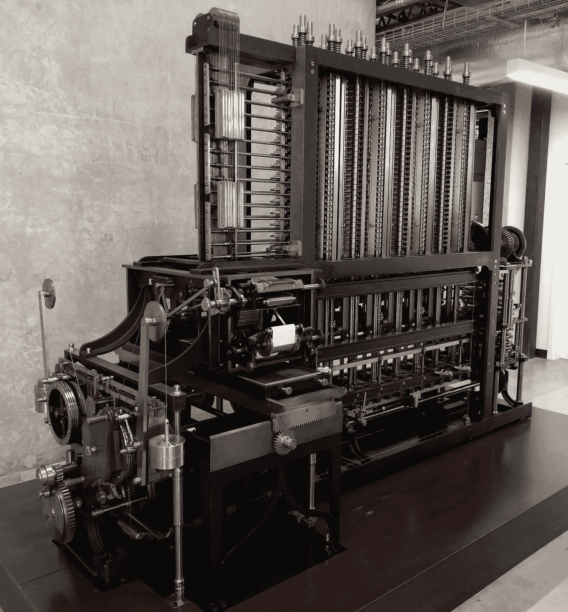

# “分析引擎”的传奇:查尔斯·巴贝奇和阿达·洛芙莱斯如何发明数字计算机

> 原文：<https://medium.com/codex/the-saga-of-the-analytical-engine-how-charles-babbage-and-ada-lovelace-invented-modern-computers-fd096952371b?source=collection_archive---------6----------------------->

差异引擎 2 号，维基共享

查尔斯·巴贝奇是英国数学家、哲学家和机械工程师，1792 年出生于德文郡。他是银行家本杰明·巴贝奇的儿子，由于小时候身体不好，他一直接受私人教育，直到 1810 年他在剑桥上大学。他热爱自学的数学，并沮丧地发现自己比老师懂得还多。

在大学里，他最亲密的朋友是约翰·赫歇尔和乔治·皮科克，他们都对数学和天文学感兴趣。他们和爱德华·布罗姆黑德一起创立了分析学会，目的是使数学研究现代化，并鼓励在微积分中使用大陆方法。

二十多岁时，巴贝奇成为一名数学家，并于 1816 年当选为皇家学会会员，在 1820 年成立天文学会(后来称为皇家天文学会)的过程中发挥了重要作用。

巴贝奇和约翰·赫歇尔一起为天文学会校正数学表格。这些表格是由“计算机”计算出来的。那时的“计算机”是指按照固定的算术程序用手进行计算的人。这两个朋友正在比较由不同“计算机”执行的同一组计算结果的表格。如果“计算机”工作正常，两组结果应该是相同的。这是一个需要高度集中注意力的缓慢过程，激怒了巴贝奇，据报道他大声说道:“*我真希望这些计算是用蒸汽完成的。”*

机械计算数学表格的想法在 1812 年左右首次出现在巴贝奇的脑海中，并主宰了他的余生。

多年来，许多人试图制造计算机器。17 世纪 40 年代，法国数学家和哲学家布莱士·帕斯卡发明了一种可以加减数字的机械计算器，并获得专利和商业销售。30 年后，德国数学家兼哲学家戈特弗里德·莱布尼茨试图通过增加乘除能力来改进帕斯卡的机器，然而，他无法生产出可靠工作的版本。

巴贝奇熟悉帕斯卡和莱布尼茨的装置，但他想发明一种机械方法来计算对数，采用了法国数学家加斯帕德·德普罗尼的想法。为了创建三角学表格，de Prony 将运算分解成非常简单的步骤，只涉及加法和减法。

巴贝奇在 1822 年设计了一种使这一过程机械化的方法，他称之为**‘差分机’**，一种用来计算多项式函数值的计算器。他设法从英国政府获得资金，并于 1823 年邀请约瑟夫·克莱门特来实施他的计划。

父亲去世时，巴贝奇继承了一大笔财产，他每周都在自己家里举行聚会，邀请多达 300 名客人，包括知识分子、实业家、政治家和科学家。这些活动的亮点是巴贝奇展示了他的差分机的模型部分。巴贝奇会很有天赋地展示这个模型，转动手柄来计算一系列数字，强调数字的模式是如何根据他给机器的编码指令而变化的。那些对机器的工作表现出兴趣的人被请去参观了他家以前的马厩，整个机器就是在那里建造的。拜伦的女儿阿达·洛芙莱斯继承了她父亲的浪漫主义，她的母亲试图通过让她上数学课来减轻这一点。与她父亲不同，她父亲认为浪漫主义时代的情感与工业革命的精神相冲突，艾达对这两个时代都很适应。在一次活动中，艾达见到了巴贝奇，并向他表达了对机器概念的兴趣。

19 世纪 30 年代中期，当巴贝奇还在研究差分机时，他就为**【分析机】**制定了计划，这将是一台可编程的机械数字计算机，能够通过执行所有四种基本算术运算来执行任何计算。这种机器将由蒸汽机提供动力，并由四个部件组成:磨坊(现代计算机中的中央处理器)、商店(相当于记忆和存储)、阅读器(输入设备)和打印机(输出设备)。分析引擎从未被制造出来，因为它比当时制造的任何东西都要复杂得多。

阿达·洛芙莱斯意识到了这个概念的可能性，她开始鼓励其他人也看到这一点。

为了寻求对他的想法的支持，巴贝奇同意在都灵的意大利科学家大会上发表演讲。年轻的工程师 Luigi Menabrea 上尉参加了这次活动，他后来成为意大利总理。1842 年，Menabrea 用法语发表了一篇关于机器工作的文章。

阿达·洛芙莱斯的朋友鼓励她为“科学回忆录”翻译梅纳布雷亚的文章，这是一份致力于科学论文的出版物。这将是一个帮助巴贝奇并展示其才华的机会。

翻译完成后，她通知了巴贝奇，后者建议她给梅纳布雷亚的作品添加一些注释。艾达开始着手一个名为**‘译者注’**的章节，结果这个章节的长度是原文的两倍。

这些“笔记”最终比那篇文章更出名，使她成为计算机历史上最重要的人物之一。

在她的“笔记”中，艾达探讨了四个概念:第一个是强调巴贝奇的差异引擎和分析引擎之间的差异。差异引擎是为航海表的计算而构建的，而分析引擎将能够计算任何函数——就像现代计算机一样，这将是一台通用机器。

第二个概念来自这样一种理解，即这台机器的操作不需要局限于数学和数字，而是可以扩展到任何符号，如单词和音符。这将成为数字时代的核心概念:任何内容、数据或符号，如音乐、文本、图片或视频，都可以数字化表达，并由计算机处理。在巴贝奇专注于数字的地方，阿达实现了从计算器到现代计算机的概念飞跃。

阿达的第三个概念是详细了解我们现在称之为计算机程序或算法的工作原理。她设计了一个计算伯努利数的程序，描述了一系列操作和一个图表，显示了每个操作如何被编码到机器中——该程序将包括子程序(执行特定任务的指令序列)和递归循环(自我重复的指令序列)的概念。所有这些都可以通过使用穿孔卡来实现。

她的“笔记”的第四个概念是解决这样一个问题:“机器能思考吗？”
根据她的说法:*“分析引擎并不自命不凡，无论如何都要创造任何东西，它可以做我们知道如何命令它执行的任何事情。它可以跟随分析；但它没有能力预测任何分析关系或真理。”*

直到 1937 年发现了他的笔记本，巴贝奇的分析引擎计划才被人遗忘。1991 年，伦敦科学博物馆建造了巴贝奇差分机 2 的工作模型，这一设计融合了巴贝奇在研究分析机时的改进思想。