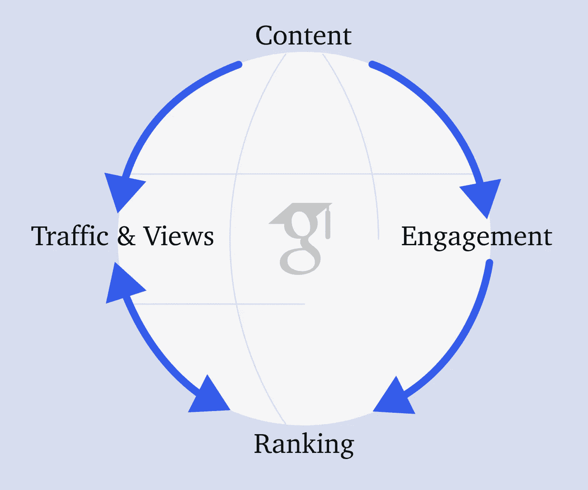

# 搜索引擎的秘密

> 原文：<https://medium.com/codex/the-secret-to-search-engines-af124f25421f?source=collection_archive---------13----------------------->

去年谷歌赚了 2560 亿美元，电子商务总收入达到 5.6 万亿美元。

搜索引擎的成功是通过在尽可能短的时间内为用户提供他们正在寻找的东西来推动的。秘密在于他们的算法，该算法对网站质量和与任何给定搜索的相关性进行精确排名。

在 Figma 中设计，带有[图标](https://www.figma.com/community/plugin/735098390272716381/Iconify)

# 相关性:

相关性是通过不断扫描和索引网络来评估的。搜索引擎将首先识别搜索中的主要关键字。

如果我搜索“[什么是数字营销](/@aidanmcmurray/how-to-sell-a-product-in-5-minutes-a59556819367)？”那么数字营销将是主要的关键词。

然后，搜索引擎会寻找二级关键词(又名 LSI 关键词)，如社交媒体、电子邮件和显示广告，以确保列出的网页全面且切题。

# 等级

搜索引擎根据质量标准对网站进行排名，被称为质量分数。

如果你建立了一个网站，它会在同一天被索引到相关的搜索。该网站将不会排名，直到它开始推动参与和证明自己的质量。这需要利用来自社交媒体、电子邮件列表、电话甚至店面的顾客。随着时间的推移，流量像雪球一样越滚越大。

## 约会

质量是通过参与度来衡量的。这是由以下数据集决定的:

*   **反向链接:**这些是分享你页面的网站。从你的文章被引用的博客到分享文章的社交媒体平台，任何东西都可以称为反向链接。这些网站和社交分享的参与度也会影响你的排名。
*   用户在你网站上花费的时间是谷歌用来衡量你网站质量的最重要的指标之一。
*   跳出率:这显示了有多少用户离开了他们访问的第一个网页。
*   **退出率**:这表明有多少百分比的用户在浏览了网站的其他部分后离开了特定的网页。

## 你如何创建一个有良好参与度的网站？

好的图片和文字，也就是内容，是第一要素。第二个是你的界面和它的效果。

> [如果页面加载时间超过 3 秒，53%的移动网站访问会被放弃](https://www.hobo-web.co.uk/your-website-design-should-load-in-4-seconds/)

74%的专业人士表示，优质内容是营销最重要的方面。内容是推动参与度、排名和浏览量的因素。这种效应是循环的，导致一个帖子、网站或个人资料变得像病毒一样传播或消失。

## 如何测试我的网站的网页性能？

有一些工具可以衡量 web 性能的各个方面。谷歌有一些是免费的；

*   **Pagespeed insights:** 该网站自动发现网站加载时间的问题和解决方案。这是最好的负载测试服务。
*   **谷歌趋势:**该网站识别高流量关键词，并提供相关关键词，以协助撒网。
*   **分析:**谷歌提供的最强大的工具是分析。它跟踪你的网站如何获得用户以及他们如何行动。

# 结论

> 【内容为王】-**-*比尔盖茨*-**

如果内容为王，那么参与就是皇冠。

内容的效果可以通过整合您的数字成果来增强。在社交网站上分享你的网站，社交到电子邮件等。归根结底，你的内容将是决定你或你的公司网上形象的关键。

## 为什么跟踪换跟踪的方法不起作用

> ***跟我来，我跟着你回去***

我相信你在网上看到过这个。这是通过与他人互动来提高你的参与度的最直接的方式。是的，我会跟着你回去。我也会关注你的内容，这样你也会关注我的内容。

跟随跟随方法的问题在于，跟随来自于人为的兴趣。用户关注你只是为了获得一个关注度。因此，他们不太可能关注你未来的内容。随着你对参与度的看法下降，这可能会导致影子禁令。

所以我不会真的跟着你回去。除非你非常仔细地阅读这篇文章，并留下深思熟虑的评论。这样，兴趣是真实的，我们可以一起增加我们的追随者。

# TL；速度三角形定位法(dead reckoning)

更多的参与带来更高的排名，带来更多的流量和更多的参与。

这就是我写这篇文章的原因。这就是为什么苹果、宝马，甚至家具公司都在写博客。

它也可以通过与你的客户和追随者频繁接触来增强。人们更有可能与和他们交往的人交往。

最后，对互联网上的任何东西进行排名都是一项巨大的工作。通常最便宜的选择是选择直接销售你的产品的广告策略。

## 你可以在这里阅读那些付费广告策略的概述[或者在](/@aidanmcmurray/how-to-sell-a-product-in-5-minutes-a59556819367) [LinkedIn](https://www.linkedin.com/in/aidan-mcmurray-03a156242/) 联系我进行咨询。

 [## 简化的数字营销:社会工程和算法

### 过去，在 5 分钟内卖出一件产品仅限于打电话或在店面销售。互联网让消费者…

aidanmc.gumroad.com](https://aidanmc.gumroad.com/l/DigitalMarketingSimplified)