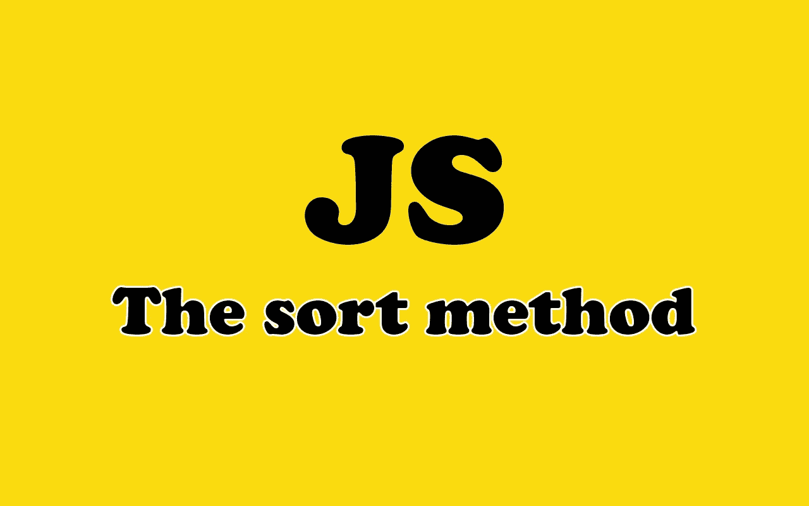

# 举例说明 JavaScript 中的排序方法

> 原文：<https://medium.com/codex/the-sort-method-in-javascript-explained-with-examples-f1806b3fbda6?source=collection_archive---------1----------------------->

## [法典](http://medium.com/codex)

## 通过示例了解 JavaScript 中的排序方法。

由[作者](https://mehdiouss315.medium.com/)创造的 with❤️️形象。

# 介绍

高阶函数基本上就是以另一个函数为自变量的函数。sort 方法是一个有用的高阶函数，主要用于 JavaScript 中的数组。