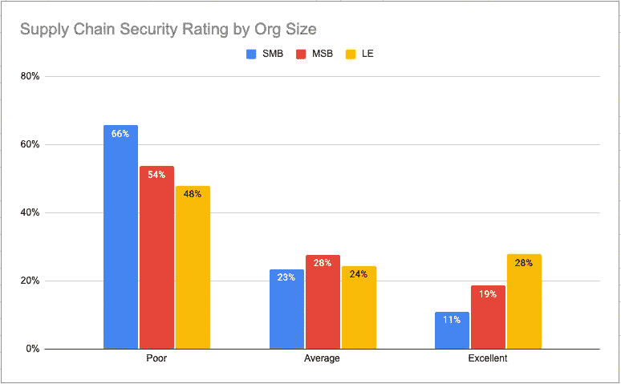
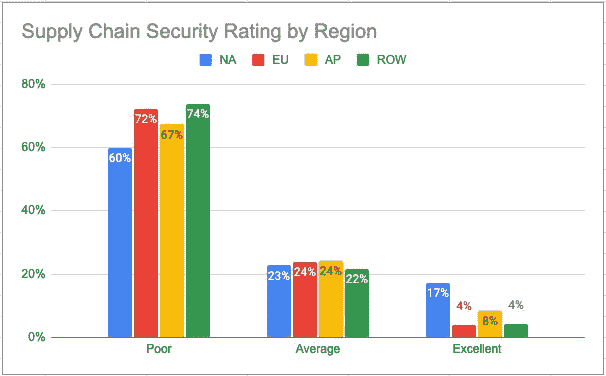

# 软件供应链安全状况

> 原文：<https://medium.com/codex/the-state-of-software-supply-chain-security-bc565a50b877?source=collection_archive---------27----------------------->

2021 年末，ActiveState 进行了一项包括 1500 多名软件专业人员的[供应链安全调查](https://www.activestate.com/resources/datasheets/software-supply-chain-security-survey-report/)；全世界大大小小的组织中的编码人员(32%)、安全人员(44%)和开源领导者(19%)。长话短说:不到 20%的受访者(平均而言)在他们现有的软件供应链安全实施方面获得了“优秀”的评级。

问题在于软件供应链既广泛又深入，包括您使用的所有公共开源库，以及您的组织运行的专有软件开发过程。换句话说，从端到端保护您的供应链是一项重要且昂贵的任务，大多数组织尚未投入适当的时间和资源。

但是供应链的威胁是真实的，并且还在增长。Sonatype 报告称，2021 年[供应链攻击增长了 650%](https://www.sonatype.com/resources/white-paper-state-of-the-software-supply-chain-2020) ，相比之下，2020 年增长了 430%。甚至拜登总统也被迫呼吁关注日益增长的风险，发布了一项[行政命令](https://www.activestate.com/blog/president-biden-secure-your-software-supply-chain/)，呼吁在 2021 年期间改善开源安全实践。不幸的是，供应链安全仍然是一个不成熟的实践。虽然某些方面，如管理开源漏洞是众所周知的，并有完善的最佳实践，但保护整个软件开发生命周期(从导入开源组件到构建工件到运行功能代码)仍然是一个关键挑战。

这篇博客文章可以帮助您了解您自己的供应链安全性与同行相比如何，以及您可以实施哪些最佳实践来提高您的软件供应链的安全性和完整性。

# 保护开源软件供应链

我们进行了供应链安全调查，以评估组织目前正在采取哪些措施来限制他们在软件开发过程中使用的潜在受损软件。带来安全挑战的关键流程包括:

*   **导入** —导入第三方工具、库、代码片段、包和其他软件资源以简化开发工作的过程。
*   **构建** —编译、构建和/或打包代码的过程，通常通过自动化系统，该系统还对构建的工件执行测试。
*   **运行** —在开发、测试和生产环境中使用、测试和运行构建的工件的过程。

对于每个流程，组织都可以实施许多最佳实践安全控制来降低风险。调查对象被问及，他们目前有哪些控制措施来降低与进口、构建和运行他们用来创建商业软件产品的开源软件相关的风险。根据他们的回答，给他们打分:

*   **差** —分配给实施了最低限度的导入、构建和运行安全控制的受访者。
*   **平均值** —分配给已经实施了许多导入、构建和运行安全控制的受访者。
*   **优秀** —分配给已经实施了大部分导入、构建和运行安全控制的受访者。

上图显示了按公司规模划分的软件供应链安全评级，包括中小型企业(SMB)、中型企业(MSB)和大型企业(LE)。

结果并不令人惊讶，它表明较小的组织往往被评为差，而较大的组织有更好的供应链安全评级。这一结果只是反映了这样一个事实，即在整个软件供应链中实现安全性和完整性控制是一项昂贵且资源密集型的任务，更适合财力雄厚的大型企业。

上图显示了按地理区域划分的软件供应链安全评级，包括北美(NA)、欧盟(EU，包括英国)、亚太地区(AP)和世界其他地区(ROW)。

供应链安全是一个全球关注的问题，但一些国家的公司在实施方面比其他公司走在了前面。一个典型的例子是，与其他地区的公司相比，至少有两倍多的北美(NA)公司已经获得了“优秀”供应链安全评级。也就是说，超过 80%的 NA 组织仍然缺乏真正强大的解决方案。

# 说到供应链安全，大多数软件行业还有很长的路要走

在很多方面，软件供应链安全并不是一个新概念。自从我们使用开源软件以来，我们已经有了处理开源漏洞的长期最佳实践。但是当涉及到我们的软件开发过程时，我们仍然缺乏相同程度的最佳实践实现来处理:

*   **进口安全问题**如:
*   域名仿冒——攻击者向开源存储库提交一个与流行的现有包名称相似的包的行为。
*   依赖关系混乱——当构建系统从公共存储库中而不是您的私有存储库中获取一个相似名称的依赖关系时，就会发生这种情况。
*   作者模拟——例如，突然拥有新作者的包应该被视为可疑包。
*   **构建安全问题**比如可能利用您的构建系统的恶意构建/安装脚本，或者可能包含远程资源的动态包。
*   **开源消费安全问题**，例如确保您的开发人员只使用由可信供应商根据审查过的源代码构建的经过签名和验证的包，而不是安装来自公共存储库的未经签名的预构建二进制文件。

正如来自 [ActiveState 调查](https://www.activestate.com/resources/datasheets/software-supply-chain-security-survey-report/)的数据显示，行业的软件供应链安全实践继续落后于日益增长的供应链威胁。在 2022 年，软件开发组织需要做更多的工作，以降低用折衷的开发过程和开源包创建软件的风险。