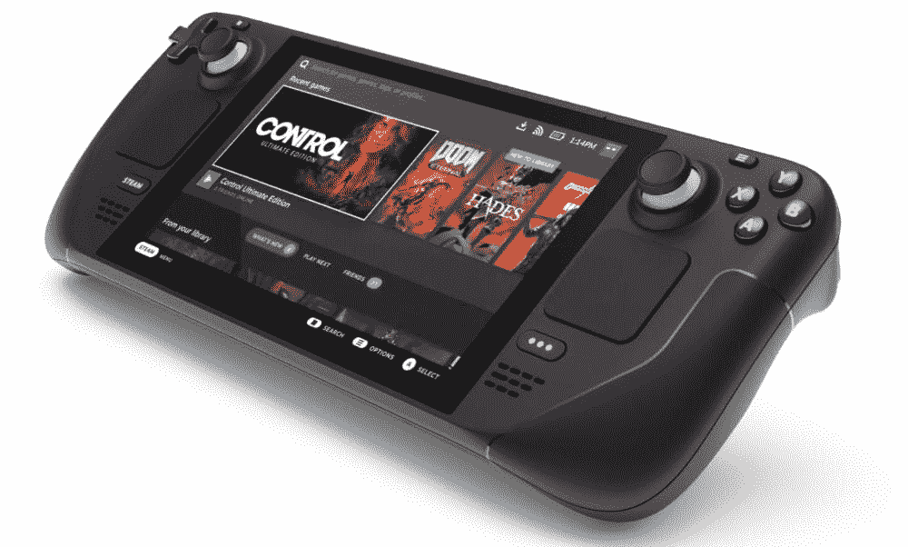

# 蒸汽甲板是游戏的未来

> 原文：<https://medium.com/codex/the-steamdeck-is-the-future-of-gaming-483a477f6f60?source=collection_archive---------4----------------------->

2021 年夏天，Valve(Steam 的母公司)发布了他们的掌上游戏机 Steamdeck，让整个游戏世界兴奋不已。现在它在这里，这是我对它的看法。

# 用户界面(用户界面/UX)

Steamdeck 的用户界面使用经典的 steam 颜色(黑色和蓝色)，同时仍然具有现代和干净的外观。菜单很容易理解，可以使用触摸屏或操纵杆进行导航，让您选择自己喜欢的输入法。

几乎 Steamdeck 上的每一个动作都伴随着令人满意的声音，偶尔还有一些触觉反馈，这不像许多其他评论者，我觉得很好。

在用户界面方面唯一令人失望的是商店，因为它使用 steam 网站，因此每当按下按钮时都需要一段时间来加载。

# 硬件

蒸汽甲板的硬件很棒。它不仅具有良好的人体工程学特性和相对于其尺寸而言较轻的重量，而且还具有出色的内部功能，包括带有 RDNA 2 集成显卡的 AMD 处理器、16 GB 内存、蓝牙、wifi、SD 卡插槽以及 64、256 或 512 GB 存储空间，具体取决于型号。

Steamdeck 也有很多方法来控制你玩的游戏，包括两个操纵杆，左右触发器，左右按钮，一个 d-pad，一个 b x y 按钮，背面的 4 个额外按钮，两个触摸板，陀螺仪控制和一个触摸屏。

# 游戏感觉如何？

在 Steamdeck 上，大多数独立游戏都玩得很好，没有口吃或突然的 fps 下降。像 Forza Horizon 5 和 Apex legends 这样的 3a 游戏也可以工作，尽管可能会出现口吃，并且登录 Apex Legends 需要用户手动让键盘出现。

Steamdeck 在游戏中非常有用的一个惊人功能是内置的 fps 计数器，可以配置为显示不同数量的信息。

# 结论

在使用 steam deck 几天后，我现在认为它是一个了不起的主机，但在软件方面仍需要一些工作。我认为 Valve 在融合 PC 的开放性和控制台的用户友好性方面做得很好。

我希望你喜欢这篇文章，如果你喜欢它，请留下喜欢，如果你不同意或有一些反馈，请留下评论。如果你喜欢科技内容，可以考虑跟着我或者在 https://www.buymeacoffee.com/ccm7676 买杯咖啡。