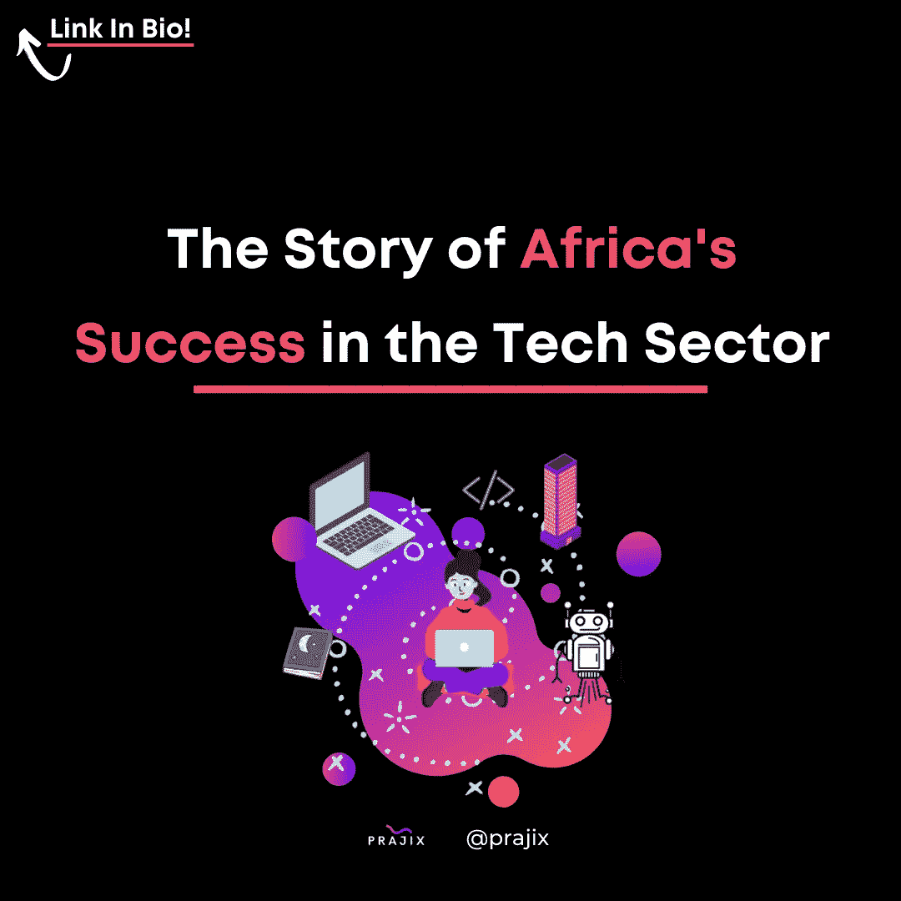

# 非洲在科技领域的成功故事

> 原文：<https://medium.com/codex/the-story-of-africas-success-in-the-tech-sector-8ed532cc2053?source=collection_archive---------7----------------------->

近年来，非洲的科技创业公司受到了很多关注。似乎每天你都会阅读全球科技的最新消息，似乎都会提到一家总部位于非洲的新科技创业公司获得了资金。

自 2010 年代初以来，非洲科技公司一直在稳步获得更多资金，以实现财务稳定。2015 年，非洲有 55 家科技创业公司获得了资金。2020 年，这一数字上升至约 359 家(资料来源:《克服非洲科技创业障碍》，波士顿咨询集团，2021 年)。

为什么会出现这种情况*现在*？什么样的全球经济/社会力量给非洲科技带来了前所未有的成功？这对非洲和全球经济的未来意味着什么？

我们决定一探究竟。

**不断变化的人口统计数据**

近几十年来，非洲人口稳步增长。这意味着今天生活在非洲的年轻人比历史上任何时候都多。除此之外，互联网和其他新技术的普及程度也在增加，我们可以看到更多青年参与技术领域的新趋势。

整个非洲大陆的教育条件也在稳步改善。小学入学率约为 80%,与近几十年相比，这是一个显著的进步。

整个非洲大陆的科技开发人员数量也大幅增加。2019 年，有 70 万注册技术开发人员在非洲大陆工作，其中大部分在肯尼亚和南非。2021 年，这一数字增长至 71.6 万，增幅为 2.3%。

**外国利益&不断变化的经济状况**

新冠肺炎疫情和随后的封锁永远改变了业务的运作方式，主要是通过远程工作。许多大公司和小公司现在意识到，网站、移动应用程序和其他电子服务的软件开发可以通过互联网连接从世界上的任何地方远程完成。

这让非洲的科技劳动力受益匪浅。大约 40%的非洲软件开发人员为至少一家位于非洲大陆以外的公司工作，50%为总部位于非洲的初创公司工作(Quartz Africa，*全球对非洲开发人员的需求在上升，* 2022)。非洲为世界各地的公司提供了廉价、广阔、熟练的技术劳动力来源。

除了外国投资者的兴趣之外，非洲各国政府在过去的十年里稳步地向科技项目投入了更多的资金。经济分析师将这一趋势的开始归功于四个根本性的政策变化:移动货币、全球公认的众包应用、非洲的科技孵化器模式以及政府对 ICT 政策的承诺。

这些政策变化几乎产生了多米诺骨牌效应。2007 年，肯尼亚电信公司 Safaricom 推出了“M-Pesa 移动货币”。此后不久，开发人员发布了 Ushahidi 众包应用程序，该应用程序有助于以数字方式绘制出全球任何地方的重大人口变化/事件。然后在 2010 年，肯尼亚政府完成了东非海洋系统(TEAMS)。这种水下光纤电缆增加了东非的宽带连接，从而提高了肯尼亚的信息通信技术(ICT)能力。

2008 年，Ushahidi 联合创始人埃里克·赫斯曼(Erik Hersman)为内罗毕的 iHub 揭幕，为开发者、投资者和技术公司创建一个中央数字实体。在过去的十二年里，IHub 已经创建了 152 家公司，拥有大约 20，000 名开发人员。iHub 的概念让位于非洲大陆金融、农业、能源、时尚、娱乐、交通和医疗保健等领域的软件开发的显著增长。

未来会带来什么？

根据谷歌的一份报告，*非洲开发者:创造机会，建设未来(2022)，*全球对技术专家的需求只是在增加，疫情期间形成的远程工作模式加速了这一趋势。这种需求通过创造更多远程编码的机会来帮助非洲开发者。

谷歌的同一份报告表明，越来越多的非洲年轻开发人员正在通过为当地初创公司工作来抓住机会，他们的工资也在稳步增长。去年，高级开发人员的平均年薪增长了 11%，达到 55，500 美元，而中层员工的平均年收入增长了 9%，达到 25，500 美元。

非洲对程序员的大部分需求在于移动应用开发和网站构建。

**障碍**

虽然小学入学率继续增加，但中等和高等教育入学率仍然落后。只有大约 30%到 50%的中学适龄儿童正常上课。这种差异主要是区域性的，非洲中部和东部的社区落后，而非洲北部和南部的社区入学率稳步上升。

非洲科技行业的持续成功无法在教育率下滑的情况下持续下去，这仍是当地官员需要面对的一个问题。

虽然教育仍然是撒哈拉以南非洲国家的一个突出问题，但长期可持续性是这些新创业公司生存的首要问题。根据布鲁金斯研究集团的一份报告，大多数非洲科技创业公司都没有通过 B 轮融资。2019 年，只有 3%的非洲科技创业公司获得了 C 轮风险投资。

缺乏资金承诺是非洲大陆特有的复杂经济条件造成的。这些因素包括低消费习惯、复杂的商业法规、缺乏数据通信基础设施和资本稀缺。除了这些障碍，国家垄断的形成抑制了初创企业的增长，加深了这些差异。

尽管遇到了挫折，但经济学家预测，到 2025 年，非洲的数字经济将突破 1800 亿美元(占非洲 GDP 总量的 5.2%)。到 2050 年，这个数字可能会达到 7120 亿美元。

有关更多信息:

[https://www . Brookings . edu/blog/Africa-in-focus/2021/06/23/figure-the-week-rise-of-Africa-tech-startups/](https://www.brookings.edu/blog/africa-in-focus/2021/06/23/figure-of-the-week-the-rise-of-african-tech-startups/)

[https://qz . com/Africa/2136331/Google-report-shows-a-growing-demand-for-Africa-programmers/](https://qz.com/africa/2136331/google-report-shows-a-growing-demand-for-african-programmers/)。

[https://www . un . org/africare newal/magazine/December-2017-March-2018/Africa-graffles-huge-differences-education](https://www.un.org/africarenewal/magazine/december-2017-march-2018/africa-grapples-huge-disparities-education)

[https://blog . charis ol . io/the-rise-of-software-developers-in-Africa-e 1943 c 98 fa 3](https://blog.charisol.io/the-rise-of-software-developers-in-africa-e1943c98fa3)

**什么是 Prajix？**

对你来说，掌握编码世界的最好方法是把这个世界放在你的指尖。我们的使命是让世界各地的开发者通过在线协作来彻底改变我们希望拥有的未来。

我们允许开发人员在我们的平台上创建或加入项目想法，他们可以在我们的协作室中找到志同道合的个人进行团队合作。

我们正努力将全世界最有价值的程序员、编码员和开发人员的网络集中到一个地方，创建一个技术发电站，帮助全球的个人和社区。

如果你对此感兴趣或者想了解更多，请访问我们的网站:[https://www.prajix.com/](https://www.prajix.com/)