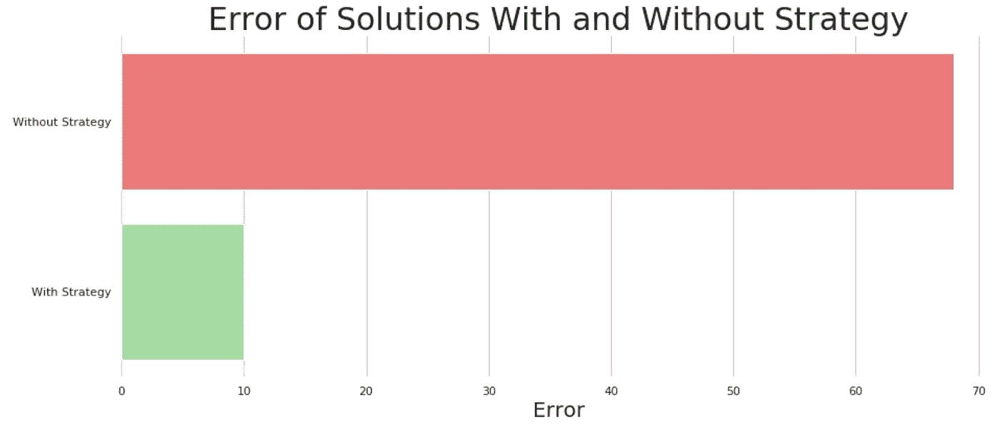

# 保证每次都能提高模型准确性的策略

> 原文：<https://medium.com/codex/the-strategy-that-increases-model-accuracy-every-time-guaranteed-6ee5e476262d?source=collection_archive---------0----------------------->

## [法典](http://medium.com/codex)

## 不相信我？我带你去看

我在 Kaggle(一个数据科学学习平台)上非常活跃，尤其是在查看人们创建的内核(代码笔记本)方面。无论是竞赛还是简单的分析，我注意到绝大多数人都做的一件事——他们只使用…