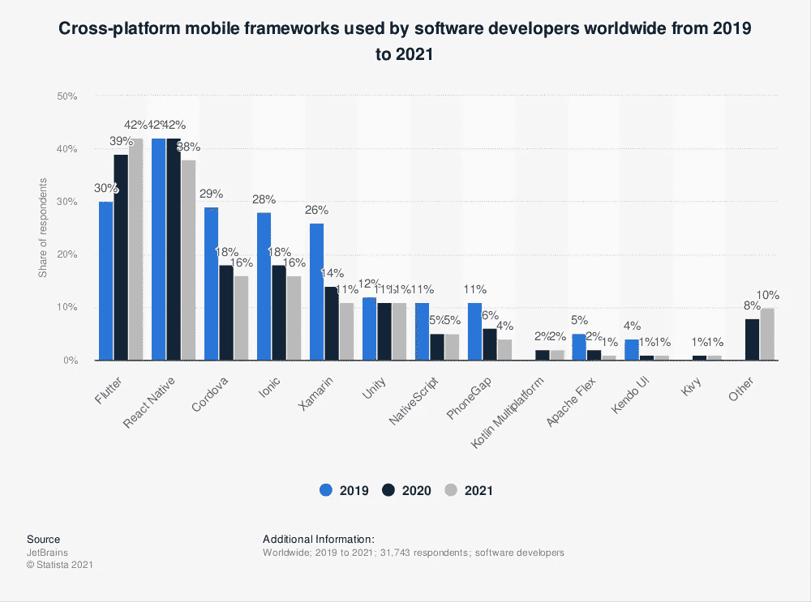

# Apache Cordova 的日落:2022 年跨平台移动开发的替代方案

> 原文：<https://medium.com/codex/the-sunset-of-apache-cordova-alternatives-for-cross-platform-mobile-development-in-2022-9da34234c992?source=collection_archive---------0----------------------->

你听说了吗，Apache Cordova 支持正在从应用程序中心退出？想知道这将如何影响您现有的科尔多瓦应用程序吗？

跨平台移动开发的未来趋势已经开始出现，Apache Cordova 似乎不会被包括在为移动设备提供混合 web 应用的框架列表中。该框架发布于很久以前——从技术开发的角度来看——2009 年，为了找出破坏其稳定性的原因，我们将分析 Apache Cordova core、现有的竞争对手以及表明需要转向其他选项的营销信号。

在这篇文章中，你将找到与 Cordova 及其替代品(包括 Flutter、React Native、Xamarin、Ionic 和 NativeScript in 2022)的相关性相关的最常见问题的答案。

# 阿帕奇·科尔多瓦怎么了？

根据 [npm](https://www.npmjs.com/package/cordova) (数字可能很重要)，在 2020 年 11 月至 2021 年 10 月期间，用于构建、部署和管理基于 Cordova 的应用程序的命令行工具的每周下载次数下降了近 42.4%。此外，自从应用中心发布 [Cordova 退休的声明以来，这种稳步下降一直在加剧。这是最近于 2021 年 10 月 15 日发表的，它指出，这一消息影响了阿帕奇科尔多瓦，使其面临失去人气的风险。](https://devblogs.microsoft.com/appcenter/announcing-apache-cordova-retirement/)

在 4 年前推出之后，Visual Studio App Center 增加了对 Apache Cordova 和 15 个其他框架和平台的支持。那时开发人员开始从 web 转向移动应用程序开发，所以这种跨平台的框架值得关注，并得到了社区的赞赏。支持 [CodePush](https://docs.microsoft.com/en-us/appcenter/distribution/codepush/) 的核心技术由 Apache Cordova 和 React Native 组成，CodePush 是一种能够将更新直接部署到用户设备的云服务。

而如今，根据 Statista 的数据，科尔多瓦的受欢迎程度正在下降。2019–2021 年使用 Apache Cordova 的软件开发者数量从 29%下降到 16%。

*来源:* [*Statista*](https://www.statista.com/statistics/869224/worldwide-software-developer-working-hours/)

来自 Cordova SDK 的调用按 VS 应用中心服务的不到 1 %计算；因此，App Center 宣布撤销对 Apache Cordova 的支持:

*   使用门户、CLI 或 API 开发 Apache Cordova 应用程序的选项已经被 App Center 取消了。
*   从 2022 年 4 月开始，App Center portal 将不接受来自 Cordova SDK 的呼叫。过了那个日期，服务的可用性和交互就没有保证了。

从提供的公告中还可以看出，那些拥有 Apache Cordova 应用程序的人应该考虑替代方案，以便不坚持使用过时的技术。

然而，由于构建、测试、发布和监控应用程序的最大平台之一不再支持 Apache Cordova，您可能会认为该技术仍然有机会。假设我们可以重新配置开发周期，从而避免将微软产品用于 Cordova 应用程序，那么就有可能继续将该框架应用于跨平台应用程序开发。

我和我的开发团队以及我们的客户不需要重新配置开发周期，因为我们使用自己的 Gitlab 基础设施并构建系统来建立 CI/CD 管道。但是，我们不应该超越可能的方法来避开 App Center，而是应该回到框架上来处理一些问题，我们已经部分解决了这些问题。

# 问题№1 阿帕奇科尔多瓦有前途吗？

也许我们应该从一个基本的解释开始。如果你知道基本的东西，就跳过这一段。

Apache Cordova 是 Nitobi 在 2009 年创建并推出的一个移动开发框架。一个关键的考虑是为应用程序开发者提供设备 API，使他们能够直接从 JavaScript 访问他们的功能。当这些功能与 jQuery Mobile 或 Sencha Touch 等 UI 框架相结合时，移动应用程序可能已经在基本 web 技术的帮助下开发出来了。现在提到的 UI 框架都不如现代的 SPA(单页应用)框架，包括 ReactJS、AngularJS、VueJS 等。

因此，要回答关于 Apache Cordova 的未来的问题，我们需要评估微软所做决定的重要性。因此，我们的挑战是从拥有 Github 和相关基础设施的公司那里抓住信息的本质，这正式表明 Apache Cordova 在开发技术方面不再那么出色。这将如何影响跨平台开发的未来？

市场变化涉及各种规模的公司:在小型甚至中型公司工作的独立软件开发人员将不得不寻找 App Center 的替代品，这是一种广受欢迎的自动化和管理应用程序生命周期的工具，或者自己创建这样的替代品。App Center 的高调宣布也迫使打算开始新项目的企业主认识到 Cordova 是一项比以前风险更大的技术。

很有可能，Thoughtworks 会建议企业避开科尔多瓦。提到营销信号，应该提到的是 [PhoneGap Build 于 2020 年 10 月](https://blog.phonegap.com/update-for-customers-using-phonegap-and-phonegap-build-cc701c77502c)停产。

# 问题№2 科尔多瓦是否被弃用或仍然相关？

在回答科尔多瓦是否被废弃或者仍然相关的问题时，我们想从声称[阿帕奇·科尔多瓦](https://cordova.apache.org/)仍然活着开始。具体的标记包括改进和修正的新更新。 [Cordova Android 10.1.1](https://cordova.apache.org/announcements/2021/09/15/cordova-android-release-10.1.1.html) 于 2021 年 9 月发布。与此同时，Cordova 的最新更新和操作系统版本之间的差距仍然很明显——Cordova 支持 Android 10，但 Android 12 已经发布。

主要的发现意味着科尔多瓦可以使用，但它不是新项目的合适选择。

# 问题№3 用什么代替科尔多瓦？

现在是时候回顾 Apache Cordova 的替代方案，并强调该框架的竞争对手了。Flutter、Xamarin、React Native、Ionic、NativeScript 可能是跨平台 app 开发中 Cordova 的很好替代品。这些尖端技术可能是你的混合应用程序的最佳选择，尽管没有理由认为它们是银弹，因为所有技术都有优点和缺点。

# 2022 年阿帕奇科尔多瓦的替代品

可以使用几个标准来比较与 Apache Cordova 竞争的技术:UI、性能、可定制性、本机模块和插件、社区和可持续性。

# 科尔多瓦 VS 颤振

[Flutter](https://mobidev.biz/blog/flutter-app-development) 是目前构建 UI 最灵活的技术。它有一整套其他框架没有提供的材料和 cupertino 小部件。UI 在不同的设备和厂商之间是一致的，概念上和 React.js 类似。

基于 Dart 的 Flutter 目前表现最佳。性能与原生 Android 或 iOS 应用相同。Flutter 架构使基于它的应用程序能够以与 Java 或 Kotlin Android 应用程序相同的性能甚至更快的速度工作。UI 非常灵活，允许我们像本地平台一样构建 UI。我们可以定义定制的视图和定制的布局，而不需要选择本地平台。

Flutter 还使开发人员能够从本机视图构建模块和视图，重用本机库的可能性也源于此。与 Javascript 社区相比，Dart 和 Flutter 社区要小一些，但是它正在被本地开发人员快速扩展。目前，它比 NativeScript 社区大得多，几乎与 React 原生社区一样大。

Flutter 中的版本很稳定，不会破坏应用程序——谷歌和苹果及时做出了改变。用于创建 web 应用程序和桌面应用程序的开发者预览版也值得注意。

# 科尔多瓦 VS 反应土著

UI 足够灵活，可以涵盖开发应用程序所需的大多数情况。它没有完整的原生组件，因为它们通常被社区插件所替代，UI 框架是 React.js。

基于 JavaScript， [React Native](https://mobidev.biz/blog/how-react-native-app-development-works) 对所有视图使用桥架构，这导致在实现动画和使用报告更新的视图时出现一些问题。例如，滚动视图位置。

React Native 的可定制性可以根据定制绘画的使用来评估。它是可访问的，但是有限，并且文档很差。如果不选择本地平台，就无法定义自定义布局。允许从本地视图构建模块和视图以及重用本地库的功能与 Flutter 的情况相同。

如果考虑 React Native 的稳定性——它处于测试阶段。该框架不时会有一些与本机平台新变化相关的突破性变化和问题。但总体来说稳定性还是不错的。维护人员并不总是能够及时解决问题，通常社区会帮助修复第三方库中的问题。在 React Native 中，只可能与 web 共享应用程序的逻辑部分。

# 科尔多瓦 VS 爱奥尼亚

Ionic 是一个用于构建跨平台应用的开源移动工具包，自 2021 年 5 月起[它不再基于 Cordova](https://ionicframework.com/blog/ionic-isnt-cordova-anymore/)。

在 Ionic 中，可以为 web 使用任何 UI 库，但不幸的是，web 和移动设备的模式是不同的，所以这些库通常不是为移动设备优化的，这导致了许多 UX 和性能问题。

Ionic 基于 JavaScript，对整个应用程序使用包装器架构。当执行繁重的计算或在隐藏模式下工作时，这会导致许多问题。UI 非常灵活，允许像 Javascript 应用程序一样构建 UI。可以定义自定义布局，而不需要选择本地平台和编写本地插件。

JavaScript 有一个巨大的社区，这个平台支持 JavaScript 库的重用。ReactNative 社区也有大量可用的插件。主要问题是安全限制和为每台设备润色应用程序所需的大量时间。

# 科尔多瓦 VS NATIVESCRIPT

就 UI 而言，NativeScript 类似于 React Native——它构建在本机视图之上。它有与 React Native 相同的问题。NativeScript 允许使用 Angular 2+、Vue.js 以及它们自己的 UI 框架来构建 UI。

基于 JavaScript，与 React Native 相比，NativeScript 具有更有限的性能，因为一切都在 JavaScript 线程上工作。NativeScript 没有为开发人员提供使用自定义绘图和定义新布局的能力。视图上的本地方法可以直接从 JavaScript 调用。

NativeScript 可以使用自己的机制构建模块和查看插件。它允许直接从 JavaScript 调用视图。与 Flutter 和 ReactNative 相比，编写插件更难，因为它们使用编组 JavaScript 来匹配本机平台语言(Java，Obj-C)和它自己的语法。这与在其他平台上直接使用原生模块相比是非常耗时的。

NativeScript 能够利用不依赖于 DOM 的 JavaScript 库。此外，与 ReactNative 相比，它的社区更小，插件数量也更少。

如果开发人员在较高层次上不熟悉该框架，并且不知道如何减轻这些问题，NativeScript 中的内存泄漏问题可能会导致一些问题。最常见的问题是无法及时解决。

# 科尔多瓦 VS XAMARIN

Xamarin 应用中的 UI 可以拥有惊人的响应能力。开发人员使用 XAML 或 C#来创建用户界面。C#包装器允许复制本机性能。

使用 Xamarin，开发人员可以为平台构建各种不同的接口——这就是 Cordova 在本机性能方面的不足之处。

Xamarin 和 React Native 一样，提供了接近本机的性能。C#和。NET 服务于创建一个单一的应用程序逻辑。请求由应用程序发送到设备上的 API 接口。Xamarin core 包含编译后的代码，并在。NET 团队可以自由地使用框架。

Xamarin.forms 简化了原型设计，所有平台共享一个接口。一些开源库的不可用性和集成第三方工具被认为是 Xamarin 的主要缺点。

# 2022 年新项目该不该用科尔多瓦？

2021 年启动新项目的企业更加关注技术堆栈，避免过时的技术，这种方法从现在起被认为是必不可少的。

MobiDev 的经验表明，公司的目标是从相同的起点为所有产品利用预期的技术堆栈，因为切换到新的技术堆栈会导致额外的成本。如果你不打算在不久的将来重写你的项目，**在 2022 年**考虑其他选择而不是科尔多瓦。

然而，您的选择确实取决于项目需求，Cordova 可能与您的需求相关，所以请随意评论我的文章——我欢迎任何关于跨平台应用程序开发的进一步讨论。

由 [MobiDev 的 JavaScript 团队负责人塞维多夫·卢恰尼诺夫撰写。](https://mobidev.biz/services/web-application-development)

*全文原载于*[*https://mobidev . biz*](https://mobidev.biz/blog/apache-cordova-alternatives-cross-platform-mobile-app-development)*，基于 mobi dev 技术研究。*