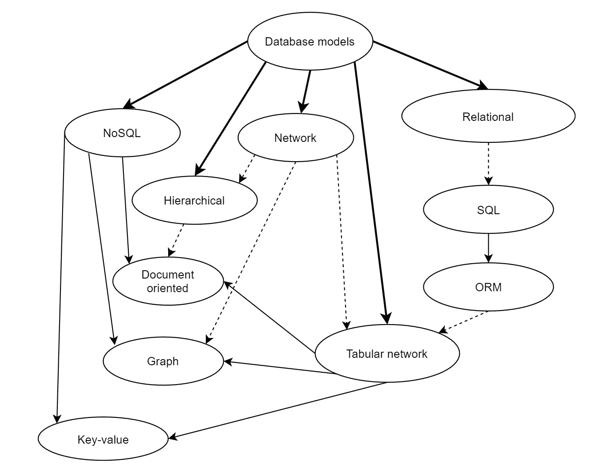

# 表格网络数据模型。讨论

> 原文：<https://medium.com/codex/the-tabular-network-data-model-discussion-5cb1aae47000?source=collection_archive---------22----------------------->

## 超表格或表格网络数据库——关系数据库和网络数据库概念与 Python 中面向对象编程的交叉点上的新方法

[这是表格网络数据模型系列的第 6 部分。点击这里查看所有帖子[的链接。]](/@azur06400/tabular-network-data-model-series-f7b8469ed333)

我提出了一个新的数据模型，用于面向对象的软件，通过实现一个虚拟的对象数据库，在基于类描述的应用程序中执行 DBMS 的所有常用功能，并调用它们的方法。

数据库模型被称为**表格网络**，因为它使用表格——作为存储信息和显式链接的通用结构——来映射形式化经验系统中对象之间的关系结构。像自定义数据一样，关系(链接)包含在表格的单元格中。在这种技术中，单个数据库被称为**超表(HT)** 。HT 中的数据搜索使用图(网络)中的波传播算法执行，并由相应类的方法激活。

图 1:数据库模型和形式化的依赖和影响——非常有条件的和近似的。

这里介绍的研究和实际验证的主要结果包括以下内容:

*   简单通用的表格网络数据模型；
*   将软件组织为一组类，用于形式化数据库模式和编程数据操作。这使得有可能完全取代对象关系映射(ORM)软件，并在没有关系后端 DBMS 的情况下在表格网络数据模型的概念内管理数据库。
*   搜索波机制，而不是数据操作语言(DML)中的查询。这使得在没有特殊形式语言的情况下形式化复杂的多级搜索成为可能。

这种新的数据建模方法与众不同之处在于它在所有表现层次上的内聚性和不可分割的完整性:概念、逻辑和物理。在某种意义上，这可以被认为是对早期“纯”数据模型的“回归”——网络和关系，但在面向对象编程的框架内，没有使用 DML，而是在一个新的组合级别上。

表格网络模型的价值在于逻辑模型和它的物理实现之间不可分割的联系，如这里详细所示。

模型中的链接基于表的物理行号，每个表的行长度，或者说“行描述符”是固定的。因此，如果整个数据库适合 RAM，那么这种数据库中的搜索速度理论上不取决于它的大小。然而，如果在访问数据文件时不提取硬件和网络的成本，就会出现这种依赖性。只有在真实系统上进行实验，才有可能对其进行改进。

可变长度字段的行内容存储在独立的、可直接访问的文件中，分别用于自定义数据和链接。将链接的内容分配到内存中的一个单独区域，可以快速纠正它们，如果需要，可以以最小的开销(不访问单个表)成对地更改物理行号(表号，行号)。

如果考虑在逻辑和物理级别上存储对所提出的模型之外的表行的引用的抽象想法，它就变成了网络或/和图形数据库的变体，具有它们所有的缺点。

基于**超表管理系统**(HTMS)——用 Python 实现的表格式网络 DBMS 的原型——的特性，已经可以说这种技术可能在可用的 SQL 和 NoSQL 系统并不总是有效的领域中是令人感兴趣的:

1.  当创建难以预先构造信息的应用程序时，当数据模型随时间变化时，或者当自适应地改变数据库的结构很重要时，可以在具有自修改数据库结构的自适应应用程序中使用它；
2.  它可以在创建硬件资源有限的嵌入式系统时使用，例如，在移动设备和物联网领域。例如，HTMS 可以使应用程序适应有限的 RAM 资源(用于在应用程序中安装 HTMS 的 Python 包的总大小约为 110 KB ),并使用基于 Web 套接字的 TCP 协议与文件服务器交换数据，而无需使用复杂的 SQL 事务处理系统。

用编译语言(C++)开发 TNDB 版本将进一步增强它们的吸引力。

请注意，HTMS 是 TNDB 概念的第一个实现，目前是一个实验软件包，只能用于小型项目的研究，以及作为创建工业版本的原型。

根据一般的理论考虑，可以假设数据结构到 TNDB 的映射在以下领域是有用的:

1.  它可用于简化项目数据库的设计、填充和维护，在这些项目中，关系范式要求框架内的建模会给程序员带来困难。开发时间的缺乏经常会导致需要纠正的错误。然而，向已经“活动”的数据库添加任何改变是复杂且耗时的任务，在某些情况下，除了用新数据库完全替换旧数据库之外，没有其他解决方案；
2.  它可以用来创建基于 HTMS API 的“分支”(分叉)的高度专业化的系统，以取代 NoSQL DBMS，如图形、键值和文档。这是可能的，因为 HTMS 符合众所周知的面向对象编程的经典原则——类抽象、多态性、类和对象的继承、封装——而这在 SQL 或 NoSQL 系统中从未实现过。
3.  它可以用于创建基于 HTMS 的数据存储设备，以提高生产率，因为在物理层，导航是使用自然数而不是字符串来执行的。
4.  它可以用于创建接收、存储和处理“大数据”(视频监控系统、空间传感器、计费等)的实时系统。)，包括新数据流量大(每秒兆字节和太字节)的系统。在这种情况下，关系模型是无效的，因为它为索引、散列和聚集消耗了大量的资源。很可能为了在这样的系统中使用，有必要在低级别上使 HTMS 的实现复杂化，以确保具有足够的速度和大的链路修改流。

提议的模型的一些限制应该已经很清楚了，并且是由链接包含表的物理行号这一事实造成的。因此，确定表格网络模型和相关软件(HTMS)的适当应用领域是未来工作的一项重大挑战。

需要进行额外的研究，以便在不同的方向进行定量实验，例如属性、表和表中的行数、客户端 RAM 的容量以及网络上数据交换的速度，从而确定与流行的数据模型相比的表格网络模型的实际价值。

我计划继续撰写关于表格网络数据模型和我的 HTMS 实现的文章。

本文授权文本: [CC BY-NC-ND 4.0](https://creativecommons.org/licenses/by-nc-nd/4.0/)