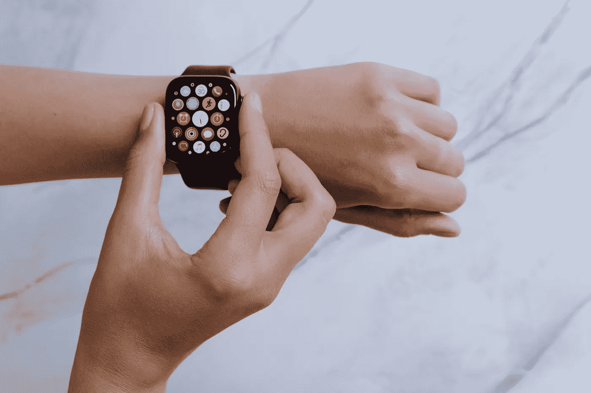

# 史蒂夫·乔布斯的故事系列

> 原文：<https://medium.com/codex/the-tale-from-steve-jobs-series-b9270a95e3b3?source=collection_archive---------9----------------------->

## 苹果如何将无聊的产品革新成最令人兴奋的时尚产品

图片由[**cotton bro**](https://www.pexels.com/@cottonbro/)**上[像素](https://www.pexels.com/photo/person-wearing-silver-aluminum-case-apple-watch-with-white-sport-band-5081924/)**

> **是的，在苹果于 2015 年推出 Apple Watch 之前，智能手表已经存在了一段时间，但对大多数人来说，尤其是年轻一代，出于健康原因购买智能手表将是他们清单上的最后一项。如今，人们倾向于把收入花在…**