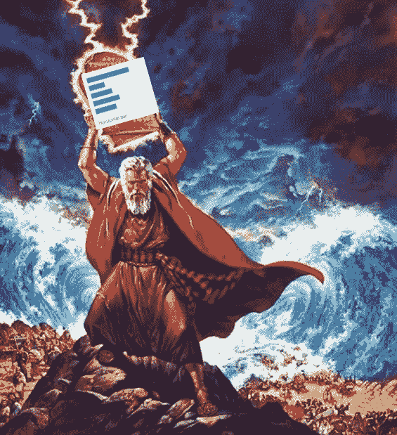

# 数据可视化的十诫

> 原文：<https://medium.com/codex/the-ten-commandments-of-data-visualization-29d009f9eae2?source=collection_archive---------7----------------------->

如果摩西不是带着道德十诫从塞尼山下来，而是带着有影响力的数据可视化十诫呢？如果摩西的追随者不是崇拜虚假神，而是制作饼状图，会怎么样？

好吧，我开始列出数据可视化规则的清单，这些规则不枯燥，容易记忆，讨论起来可能很有趣。就像…