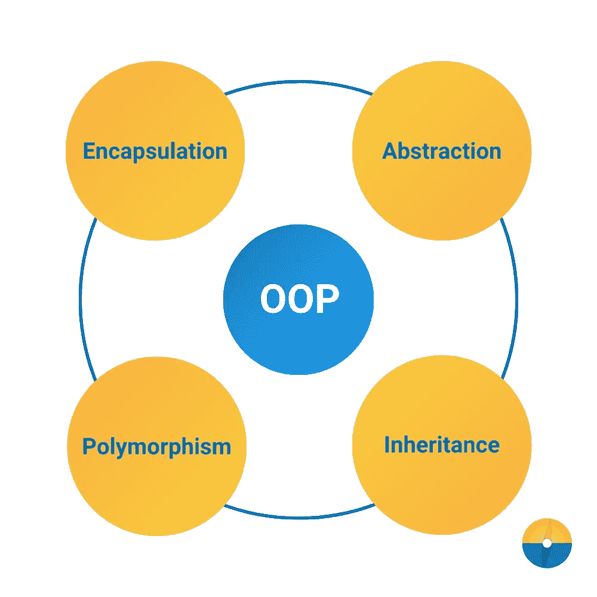

# 面向对象编程的原则和好处

> 原文：<https://medium.com/codex/the-tenets-and-benefits-of-object-orientated-programming-4e2a28da923?source=collection_archive---------16----------------------->

## 程序员应该理解的基本概念。

图片鸣谢:[https://coding roads . co/blog/what-is-object-oriented-programming-OOP-concepts-in-Java](https://codingnomads.co/blog/what-is-object-oriented-programming-oop-concepts-in-java)

面向对象编程的根源可以追溯到 20 世纪 60 年代，但是直到 20 世纪 80 年代才进入高级语言(可能从 C++开始)。真的没有 OOP 的官方定义，许多程序员可能对 OOP 的构成有自己的想法…