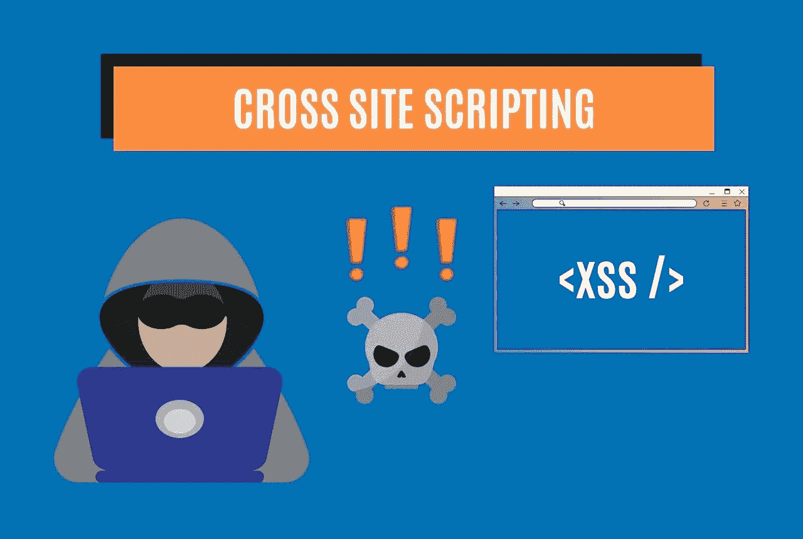

# 跨站脚本的可怕世界(XSS)(第 1 部分)——stack zero

> 原文：<https://medium.com/codex/the-terrifying-world-of-cross-site-scripting-xss-part-1-stackzero-54be9cdc011a?source=collection_archive---------16----------------------->

跨站脚本(XSS)是一种网络攻击，在这种攻击中，网络罪犯将恶意代码注入已经值得信任的有效应用程序或网站，以便 web 浏览器可以执行精心制作的有效负载。由于受害者的浏览器认为代码来自合法来源，它将运行并执行它。攻击者的目的可能是获得进入…