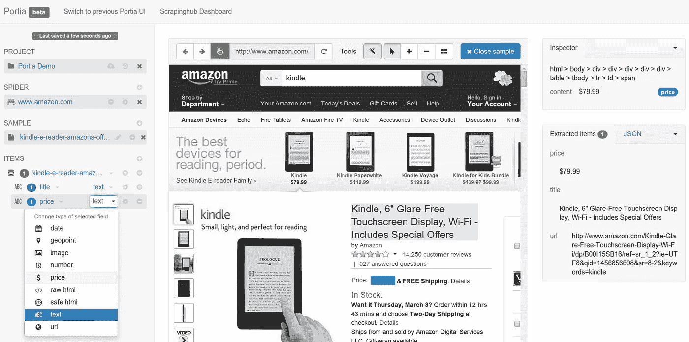

# 2022 年十大开源网络抓取工具

> 原文：<https://medium.com/codex/the-top-10-open-source-web-scraping-tools-in-2022-ede0134a00d?source=collection_archive---------0----------------------->

从 Shutterstock 获得许可的图像

eb 抓取帮助企业在短时间内方便地从网站上抓取数据。然而，付费的网络抓取工具对一些企业来说可能很贵，他们**可能没有预算。因此，开源 web 抓取工具可以帮助企业方便地抓取数据。**

强烈建议您使用高级 web 抓取工具，因为大多数开源选项都有很多限制。你可以在这篇 [**文章**](/enlear-academy/10-best-web-scrapping-tools-cb71b5900733) 中找到更多关于领先的付费网页抓取工具的信息。

然而，大多数企业都很难选择合适的开源 web 抓取工具。因此，这里是我们挑选的 2022 年 **10 个最好的开源网页抓取工具。继续阅读，找出最适合你的企业。**

# 10 个最好的开源网页抓取工具

大多数开源 web 抓取工具都是基于代码的，这使得它们具有可扩展性和强大的功能。不过也有 [**不需要基础设施的**](https://brightdata.com/lp/data-collector-b2) 可以不用编码操作。所以不管你是不是编码员，都能找到你的开源刮刀方便使用。

所以，这里是我们挑选的 10 个最好的网页抓取工具供你选择:

图片由[scrapy.org](http://scrapy.org)提供

# 1.Scrapy

在基于 Python 的 web 抓取工具中，Scrapy 是最受欢迎的一个。这个刮刀可以高效地从网页中刮取数据，根据用户的指令进行处理，并以用户想要的格式存储。

scraper 构建在一个 [**扭曲异步网络框架**](https://legacy.python.org/workshops/2002-02/papers/09/index.htm) 之上，以更快地接受和处理请求。如果一个企业需要大型 web 抓取项目，Scrapy 代理集成可以非常灵活地处理它们。

**刺儿头的优点:**

*   强大而快速
*   能够处理详细的文档
*   拥有丰富的资源和健康的社区
*   利用云环境
*   可以在不接触内核的情况下插入新功能

图片由 MechanicalSoup [Github 页面](https://github.com/MechanicalSoup)提供

# 2.机械汤

对于基于 Python 的编码者来说，MechanicalSoup 是一个出色的刮刀。scraper 旨在模拟用户在使用浏览器时与网站的交互。这个工具是围绕 HTTP 会话和文档导航开发的，可以自动跟踪重定向、提交表单、跟踪链接、发送和存储 cookies。

如果你想在某些网络事件中**模拟人类行为**或者想了解某个网页的某些产品，MechanicalSoup 会很有用。您可以从这个 scraper 中获取您需要的唯一数据，而不是从一个页面中获取所有数据。

**机械汤的优点:**

*   非常快速的网页抓取
*   支持 XPath 和 CSS 选择器
*   模拟人类行为

图片来自[维基百科](https://en.wikipedia.org/wiki/Heritrix)

# 3.Heritrix

如果你精通 JAVA 语言，那么 Hertrix 是你的 web scraper 的绝佳选择。这个刮刀是为 web 归档而设计的，在以自适应的、有分寸的速度收集数据时，遵守 robot.txt 排除指令和元机器人标签。

所有这些设计使得 Heritrix 成为一个几乎不会影响一般网站活动的特殊工具。用户可以从他们的 web 浏览器访问基于 web 的用户界面来控制和监视爬行。

**Heritrix 的优点:**

*   可插拔和可更换模块
*   尊重 Meta 机器人标签和 robot.txt
*   基于网络的界面
*   出色的扩展性

图片来自 [Apify 博客](https://blog.apify.com/)

# 4.Apify SDK

Apify SDK 利用 **JavaScript** 从网站抓取数据。用户可以利用 headless Chrome 和 Puppeteer 来开发数据提取和 web 自动化作业。通过这种方式，可伸缩库可以提供很大的帮助。

Apify SDK 利用 AutoscalePool 和 RequestQueue 等工具，帮助用户开始抓取几个 URL 并跟随链接到其他页面。尽管抓取了多个页面，Apify SDK 仍能以最大容量运行。

**API fy SDK 的优势**

*   Apify Cloud 附带了一个代理池来避免检测
*   适用于大规模数据的高性能、可靠的刮刀
*   对不同浏览器的内置支持

图片由 [Sourceforge](http://web-harvest.sourceforge.net/) 提供

# 5.网络收获

Web-Harvest 是另一个基于 JAVA 的开源抓取工具，从特定页面抓取数据。这个 scraper 利用 XQuery、XSLT 和正则表达式等技术进行操作。这个 web scraper 可以利用定制的 Java 库来证明它的提取能力。

**网络收割的优势**

*   强大的 XML 操作和文本处理器来处理和控制数据
*   获取变量上下文以使用和存储变量
*   支持脚本语言以集成到铲运机配置中

# 6.远足

这个抓取工具是为 web 抓取、JSON 查询和 web 自动化而设计的。这个 scraper 利用了 JAVA 并提供了超轻、快速和无头的浏览器。因此，用户可以获得 web 抓取功能、对 DOM 的访问以及对每个 HTTP 响应或请求的控制。但是，这个平台不支持 JavaScript。

**短途旅行的好处**

单独处理 HTTP 响应/请求

*   与 REST APIs 的直接接口
*   支持 HTTPS、HTTP 和基本身份验证
*   RegEx——支持在 DOM & JSON 中查询

图片由 Pyspider.org 的[提供](http://docs.pyspider.org/en/latest/)

# 7.皮蜘蛛

如果您正在寻找一个强大的基于 Python 的 web scraper，它具有简单的 Web UI 和分布式架构，PySpider 可以检查所有这些框。这个刮擦器利用提取器、处理器和调度器来帮助刮擦测量。像 **MongoDB 和 MySQL** 这样的不同数据库都可以被这个 scraper 支持用来存储数据。

**py spider 的优势**

*   具有任务监视器、结果查看器、脚本编辑器和项目管理器的权威 WebUI
*   Kombu、Beanstalk、Redis 和 RabbitMQ 作为消息队列
*   分布式体系结构

图片由 Portia [Github 页面](https://github.com/scrapinghub/portia)提供

# 8.波西亚

如果你正在寻找一个不需要任何编程知识就可以使用的 scraper，Portia 是你可以选择的。这个刮刀可以自动化数据提取过程，你不需要下载或安装任何东西来使用这个刮刀。

该工具利用 **Github 库**提取数据，不需要**XPath**学习。这使得它成为一个无需编写一行代码就能抓取数据的优秀工具。

**Portia 的优势**

*   基于视觉选择从网站提取数据
*   导出 JSON、CSV、JSON-lines 和 XML 格式的抓取信息
*   可以创建通用的网页抓取器，从结构相似的网页中抓取数据

图片由节点爬虫 [Github 页面](https://github.com/bda-research/node-crawler)提供

# 9.节点爬虫

Node-crawler 是另一个流行的网页抓取工具，用 JavaScript 和 T21 编写。网络爬虫用 Node.js 编写，支持非阻塞异步 I/O，因此爬虫的流水线操作机制提供了极大的便利。DOM 的快速选择提高了爬虫开发的效率。

**节点爬虫的优势**

*   URL 请求的不同优先级
*   可配置的重试次数和池大小
*   速率控制、服务器端 DOM &用 JSDOM 或 Cheerio 自动插入 jQuery

# 10.弗龙特拉

Frontera 是一个基于 Python 的 scraper，对开发者和技术公司都非常有用。这个刮刀可以处理 [**大规模的网页抓取**](https://levelup.gitconnected.com/web-scraping-and-the-art-of-war-5-tools-that-will-help-your-bot-win-c2a3840d8b71) ，可以访问用户需要的所有必要数据。由于该工具是作为开源框架开发的，所以人们可以免费从该工具中获得最大的好处。

这个工具的缺点是**不主动维护**。因此，用户在操作过程中可能会遇到一些小故障。

**Frontera 的优势**

*   不停止爬行的可修改的爬行策略
*   爬行策略可以作为单独的模块来实现
*   可以抓取与特定主题相关的网页

# 结果

虽然开源的抓取工具非常优秀而且免费，但是它们缺乏支持和数据库。所以，如果可以的话，可以考虑投资类似 [**光明数据采集器**](https://brightdata.com/products/data-collector) **或者 Parsehub** 这样的付费刮刀。付费网络抓取工具将为您提供强大的支持、灵活的交付方式和易于使用的模板，无需编码即可抓取数据。

如果你对开源的刮刀感兴趣，上面提到的任何工具都是不错的选择。但是，要确保你有足够的专业知识来为 scraper 编写合适的语言。

在 *案例中，如果您个人使用了开源的网络抓取工具，并且觉得值得一提，请写信给我们！此外，如果你对上面列出的免费工具有任何特殊的问题(我知道出于某种原因有许多不满的 Scrapy 用户),我们很乐意了解你的经历。*

这个故事最初发表在 [techbullion](https://techbullion.com/10-best-open-source-web-scraper-in-2022/) 杂志上。