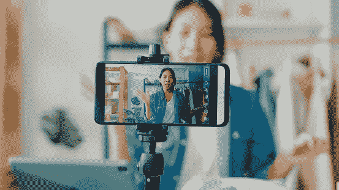

# 影响者文化的毒性

> 原文：<https://medium.com/codex/the-toxicity-of-influencer-culture-445a4abde933?source=collection_archive---------12----------------------->

这个帖子最初发布在[心灵美丽简单](http://mind-beauty-simplicity.com/2020/08/17/the-toxicity-of-influencer-culture/)

*美国人平均每年扔掉 65 磅衣服。人们总是渴望更多和新的东西，这就变成了无休止的过度消费循环。随着社交媒体&影响者时代的到来，这种趋势不会很快离开我们。*

如果我是这一代的年轻人，我会是一个彻底的烂摊子。只需点击一下鼠标，就能看到描述这些“所谓的完美生活”的大量照片和视频，这种生活方式怎么会不影响人们的幸福呢？

有时候我怀念 90 年代，因为对我来说，前数字时代很简单。孩子们仍然出去玩。现在父母必须监控屏幕时间。人们的生活更加神秘&你的过去不那么容易跟随你。

科技的世界，虽然相当方便；也会在攀比战中造成负担。

甚至在我现在这个年龄，几年前我会沉浸在想要和需要某些产品来让我快乐的感觉中。完美生活协会在网上展示的画面，与他们的现实相比，算不了什么。即使有了这些知识，我还是很快被那些世界吞噬了。2016 年删除我的 Instagram 是我做过的最好的决定。

除了对成功的描述，最让我感动的是过度曝光的广告。有影响力的人会在亮粉色的墙上贴一张自己穿着套装的照片&照片的每一寸都有品牌和公司的附属链接。

不，我不是说赞助内容是愚蠢的&不必要的。这是谋生的一种方式。你不能否认这一点。但是你不能无所事事，无视这影响了观众的决定。尤其是这些年轻观众。

我相信所有平台的有影响力的人都应该记住他们在向他们的追随者推销什么。他们毕竟是榜样。人们全心全意地相信他们的意见。所以他们最好真正享受他们所宣传的东西。我自己购买的大部分化妆品都是因为有人(美容专家)推荐。

早在大学的时候，我就写过一篇关于 YouTube 上的美女如何对我们的年轻人产生负面影响的文章。我仍然觉得它有很多道理。"买这种化妆产品，因为它会增强你的美丽."我不在乎青少年对广告策略和噱头有多了解，他们仍然会购买这些产品，不是吗？

难怪有人在自尊、身体形象和抑郁中挣扎。但那是另一天的话题。

关键是，影响者从左向右推动产品。永远都不够。总会有新的产品需要尝试，总会有新的趋势出现，这些产品中的大部分都相当奢华&设计师。更不用说在所述产品上浪费的金钱。普通人不可能在名牌包和服装上花费数千美元。但是影响者让它看起来可行。大多数时候，这些男人和女人会免费收到这些东西！这种改变需要来自我们这些观众，我们说够了就够了。

不要误解我，我喜欢不时的大减价。例如，诺德斯特龙的周年特卖是我的最爱。还有*丝芙兰的 VIB 拍卖会？*我的借记卡光是想想就已经哭了。不过老实说，我已经学会了 ***把钱包收起来*** 。货架上并没有什么真正不同的东西。哦，男孩，另一个基本的白色 t 恤！又一双黑色短靴！多么有创意。而一个人到底需要多少支口红呢？！

出于某种原因，当一个普通女孩向窗外望去，注意到一片树叶从树上掉了下来[秋天即将来临的迹象]时，衣柜里需要再添一双靴子或一件毛衣。尽管她知道自己已经有 10 件毛衣了。

相信我，我就是那个女孩。在我发现极简主义之前，我认为我需要所有这些物质物品来获得快乐和成功。我仍然热爱时尚&通过化妆和服装来表达自己。但是我更在意我的购物习惯。我不反对拥有昂贵的东西或花钱。关键是问自己是否真的需要它？

我自己作为一个博客写手可能会让我听起来像个伪君子，因为我谈论的是产品和服装。但对我来说，更重要的是我所谈论的对我&读者来说很重要的概念。例如，当我谈论我的衣柜时，我可能会谈论品牌和商店，但主要目标是告诉人们，他们可以少用一些。

作为一个极简主义者，你不觉得有必要买某些东西来让自己感觉完整。你应该什么都没有就有这种感觉。想象你自己在一个空荡荡的房间里，只有你自己和你的想法。你感觉如何？如果你觉得空虚，那就有问题了。你的物品不应该定义你是谁。

我认为，只要你考虑到这些公司和有影响力的人的目标是什么，这是助长消费主义，你就可以掌控和改变你的观点。有时候真的太多了。

我宁愿少一些我真正喜欢的东西，而不是一大堆还可以的东西。我不想一直觉得有必要整理东西&把一袋袋的东西送到捐赠中心和垃圾填埋场。

社交媒体和有影响力的人创造了这种“吹牛”和“炫耀”的想法，作为一种可以接受的存在方式。尽管为你所取得的成就感到自豪是件好事，但我认为像 Instagram 这样的应用程序已经毁了人们的这种感觉。

与其卖一个令人向往的形象，不如就这样生活？生活中有太多的希望和渴望。但是没有人真的想离开手机&自己动手。

# -乙

[推特](https://twitter.com/mindbeautysimp1) | [Pinterest](https://www.pinterest.com/mindbeautysimplicity/_created/) | [博客](https://mind-beauty-simplicity.com/)