# NLP 中的变压器

> 原文：<https://medium.com/codex/the-transformers-in-nlp-d0ee42c78e00?source=collection_archive---------2----------------------->

在这篇博客中，我们将讨论比以前的方法更好的变形金刚**。然而，transformer 是基于注意力的，但是在体系结构中增加了并行化的概念。**

*在[之前的博客](/nerd-for-tech/what-is-attention-in-nlp-f67411426e64?source=your_stories_page)中，我们讨论了关于**注意力的问题。**在最近的深度学习模型中，注意力是一个有助于提高 NLP 应用性能的概念，如神经机器翻译、图像字幕和各种其他应用。注意力机制像人类一样工作。例如，当你听到任何句子时，你的大脑会试图找出重要的关键词，并在此基础上理解句子的上下文。像这样，注意机制在编码器侧尝试将每个 LSTM 单元的输出传递给注意机制，并基于注意分数找出序列的重要性。然后，该上下文向量与解码器的先前输出一起被提供给解码器架构中的下一个 LSTM 单元，并计算出翻译。*

*论文' [*关注是你所需要的全部*](https://arxiv.org/pdf/1706.03762.pdf) '是 2017 年推出的一种叫做 **Transformer 的新颖架构。**顾名思义，该架构使用编码器/解码器架构，但在下图所示的架构中添加了并行化功能。*

*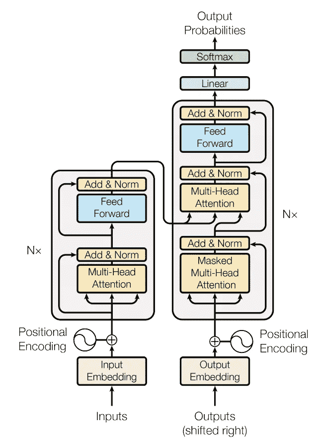*

*变压器架构来源:-[https://arxiv.org/pdf/1706.03762.pdf](https://arxiv.org/pdf/1706.03762.pdf)*

*图像可以很容易地解释建筑。让我们深入了解一下这种架构。编码器显示在左侧，由 N = 6 个相同层的堆叠组成。每层有两个子层，一个是多头自关注机制，另一个是简单的全连接前馈网络。此外，这里还添加了残差连接和图层归一化。6 个编码器相互堆叠，最后一个编码器输出给解码器。*

*解码器也由堆叠的 N = 6 层组成。此外，解码器插入第三个子层，该子层对编码器堆栈的输出执行多头关注。此外，剩余连接与所有子层一起添加，随后是层标准化。解码器中的自我关注子层也不像传统的关注方法。这里添加了掩蔽的多头注意力，它与位置嵌入相结合，以确保输入和输出的依赖性。*

*整个架构可以这样看。*

**

*《变形金刚》的编解码架构/来源:[http://jalammar.github.io/illustrated-transformer/](http://jalammar.github.io/illustrated-transformer/)*

*在传统的编码器架构中，我们使用 RNN/LSTM/GRU 作为单元，但在此架构中，方法发生了变化，编码器单元被相互堆叠的自关注和前馈神经网络所取代。*

**

*变压器编码器架构/来源:【http://jalammar.github.io/illustrated-transformer/ *

*编码器的输入首先通过自注意层，因为注意的功能是根据序列识别权重。然后自我注意的输出通过前馈神经网络。然后，该单个编码器的输出被传递到另一个编码器层(因为在该架构中有 6 个编码器层)。最后，最后一个编码器的输出被送到解码器。解码器由相似的结构组成，只有一层编码器-解码器关注(类似于 Seq2Seq 关注)被添加在它们之间。下图概述了编码器和解码器的架构。*

**

*《变形金刚》解码器架构/来源:【http://jalammar.github.io/illustrated-transformer/ *

# ***编码器***

*让我们深入了解一下单个编码器单元的内部。任何 NLP 问题的第一步都是将文本数据转换成数字表示。因此，根据研究论文，我们必须将我们的文本转换成 512 大小的矢量表示。有多种方法可以将单词转换成矢量，如 Word2Vec、GloVe、TFIDF 和 BOW。这个转换后的大小为 512 的嵌入现在被发送到底部编码器的自关注层。自关注层的输出然后被发送到前馈层，然后它将被传递到另一个编码器层。输入的大小可以根据最长的句子来决定。这里，我们以大小为 3 的词 X1，X2，X3 为例。*

*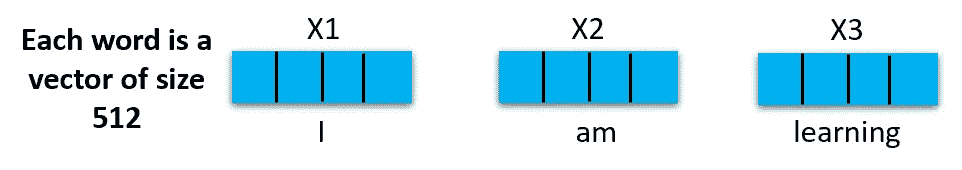*

*编码器的输入*

*嵌入后，单词按输入顺序排列，所有单词通过编码器的每一层。*

***自我关注***

*让我们先来看看当我们通过大小为 512 的向量时，自我注意是如何工作的。**注:——矢量的大小是根据研究论文提及的，根据其他研究而变化。**第一步，计算查询向量、关键向量、值向量。这些向量是通过将每个单词嵌入与所有三个度量相乘来计算的。简单地说，例如，我们有 X11、X12……的输入。X512 将与 Wq1、Wq2……相乘..Wq512 计算查询向量。与计算键向量和值向量的方式相同，如下图所示。*

*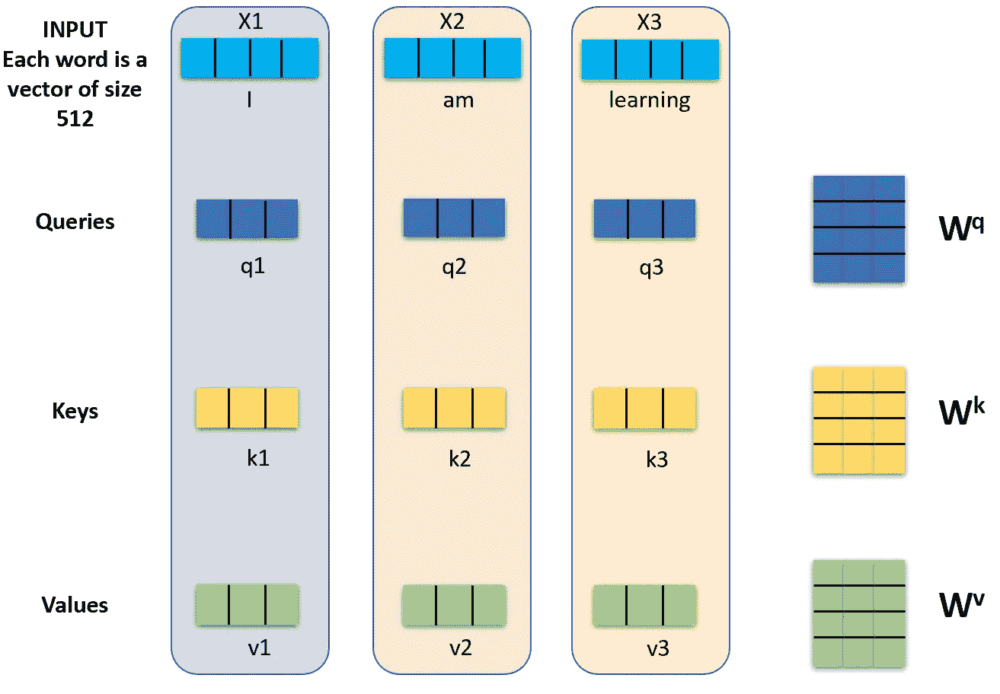*

*查询、键和值向量计算*

*根据研究论文，该向量的维数被降低，为 64，但是编码器的输出大小仅为 512。这个模型的真正优点在于，我们不是计算一个关系，而是发现每个单词的多个关系。*

*接下来，我们将使用这个向量来计算注意力得分。我们在这里使用注意力，所以在我们的例子中第一个单词是“I ”,所以我们需要检查这个单词与句子中使用的所有单词的得分。分数是通过查询和我们正在评分的相应单词的关键向量的点积来计算的。例如，我们正在计算“I”的分数，那么分数 1 将是 q1*k1，分数 2 将是 q1*k2，分数 3 将是 q1*k3。在这里，我们简单地对查询和关键指标进行**点积，结果我们会得到分数。***

*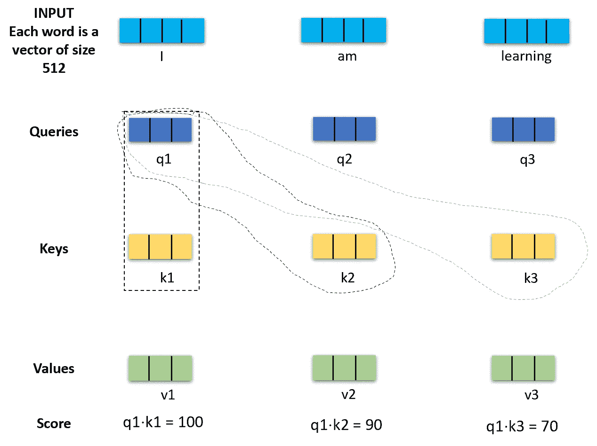*

*计算单词“I”与所有其他单词的得分*

*根据研究论文计算分数后，分数除以 8。关键向量的维数的实际值是 64，所以分数除以 8。然后，将从 softmax 函数传递 Score/8 值，我们将得到的值在 0-1 之间，根据我们的注意标准和 softmax 属性，所有值的总和将为 1。这个函数决定了单词在每个地方的重要性。单词本身具有最高分，但是我们也可以确定其他单词与当前单词的相关性。因此，根据研究论文，关注度用下面的公式计算。*

*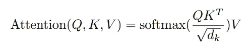*

*计算关注度的公式/来源:【https://arxiv.org/pdf/1706.03762.pdf *

*下一步是将所有的 softmax 值乘以它们的值向量。通过这一步，我们可以排除所有具有微小 softmax 值的单词，并且我们可以获得我们需要关注的单词的相关性。在下一步中，加权值向量被求和以生成特定单词的自我注意层的输出。产生的矢量被送到前馈神经网络进行进一步处理。整个流程如下图所示。*

*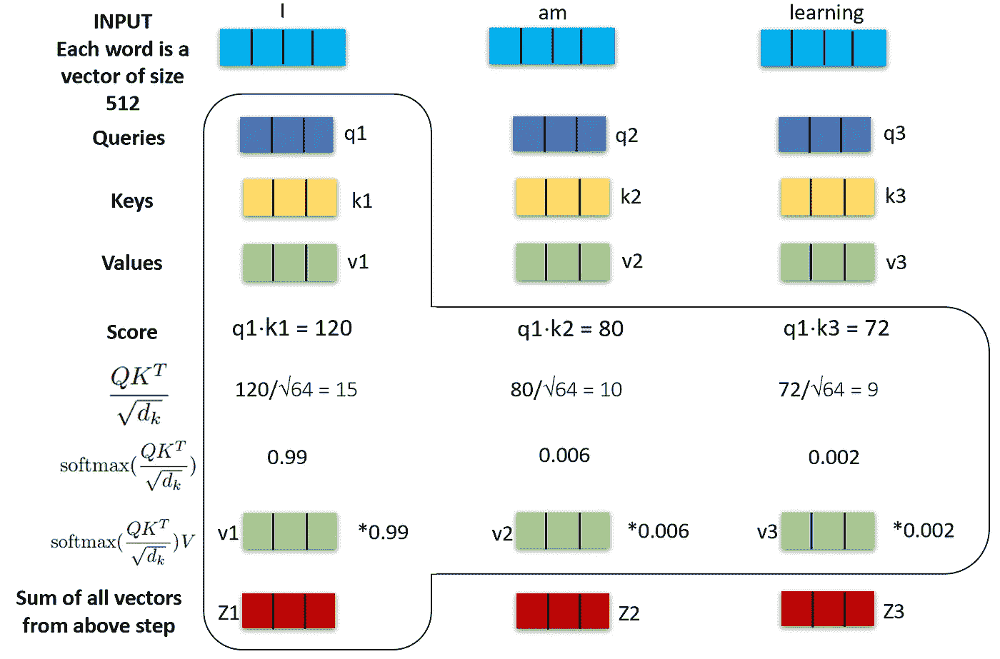*

*计算关注层输出的整个流程*

*如变压器**架构所示，使用了**多头关注。到目前为止，我们已经讨论了单方向注意力，随着多方向注意力的加入，注意力的表现将会得到改善。首先，当我们处理长序列时，它将扩展对其他单词的关注。其次，它包括随机初始化的多个查询、键和值矩阵。由于变形金刚使用了 8 种不同的注意力，我们将得到 8 种不同的 z 矩阵。整个流程如下图所示。*

*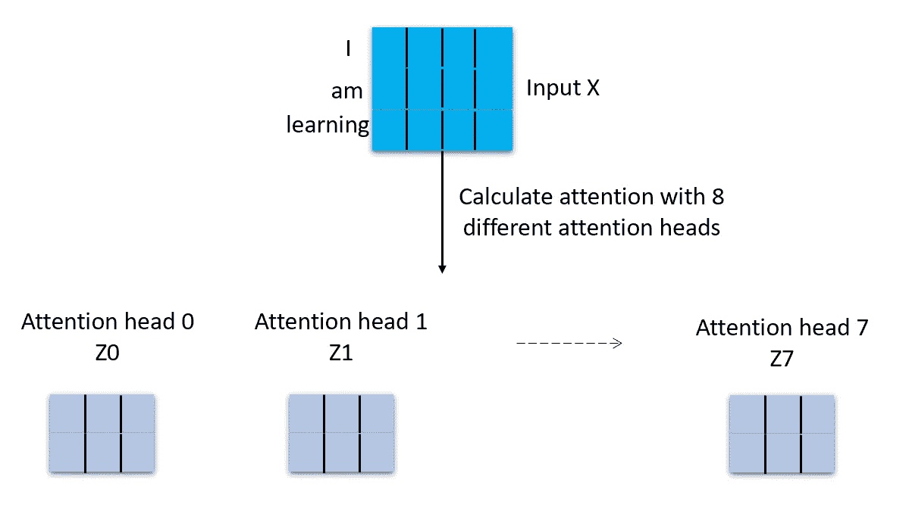*

*用 8 种不同的注意头计算 Z 矩阵*

*这个步骤问题是前馈神经网络接受单个输入，因此所有的注意力头部需要被连接。此外，研究人员在这里提出了另一个权重 W0，它乘以所有关注头的串联，以获得最终的 z。这个过程如下图所示。*

*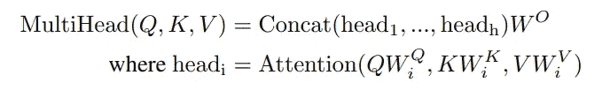*

*计算多头 https://arxiv.org/pdf/1706.03762.pdf[的公式](https://arxiv.org/pdf/1706.03762.pdf)*

*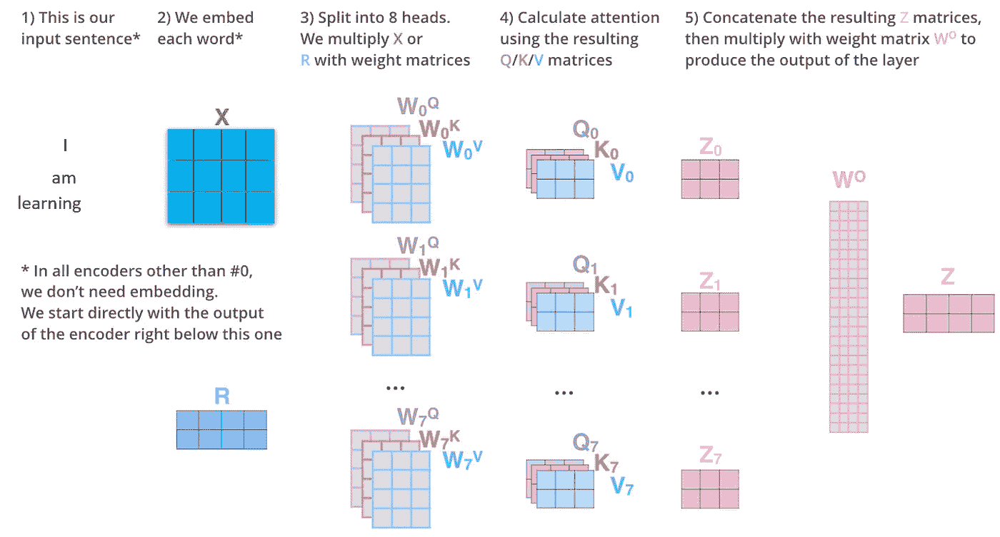*

*参考:【http://jalammar.github.io/illustrated-transformer/ *

# *位置编码*

*位置编码是识别两个单词之间的距离和单词输入顺序的关键因素。为了创建这种编码，所有的输入向量被加上位置向量(位置向量遵循模型学习的特定模式)，然后它将被提供给编码器的输入。这背后的原因是，当将这些值映射到查询/键和向量时，将这些值添加到嵌入中会在向量之间创建有意义的距离。同样，每个单词的位置和每个单词之间的距离可以用这种位置编码来确定。*

*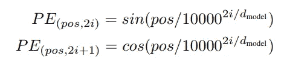*

*计算位置向量的公式*

*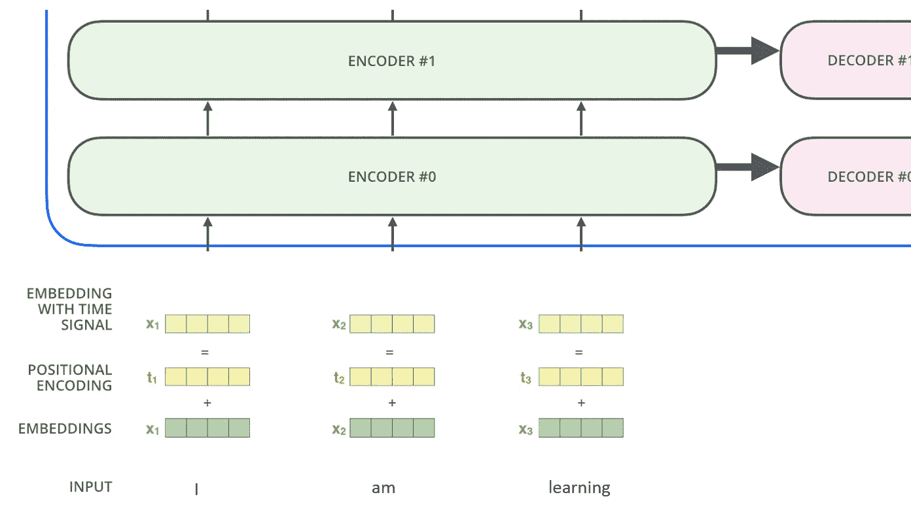*

*参考:[http://jalammar.github.io/illustrated-transformer/](http://jalammar.github.io/illustrated-transformer/)*

# *剩余网络(跳过连接)*

*在编码器的架构中，围绕多头关注和前馈网络提到了剩余连接。这个跳过连接之后是层标准化步骤。具有自我关注和层标准化的可视化可以看起来像这样。*

*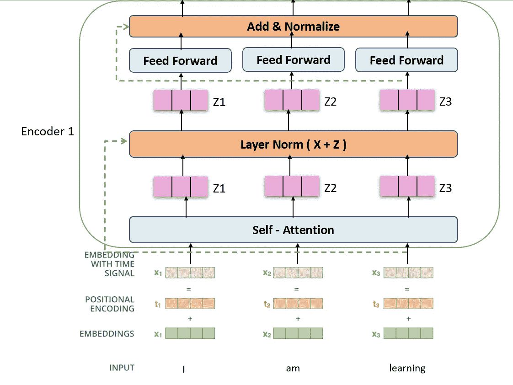*

*从编码器 1 的输入到输出的整个流程*

*现在，第一个编码器的输出被提供给第二个编码器，这样整个编码器架构就工作了。如果我们考虑 2 编码器架构，那么它会是这样的。*

*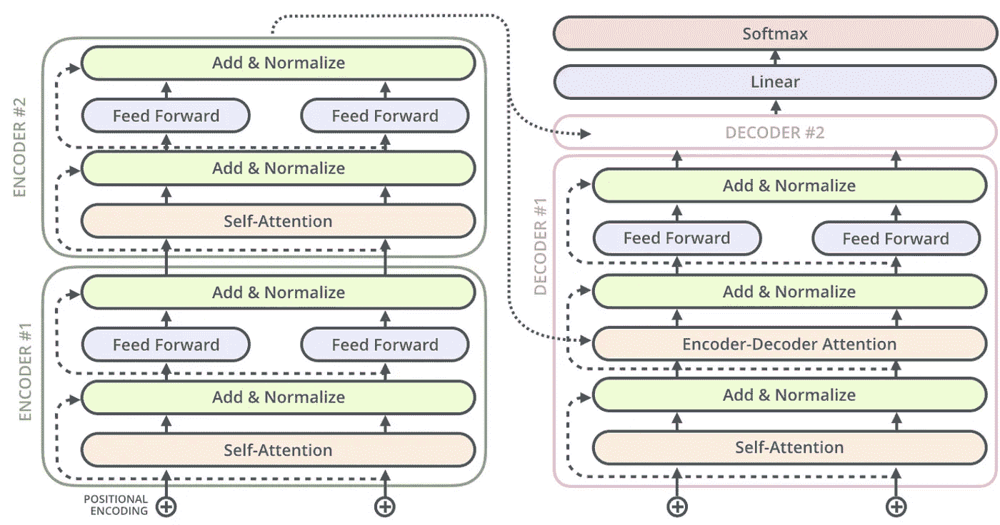*

*参考:-[http://jalammar.github.io/illustrated-transformer/](http://jalammar.github.io/illustrated-transformer/)*

# *解码器*

*在体系结构中，编码器的输出提供给第二层解码器。第一层如果解码器被屏蔽-多头关注，然后添加和规范化。在这里，掩蔽多头注意力与编码器一样，采用输出嵌入和位置嵌入。例如，如果我们正在进行语言翻译，输出语言将作为解码器的输入。屏蔽意味着一些字被屏蔽，以便模型可以学习预测数据和被屏蔽的字将在每次迭代中改变。这一层将为解码器生成查询度量。从编码器输出中获取关键字和值度量，编码器输出直接给予编码器-解码器关注，如图所示。对句子的整个序列重复该过程，直到到达完成符号。比如:-句尾。整个流程可以在下图中看到。*

*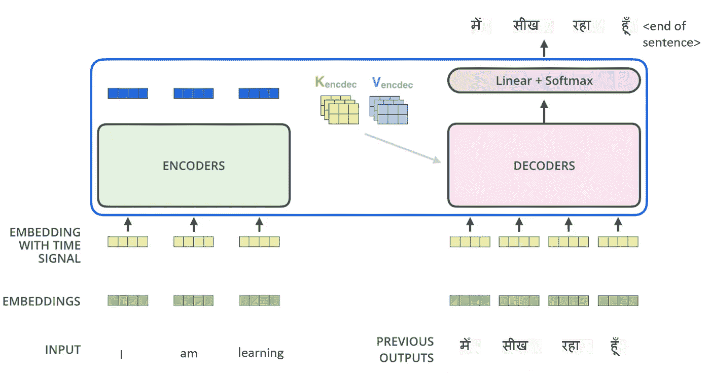*

*参考:-[http://jalammar.github.io/illustrated-transformer/](http://jalammar.github.io/illustrated-transformer/)*

*最后，堆叠解码器的输出被送到线性层，线性层是一个简单的全连接神经网络。线性层生成向量，这些向量是我们不能直接预测单词的大向量。这一层我们可以假设我们整个数据集的字典。然后从 softmax 层传递以转换成概率，选择具有最高概率的单元并将其转换成该时间戳的最佳可能单词。*

*在这个博客中，我们看到了第一个变形金刚，这是目前所有研究的基础。**在下一篇文章中，我们将尝试赶上伯特(变压器的双向编码器表示)和 GPT。***

****建议随时欢迎。****

***参考文献***

1.  *[http://jalammar.github.io/illustrated-transformer/](http://jalammar.github.io/illustrated-transformer/)*
2.  *[https://arxiv.org/pdf/1706.03762.pdf](https://arxiv.org/pdf/1706.03762.pdf)*