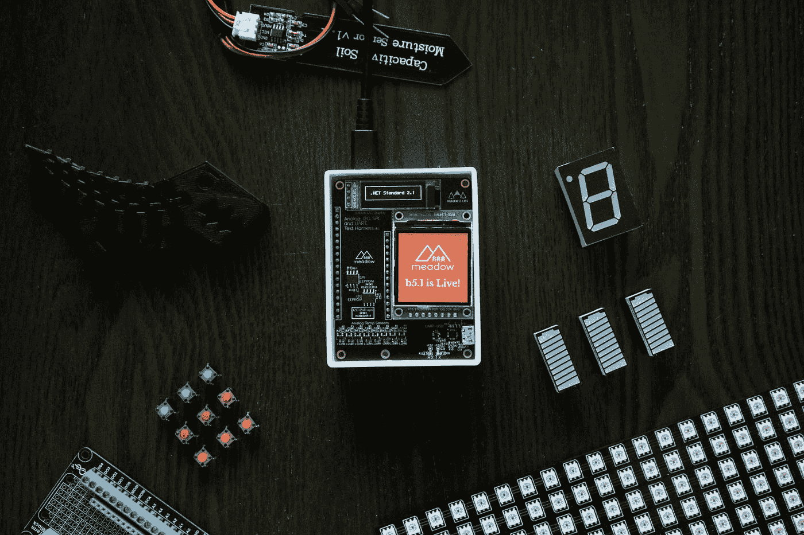

# 物联网系统。揭开

> 原文：<https://medium.com/codex/the-trinity-of-iot-systems-468bfd05645c?source=collection_archive---------14----------------------->

## 物联网系统的三大支柱概述

Jorge Ramirez 在 [Unsplash](https://unsplash.com?utm_source=medium&utm_medium=referral) 上的照片

你已经厌倦了听到物联网，IoT，及其成千上万的委婉语和衍生品。

在新闻中，在报纸上，在 Youtube 广告中，甚至你的祖母告诉你，她已经在她的狗 Max 身上安装了一个物联网设备。