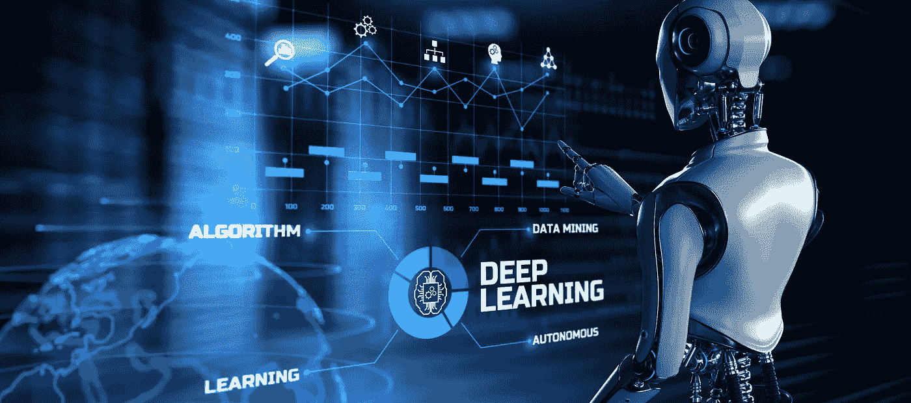

# 艺术的真谛——人工智能如何扼杀书面艺术的价值

> 原文：<https://medium.com/codex/the-true-meaning-of-art-how-ai-may-kill-the-value-of-written-art-65c9f636a882?source=collection_archive---------12----------------------->

Adobe 股票；作者:默多克

他们说，如果你想做生意，尤其是自由职业，你需要上社交媒体。

是的，在某种程度上，这就是我们如何走向世界，让自己变得可见。这是有帮助和有用的部分。有了脸书和 Instagram，你需要每天甚至更长时间发布信息，才能让别人看到你的信息。我故意选择不在脸书或 Instagram 上写太多，正是因为这个事实。每天或更长时间张贴的必要性。我不是机器人。可悲的是，这些天来，你也需要在一些平台上确认这个事实——我不是机器人。还有，不断发帖的必要性正是让我们沉迷于这类平台的原因。上瘾只是一种分心，一种对现实的逃避。

我相对来说是一个媒介新手，还在学习这个写作环境。我加入这里甚至不知道有赚钱的可能性。我只是想分享我的声音，并与其他志同道合的人联系。当我开始阅读其他人的文章时，我发现这也可以成为收入的来源，坚持是关键。我明白这一点，这是有道理的，就像生活中的许多事情一样。

然而，从我的观察来看，我有点失望，但无论如何也不会失去希望。希望这里也有价值。我们生活在一个可以获取各种信息的世界里。这太棒了，给我们带来了如此多的可能性。然而，它也带来危险和威胁，我们应该意识到这一点。信息的混乱带来了更多的困惑，因此，选择我们需要的内容并非常小心地喂饱自己和他人是非常重要的。这是非常不可能的，这些平台是如何创建的，因为他们有一个完全不同的目的。目的是让我们不断地在那里，无论是作为一个作家还是作为一个读者，或者两者兼而有之。

作为人类，我们的自然需求是创造。这是我们来到这个美丽星球的原因之一。真正的创造来自于精神，是精神的体现，是比我们人类思想更伟大的东西的体现。它以周期、波浪的形式来来去去，并不是要控制它，而是让它以自己的速度流动。

作为人类，我们通过身体以各种方式创造，绘画、写作、跳舞、编程、唱歌、演奏音乐、盖房子、设计、制作网站等等！艺术无处不在，然而，并不是所有东西都是艺术。如果我们只是为了钱而生产我们正在生产的东西，使用算法来帮助我们，我们只会给这个星球带来更多的混乱。我们不仅给自己制造陷阱，继续在仓鼠轮里跑，也是在给别人做。AI 向我们学习，我们在那里喂的东西，是 AI 学习的燃料。

*究竟是人工智能还是我们自己扼杀了真正艺术的价值？*

为什么我们不确定我们放进去的内容真的有价值呢？我们真的每时每刻都有那么多话要说吗？

*   相反，我们是否也花时间反思呢？
*   我们为什么要做我们现在做的事情？
*   我们放内容的目的是什么？
*   我们想和别人分享一些有价值的东西吗？
*   我们想在具体问题上支持或帮助他们吗？
*   或者，我们只是尽可能多地让人工智能计算算法，然后为我们赚钱？

我总是支持质量胜于数量。彻底的品质，来自心灵和精神的地方，我们让这个世界变得更加美丽和有价值。没有它，我们就成了机器人，做着没有更深层意义的事情。

这不是我们真正的本性。

我们都是拥有惊人创造能力的奇妙生物。我们不能让它因为算法而被扼杀。

实际上是人工智能还是我们自己扼杀了真正艺术的价值？

带着爱，

玛尔塔

*我真的相信，我们如何创造世界，取决于我们自己是谁，如何成为我们自己。创造来自内心。这不只是说说而已，这是科学。*

*我喜欢鼓励其他人在更深层次上反思和理解自己，因为我相信所谓的外部现实的每一次经历都始于我们自己。当我们意识到自己时，我们与他人建立了健康的关系，因此也就建立了健康的社会。*

*我是一名生活&商业蔻驰和商业导师，我很乐意通过我的* [***网站***](https://thenewhearth.com) *与你分享更多。你可以在那里注册一份时事通讯来追踪新闻和事件。*

我相信我们可以一起让这个世界变得更加美好🌍💚

***感谢大家看我的帖子，感谢大家的每一条评论，感谢大家的连接。***