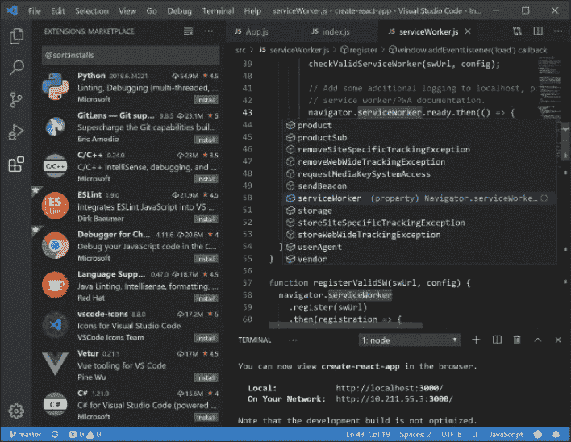
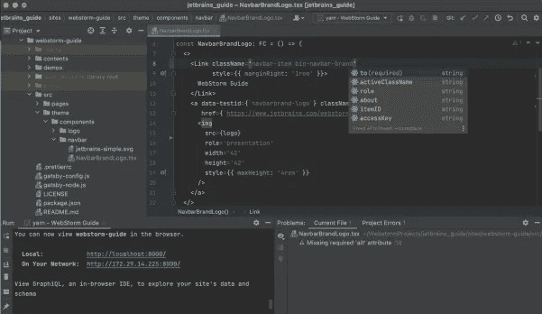

# Web 开发的两个最佳 ide

> 原文：<https://medium.com/codex/the-two-best-ides-for-web-development-34fb808b98cb?source=collection_archive---------9----------------------->

## *一个是免费的，另一个你应该问你的雇主……*

照片由[詹姆斯·哈里逊](https://unsplash.com/@jstrippa?utm_source=unsplash&utm_medium=referral&utm_content=creditCopyText)在 [Unsplash](https://unsplash.com/s/photos/programming?utm_source=unsplash&utm_medium=referral&utm_content=creditCopyText) 上拍摄

为您的开发选择一个 IDE 可能是一项困难的任务。你可以尝试所有不同的 IDEs，付费的和免费的，或者你的雇主或学校已经为你选择了。不管怎样，下面是我使用两种 ide 的经验。

IDE 的选择也可能取决于您的技术组合。这些 ide 用于一般的 web 开发(以及更多)。如果您使用 C#或 CSHTML 文件，那么可能会选择 VS2019 进行集成。

*注意:这篇文章只是我对我经常使用的两个 ide 的个人看法。这不是他们中任何一个人的付费推广。*

# [Visual Studio 代码](https://code.visualstudio.com/)

目前最广泛使用的免费**ide 之一是 **Visual Studio Code** 或简称 VSC。它是由微软制造的，根据它的网站是基于开源代码构建的，有一些很棒的特性。**

VSC 最重要的特性是它能够使用扩展。这些扩展可以由微软自己开发，也可以由其他程序员开发，为每一个程序员包含他们自己的语言或工具。

**代码完成**很容易使用，并且如你所期望的那样工作，当你已经安装了正确的扩展时，你将不会有误判或错误代码的问题。

VSC 还具有主题化和定制化的特点。您可以安装由其他创作者制作的主题或创建您自己的主题。一些扩展甚至更新了 GUI 的功能，这使得它更加有用。

图片来自[https://code.visualstudio.com/](https://code.visualstudio.com/)

# Jetbrains 网络风暴

网络风暴相当昂贵。这就是为什么我很高兴作为一名学生我可以免费使用它。它由 Jetbrains 创建，内置了从基本 HTML 到 React 本地应用程序开发的所有工具。

根据他们的网站，它是专门从事 JavaScript 开发的。然而，它也擅长于 HTML、CSS、SCSS、TypeScript 等等。

整个环境**可定制**。您可以根据自己的喜好轻松设置。我个人使用他们的 Jetbrains Mono 字体，它有很好的代码连字。如果你愿意，你可以添加或创建自己的**主题**。

它有**很棒的内置功能**，比如集成了版本控制和大量快捷方式。

我个人喜欢将这个编辑器用于较大的项目，而不是单页应用程序或简单的营销网站。但是如果我不得不购买 IDE 来使用它，我可能会坚持使用 VSC。

图片来自[https://www.jetbrains.com/webstorm/](https://www.jetbrains.com/webstorm/)

# 结论

这只是从免费到昂贵的两种选择。还有其他选择，比如基于 Eclipse 的 ide、Atom、Bracket 等等。这完全取决于您的具体使用情况和偏好。我个人喜欢更简约的风格，这是“老”款式有时所缺乏的。

感谢您的阅读，祝您愉快。