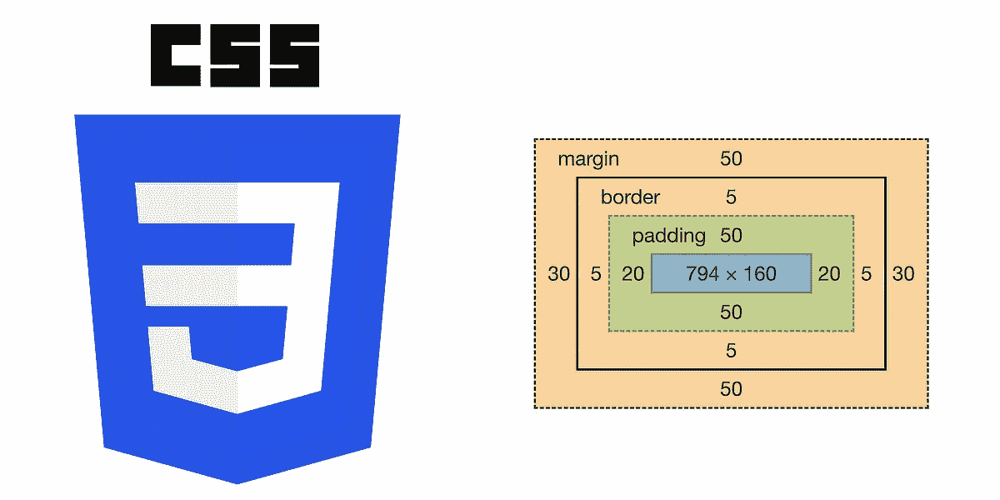

# 需要理解的两个最重要的 CSS 概念

> 原文：<https://medium.com/codex/the-two-most-important-css-concepts-to-understand-f7038c89ed35?source=collection_archive---------15----------------------->

## 标题说明了一切，让我们直接开始吧。



## 1.什么是 CSS 选择器特异性，它是如何工作的？

根据 [MDN](https://developer.mozilla.org/en-US/docs/Web/CSS/Specificity) 的说法，特异性是浏览器决定哪些 CSS 属性值与元素最相关，因此将被应用的方法。特异性是应用于给定 CSS 声明的权重，由匹配选择器中每个选择器类型的数量决定。特定性仅适用于同一元素被多个声明作为目标的情况。根据 CSS 规则，直接作为目标的元素总是优先于元素从其祖先继承的规则。

选择器的特异性值从高到低如下:

1.  内嵌样式(
2.  ID 选择器(#导航条)
3.  类、属性和伪类(。框，[type="radio"]，:悬停)
4.  元素和伪元素(h1，before)

关于特异性的计算方式有一些错误的信息。一些参考资料称，它是通过指定分值来评分的，例如:内联样式值 1000 分，ID 值 100 分，类、属性或伪类值 10 分，元素或伪元素值 1 分。这在技术上**是不正确的—** *然而*，在大多数情况下，以这种方式计算特异性仍然是好的。

计算特异性的正确方法如下:

1.  内嵌样式— 1，0，0，0
2.  IDs — 0，1，0，0
3.  类、属性和伪类— 0，0，1，0
4.  元素和伪元素— 0，0，0，1

我们从左到右比较每个逗号分隔的值。在极少数情况下，我们有 12 个类选择器和 1 个 ID 选择器，ID 选择器会赢。这是因为 ID 的值为 1 (0，1，0，0)，而 12 个类选择器的值为 0 (0，0，12，0)。如果我们错误地计算了 10 分制，12 个职业选择者将以 120 分比 100 分获胜。

查看示例，并尝试找出列表项的颜色:

```
<ul class="grocery-items">
  <li>juice</li>
  <li>bread</li>
  <li>cookies</li>
</ul>.grocery-items {
  color: blue
}ul li {
  color: red
}
```

使列表项变成蓝色的选择器的特异性是 0，0，1，0。使列表项变红的选择器的特异性是 0，0，0，2。所以颜色会是蓝色的。**如果针对同一元素的多个选择器的特异性恰好相同，那么 CSS 中的最后一个声明(无论哪个在页面的更下方)将胜出。**

还有一个”！重要”规则，适用于声明。！对任何选择者的重要胜利:

```
.grocery-items {
    color: blue
}

ul li {
    color: red !important;
}
```

尽管指向红色的选择器不太具体！重要仍然获胜，颜色为红色。

但是，如果碰到另一个！重要的是，获胜者将根据选择者的分数决定:

```
.grocery-items {
    color: blue !important;
}

ul li {
    color: red !important;
}
```

颜色将是蓝色的，因为。杂货类比两个 ul li 元素更具体。利用！重要基本上就像具有 1，0，0，0，0 的特异性。所以 1，0，0，1，0(。杂货)比 1，0，0，0，2 (ul li)更具体。

## 2.框大小属性值内容框和边框框之间有什么区别？

我们使用术语“盒子模型”(如上图)来谈论 CSS 中的设计和布局。CSS 中每个显示类型为“block”的元素都有一个矩形框模型，具有填充、边距和边框等属性。我们可以通过将 box-sizing 属性更改为 content-box 或 border-box 来修改元素高度和宽度的计算方式。Content-box 是框大小属性的默认值。它告诉我们，元素的宽度和高度将根据内容区域的大小来计算(上面方框模型中的蓝色区域)。定义元素的宽度和高度时，不会考虑元素的填充和边框。任何额外的填充或边框将被添加到给定的宽度和高度之上，并且元素的内容区域将保持不变。例如:

```
.box {
  width: 300px;
  height: 600px;
  border: 5px solid black;
  padding: 3px;
}
```

此框的内容区域宽度和高度将始终是 300 像素乘 600 像素，但页面上呈现的实际框将是 308 像素乘 608 像素，因为框将包括额外的填充和边框。这在大多数情况下并不理想，许多人喜欢将框大小属性设置为 border-box 来解决这个问题:

```
.box {
  width: 300px;
  height: 600px;
  border: 5px solid black;
  padding: 3px;
  box-sizing: border-box;
}
```

的。计算宽度和高度时，框元素现在将包括填充和边框。这意味着元素在页面上呈现的总面积将总是 300 像素乘以 600 像素。为了保持我们想要的 300 像素乘 600 像素的大小，填充和边框将从元素的内容区域中减去。所以内容区域。盒子现在是 292 像素乘 592 像素。使用边框有助于我们在定义块元素的边框时更加清晰。**注意，margin 属性不会对任何一个框尺寸属性**的宽度和高度计算产生任何影响。

*感谢阅读——在* [**LinkedIn**](https://www.linkedin.com/in/kylefarmer85) *上联系我，在*[**Kyle farmer . dev**](https://kylefarmer.dev/)*上查看我的作品集，干杯！*