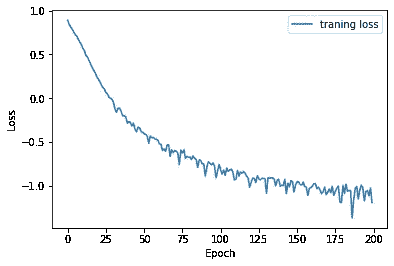
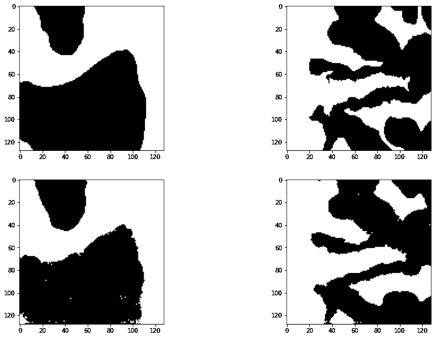

# PyTorch 中用于细胞分割的 U-Net

> 原文：<https://medium.com/codex/the-u-net-for-cell-segmentation-in-pytorch-d34dddcdaccb?source=collection_archive---------1----------------------->

在 Olaf Ronneberger 等人的原始论文中提出的 U-Net 架构。艾尔。

在本文中，我将介绍如何使用 PyTorch 实现原始的 U-Net 框架来分割医学图像。我将首先给出一个 U-Net 架构的概述，以及它是如何变魔术的；之后将介绍 PyTorch 的实现。

# U-Net，概述

U-Net 于 2015 年由弗赖堡大学的一个研究小组首次推出。如果你还没有阅读这篇论文，我强烈建议你阅读一下 [**链接**](https://arxiv.org/abs/1505.04597) 。从顶部可以看到的 U-Net 架构的图像可以清楚地看出“U-Net”这个名称的来源。U-Net 是一个完全卷积网络，由称为编码器和解码器的两侧(左侧和右侧)组成。编码器通过应用核将图像编码到小维度的特征空间中，解码器将该信息映射到空间分类中以执行分割。U-Net 的一个关键特征是每个编码器层的输入也连接到其相应解码器的输出，这被称为剩余连接或跳过连接。剩余连接让信息直接流过网络，而不需要应用非线性激活函数(*见下面的注释*)。通过在编码器中执行多个操作，丢失了一些空间信息，并且编码器和解码器之间的链接(剩余连接)能够恢复这种丢失的信息，从而产生分割特征。

编码器和解码器以相反的方式不同，因为编码器执行所谓的下卷积，而解码器执行上卷积。这些是重要的，因为通过卷积使用填充和汇集技术，创建了图像的特征空间，并进一步将其转移回空间图，从而保持了图像中像素之间的关系。上下卷积是类似于将感兴趣的信息集中在下卷积中，然后用上卷积稀释，从而仅恢复感兴趣的信息的想法。

*注意:我明白剩余连接是如何工作的，但我不完全确定它们为什么工作，我听说它们类似于集合方法的想法，但我仍然觉得有点困惑。如果有人有明确的解释，欢迎在下面评论。*

# PyTorch 实现

在本节中，首先将介绍核心 U-Net 架构，然后将介绍使用真实医学图像数据的示例训练循环。

**U 网型号:**

**让它做点酷的事情:**

在这里，我们将在结肠组织学图像上训练上面提出的 U-Net 模型，该图像最初在 GlaS 竞赛中提出。这是一个研究竞赛，来自世界各地的研究团队在细分任务中竞争；查看链接下载数据，阅读更多关于大赛的信息， [**链接**](https://warwick.ac.uk/fac/sci/dcs/research/tia/glascontest/download/) 。

首先，我们将定义一个从文件中获取图像数据的函数，将图像标准化并调整其大小(原始图像的大小各不相同，我注意到当图像大小调整为 128X128 时，结果更快更好)。I 函数将两个文件夹(一个文件夹包含“原始”图像，另一个文件夹包含注释)所在的路径、函数应该从哪个图像编号开始以及函数应该从哪个图像停止作为输入。

查看一幅图像和相应的遮罩，如下所示:

原始图像(左)和它的面具(右)。

既然可以正确加载图像，我们现在可以开始训练网络。我使用 Google Colab 进行培训，因为他们提供了一个很好的笔记本风格的环境，已经安装了大多数标准包，并提供了 12 GB 的免费 GPU 使用。使用的训练循环如下所示:

训练后，在测试集上评估该模型，得到 IoU 分数为 0.325，F1 分数为 0.789。模型损失以及原始和预测掩模的例子可以在下面看到。

使用 BCE 和 Logits 的损失。

真实遮罩(顶部)和预测遮罩(底部)。

# **结论**

有关使用的完整笔记本，请参见下面的链接。当诸如损失函数和图像尺寸的参数被调整时，U-Net 的结果变化。U-Net 是用于医学图像分割的最著名的架构之一，由于它的流行，在原始 U-Net 框架的基础上进行了开发，如 [UNet++](https://arxiv.org/abs/1807.10165) 和 [ResUNet++](https://arxiv.org/abs/1911.07067) 。我希望这篇文章对你有用，如果你有任何提示或建议，请在下面留下评论。

完整笔记本:[https://colab . research . Google . com/drive/1 nzv 1 RFI 1 _ C-_ j 9 yj Guk-OQ-OKMfkKAfE？usp =共享](https://colab.research.google.com/drive/1Nzv1rfI1_C-_j9yJGUk-OQ-OKMfkKAfE?usp=sharing)