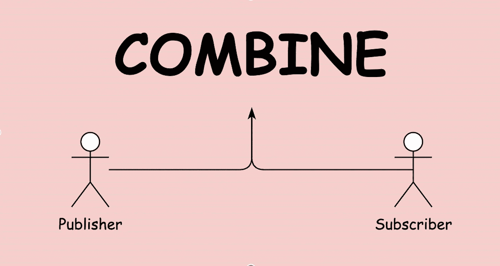
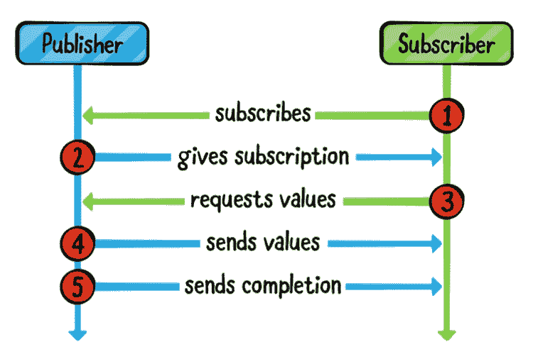
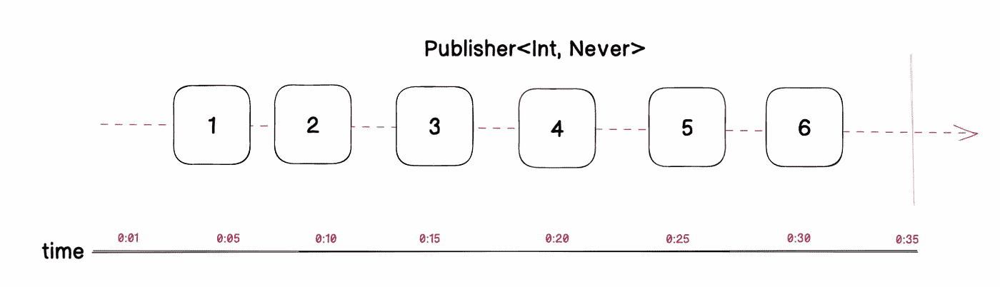
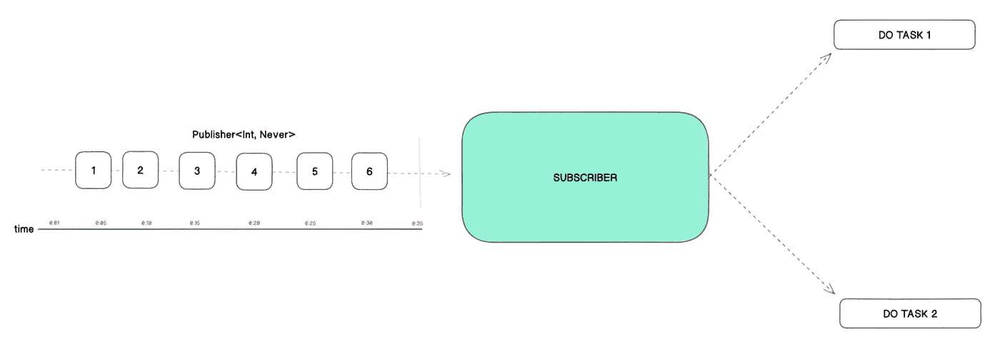

# 终极组合框架指南

> 原文：<https://medium.com/codex/the-ultimate-combine-framework-guide-e17ba0601bc?source=collection_archive---------6----------------------->

## 结合框架解释得最直白。

Combine 框架为应用程序如何处理事件提供了一种声明性的方法。例如，您可以为给定的事件源创建单个处理链，而不是潜在地实现多个委托回调或完成处理程序闭包。

Combine 凭借其两大支柱`Publishers`和`Subscribers`
屹立不倒，在很多方面，Combine 与 RxSwift 非常相似，具有等同的概念、类型和方法。如果你不熟悉我的故事，你可以在这里找到我的 RxSwift 故事。

下面描述了发布者和订阅者的相互作用。这是联合收割机的核心。这是理解联合框架所需要的基础。

这里有一只`Publisher`和一只`Subscriber`。
1。这里的`Subscriber`订阅了`Publisher`的
2。`Publisher`创建一个`Subscription`并将其交给`Subscriber`3。`Subscriber`请求值
4。`Publisher`发送数值
5。`Publisher`发送完成信息

现在，我们将尝试了解我们之前讨论的这些发布者和订阅者是什么

## 出版商

发布者与 RxSwift 中的 Observables 非常相似。出版商是那些有能力随着时间的推移释放价值的人。

发布器可以发出零个或多个输出值，如果它成功或失败地完成了，它将不会发出任何其他事件。发布者有一个`Failure`类型，决定了一个发布者实际上是如何失败的。对于没有失败的发布者，我们简单地使用`Never`它的失败类型。

从 1 到 6 的方框表示在给定时间发出的值。数字代表发出的值。右端的垂直线表示时间线的终点。这里的值是整数类型，因为发布者在这里发送了整数类型`Publisher<Int, Never>`

发布者定义

解码上面的发布者定义片段，我们可以理解
发布者将元素交付给一个或多个`Subscriber`实例。订阅者的`Input`和`Failure`关联类型必须与发布者声明的`Output`和`Failure`类型相匹配。发布者实现`receive(subscriber:)`方法来接受订阅者。

如何创建发布者的示例:
`let publisher = [1, 2, 3, 4, 5, 6].publisher`

## 订阅者

订阅者与 RxSwift 中的观察者非常相似。与订户的词义相同。订阅者是要求发布者将值发送给它的人。发布者发出值，订阅者接收这些值。

一个`Subscriber`实例从一个`Publisher`接收元素流，以及描述它们之间关系变化的生命周期事件。给定订阅者的`Input`和`Failure`关联类型必须与其对应发布者的`Output`和`Failure`相匹配。

订户辩护

解码上面的订阅者定义片段我们可以理解，`Publisher`接收`Subscriber`并可以直接发送`Input`值或`Completion`事件给所有已知的`Subscribers`。发布者的任何变化都将调用订阅。

现在，什么是**订阅**？

一个`Subscription`是当你订阅时创建的东西。订阅保留对所有必要资源的引用，并且可以使用其`Cancellable`协议随时取消(类似于`dispose` is RxSwift)

联合收割机有一些内置用户:
- **Sink
- Assign**

## **水槽**

接收器订阅者用于观察发布者收到的值。这个操作符只能在流没有失败的时候使用，也就是发布者的`Failure`类型是`Never`的时候。
举例:

## **分配**

当您希望在每次发布者生成值时设置给定属性时，可以使用分配订阅者。
举例:

在上面的代码中，你可以看到我们有一个`publisher` `Just("Snow")`并且`publisher`被赋予了狗对象的名字。最后，当我们打印`dog.name`时，我们可以看到`Snow`打印在控制台上。

我们将在这里结束这个故事。我将在接下来的故事中简要介绍操作符。

> 给所有新开发人员的一个个人提示: ***构建您的肌肉记忆*** *不要坐着计划使用什么消息/数据传递接口来完成您的任务，只需简单地编写一个发布程序并订阅该发布程序并解决您的问题。这将有助于您轻松破解合并，而不是依赖于常规的委托和完成回调。多练习一下，你会自动开始为每件事写出版商和订户。*

我希望你明白联合框架是如何工作的，什么是`Publishers`和`Subscribers`。如果你有任何疑问或建议，请告诉我。感谢你阅读❤